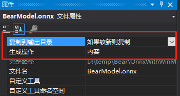
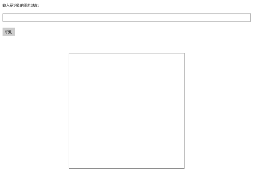
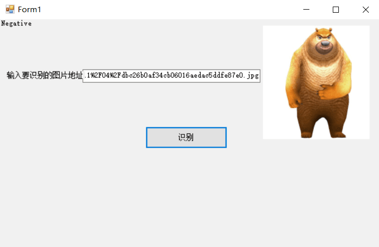

# 第二组成员：陈少辉   许诗彤  王景楠 

陈少辉 编写报告

许诗彤  演讲

王景楠 代码调试

# 使用Windows Machine Learning加载ONNX模型并推理
## 一、创建UWP项目
打开Visual Studio 2017，新建项目，在Visual C#分类中选择空白应用(通用 Windows)，填写项目名称为ClassifyBear，点击确定

在弹出的对话框中，设置目标版本和最低版本都是17763


## 二、添加模型文件到项目中
打开解决方案资源管理器中，在项目中的Assets目录上点右键->添加->现有项，添加模型文件BearModel.onnx
模型是在应用运行期间加载的，所以在编译时需要将模型复制到运行目录下。在模型文件上点右键，属性，然后在属性面板上，将生成操作属性改为内容，将复制到输出目录属性改为如果较新则复制。

打开解决方案资源管理器，应该可以看到在项目根目录自动生成了和模型同名的代码文件BearModel.cs，里面就是对该模型的一层封装，包括了输入输出的定义、加载模型的方法以及推理的方法。
# 三、设计界面
打开MainPage.xaml，将整个Grid片段替换为如下代码：
``` C++
<Grid>
    <StackPanel Margin="12">
        <TextBlock Text="输入要识别的图片地址:" Margin="12"></TextBlock>
        <TextBox x:Name="tbImageUrl" Margin="12"></TextBox>
        <Button x:Name="tbRun" Content="识别" Tapped="TbRun_Tapped" Margin="12"></Button>
        <TextBlock x:Name="tbBearType" Margin="12"></TextBlock>
        <Grid BorderBrush="Gray" BorderThickness="1" Margin="12" Width="454" Height="454">
            <Image x:Name="imgBear" Stretch="Fill" ImageOpened="ImgBear_ImageOpened" ImageFailed="ImgBear_ImageFailed"></Image>
        </Grid>
    </StackPanel>
</Grid>
```
显示效果如下图：


- 输入框tbImageUrl中用来输入要识别的图片的URL
- 按钮tbRun用来触发加载图片
- 文本框tbBearType用来显示识别的结果
- 图片控件imgBear用来预览要识别的图片，同时，我们也从这个控件中取出对应的图片数据，传给我们的模型推理类库去推理。这里将图片控件设置为正方形并且将Stretch属性设置为Fill，可以保证图片拉伸显示为一个正方形的形状，这样可以方便我们直观的了解模型的输入，因为在前面查看模型信息的时候也看到了，该模型的输入图片应是227*227的正方形。
# 四、事件类型添加
## （1）添加按钮的事件响应
前面XAML文件中给按钮添加事件，这里在MainPage.xaml.cs中完成对应的实现，从输入框中读入图片的URL，然后让图片控件加载该URL对应的图片：
```C++
private void TbRun_Tapped(object sender, TappedRoutedEventArgs e)
{
    tbBearType.Text = string.Empty;

    Uri imageUri = null;
    try
    {
        imageUri = new Uri(tbImageUrl.Text);
    }
    catch (Exception)
    {
        tbBearType.Text = "URL不合法";
        return;
    }

    tbBearType.Text = "加载图片...";

    imgBear.Source = new BitmapImage(imageUri);
}
```
## (2)添加图片控件的事件响应
前面XAML文件中给图片控件添加了两个事件：图片加载完成的事件和加载失败的事件，这里在MainPage.xaml.cs中完成对应的实现：
``` C++
private void ImgBear_ImageOpened(object sender, RoutedEventArgs e)
{
    RecognizeBear();
}

private void ImgBear_ImageFailed(object sender, ExceptionRoutedEventArgs e)
{
    tbBearType.Text = "图片加载失败";
}
```
## (3)加载模型并推理
这是最关键的一步，也是非常简单的一步。自动生成的模型封装文件BearModel.cs中已经封装了加载模型的方法和推理的方法，直接调用就可以：
``` C++
private async void RecognizeBear()
{
    // 加载模型
    StorageFile modelFile = await StorageFile.GetFileFromApplicationUriAsync(new Uri($"ms-appx:///Assets/BearModel.onnx"));
    BearModelModel model = await BearModelModel.CreateFromStreamAsync(modelFile);

    // 构建输入数据
    BearModelInput bearModelInput = await GetInputData();

    // 推理
    BearModelOutput output = await model.EvaluateAsync(bearModelInput);

    tbBearType.Text = output.classLabel.GetAsVectorView().ToList().FirstOrDefault();
}
```
# 五、测试
测试效果如下：




# 六、总结
>>>>>>>>>>># 总结

  这回遇到非常多的问题。
- 1.刚开始我们使用VS2017，程序是正确的，但是运行时间图像无法识别。
- 2、我们通过仔细检查发现我们的程序引用的文件放错了位置，当我们改正过来后，重新运行时发现还是出现了无法识别图像。
- 3、于是我们检查了模型文件BearModel.onnx，然后在属性面板上，将生成操作属性改为内容，将复制到输出目录属性改为如果较新则复制。
-     总结：最后我们成功运行了，只不过是我们换了一台电脑完成了这个项目，我们一起协作了2-3个小时完成这个项目。在制作过程中，我们总结出在做实验时应该冷静，不能因为除了错误就慌乱。在解决问题的过程中，我们要学会思考，学会自己运行自己所学的知识解决问题，另外就是在解决问题的过程中，我们要多与团队里的其他成员沟通，多交流，大家集思广益就能把一个大的问题解决。
  
          这次团队合作做项目我们都学到了很多，大家都从中学到了在课堂和书本上学不到的知识，我们受益匪浅。希望在下次团队合作过程中，我们能比这次发挥的更加出色，能够学到更多的东西。