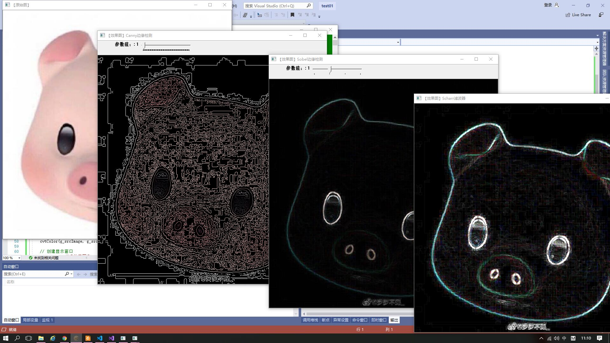
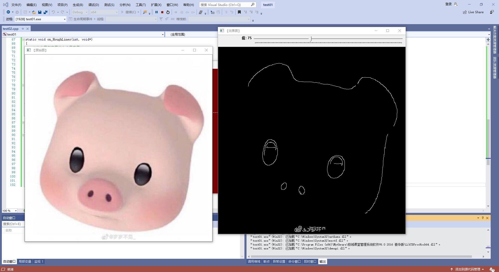
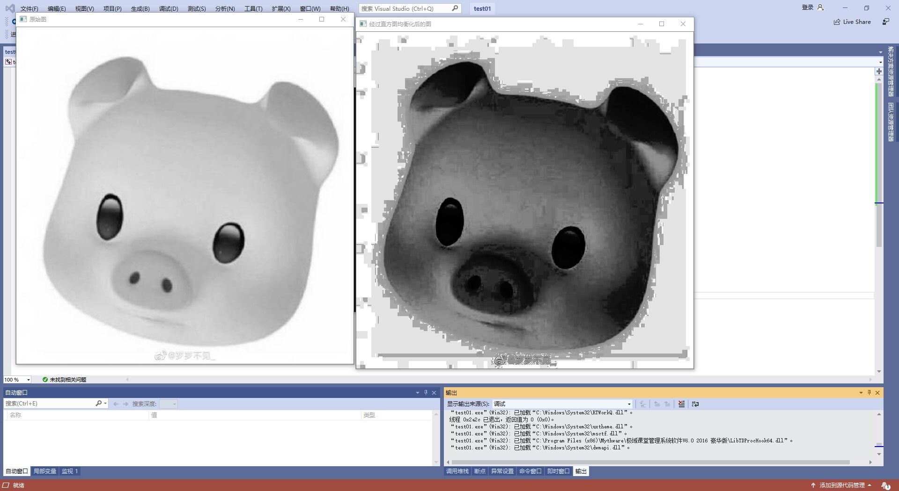

# 20191015第四次作业

## <第四次车载信息处理课程学习————图像特征提取与分析>
通过前几次课的学习，我了解了一些opencv和vs studio的基础知识，现在我利用这些控制图像结构的基本方法，来进行这节课更加复杂的图像处理。
这次课我掌握的主要内容是：图像特征的提取与分析，边缘检测，直方图的均衡化，霍夫hough变换的综合实以及直方图与匹配。
下面我将进行一一介绍总结。

#### 一.边缘检测实验
边缘检测试验总结起来一共分为三个步骤————滤波，增强，检测。
1.滤波：边缘检测算法主要是基于图像强度的一阶和二阶导数，但是导数对于噪声很敏感，因此需要采用滤波器来改善与噪声有关的边缘检测器的性能
2.增强：增强边缘的基础是确定图像各点邻域强度的变化值。增强算法可以将灰度点邻域强度值有显著变化的点凸显出来
3.检测：邻域中有很多的点的梯度值较大，但是在特定的应用中，这些点并不是要找的边缘点，需要取舍。
基于这三个步骤，进行的边缘检测实验结果如下：



这次实验的主要代码是三个函数，
```C++
void on_Canny(int, void*)
{
	blur(g_srcGrayImage, g_cannyDetectedEdges, Size(3, 3));
    Canny(g_cannyDetectedEdges, g_cannyDetectedEdges, g_cannyLowThreshold,g_cannyLowThreshold * 3, 3);
    g_dstImage = Scalar::all(0);
    g_srcImage.copyTo(g_dstImage, g_cannyDetectedEdges);
	imshow("【效果图】Canny边缘检测", g_dstImage);
}
```
分析这段代码：
```C++

blur(g_srcGrayImage, g_cannyDetectedEdges, Size(3, 3));
```
 Canny边缘检测窗口滚动条的回调函数，是指先使用 3x3内核来降噪。随后运行canny算子。
 ```C++
 g_srcImage.copyTo(g_dstImage, g_cannyDetectedEdges);
 ```
 含义是使用Canny算子输出的边缘图g_cannyDetectedEdges作为掩码，来将原图g_srcImage拷到目标图g_dstImage中。


#### 二.霍夫hough变换实验————区域边界—>参数空间
霍夫变换，作用是用来检测图像中的直线或者圆等几何图形的。说白了在我们的视频和图像中，任意的形状其实都是由参数不同的直线和圆构成的，这样的话就可以将提取图片中的直线和圆变成求解所有的(m,b)组合和求解所有（a，b，c）

我之前觉得学习数学非常难，特别是在大学之后学到的各种高等的数学，而在今天意识到，现实生活中我们遇到的问题比数学难多了，而数学可以将有些难以解答的问题形象化，简单化，由此可见，学好数学的重要性。

在对代码和原理进行了理解之后，运行成功的实验截图如下：



本次实验的重要代码是
```c++
static void on_HoughLines(int, void*)
{
	
	Mat dstImage = g_dstImage.clone();
	Mat midImage = g_midImage.clone();
	vector<Vec4i> mylines;
	HoughLinesP(midImage, mylines, 1, CV_PI / 180, g_nthreshold + 1, 50, 10);
	for (size_t i = 0; i < mylines.size(); i++)
	{
		Vec4i l = mylines[i];
		line(dstImage, Point(l[0], l[1]), Point(l[2], l[3]), Scalar(23, 180, 55), 1, LINE_AA);
	}
	imshow("【效果图】", dstImage);
}
```
现在来逐条分析代码
```c++
Mat dstImage = g_dstImage.clone();
Mat midImage = g_midImage.clone();
```
这段代码的含义是定义局部变量来储存全局变量
```c++
vector<Vec4i> mylines;
HoughLinesP(midImage, mylines, 1, CV_PI / 180, g_nthreshold + 1, 50, 10);
```    
这几句调用HoughLinesP函数，随后循环遍历绘制每一条线段，从而找到每一个点的对应值，最后显示出图像。

#### 三.直方图与匹配
  直方图广泛应用于很多计算机视觉应用中。通过标记帧与帧之间显著的边缘和颜色的统计变化，直方图被用来检测视频中场景的变换。用来描述各种不同的参数和事物，色彩分布，物体边缘梯度模板，以及表示目标位置的当前假设的概率分布。
  学到这些我不禁联想到在大二的时候，龚老师曾让我们参观过第二实验楼学长们正在做的实验，实验内容是将视频中我们所需要的物体信息提取出来，这不正是我们这节课学到的内容吗，突然有了一种实践和理论相结合的感觉，带着这个好奇，完成了本节课的实验。
    简单来说，直方图的意义其实就是图像中像素强度分布的图形表达方式，他统计了每一个强度值所具有的像素个数。

#### 四.直方图均衡化
直方图着我们在高中时期都学过，他是一种统计报告图，由一系列高度不等的纵向条纹或线段表示数据分布的情况，横轴表示数据类型，纵轴表示分布情况。而灰度直方图是灰度级的函数，描述的是图像中具有该灰度级的像元的个数。横轴表示灰度级，纵轴表示每一灰度级具有的像元数或该像元数占总像元数的比例值，做出的条形统计图即为灰度直方图。
直方图均衡化是将原图像的直方图通过变换函数变为均匀的直方图，然后按均匀直方图修改原图像，从而获得一幅灰度分布均匀的新图像。
* 总而言之，直方图均衡化其实就是通过拉伸像素强度分布范围来增强图像对比度的方法。 

先通过实验结果再来分析代码
实验运行结果：



可以看出图中的小猪变灰了，均衡化过程中，必须要保证的条件是，像素无论怎么映射，一定要保证原来的大小关系不变，较亮的区域，依旧是较亮的，较暗依旧暗，只是对比度增大，绝对不能明暗颠倒。

#### 五.图像特征提取与分析
这是本次课的核心内容，特征提取是图象处理中的一个初级运算，也就是说它是对一个图像进行的第一个运算处理。它检查每个像素来确定该像素是否代表一个特征。假如它是一个更大的算法的一部分，那么这个算法一般只检查图像的特征区域。作为特征提取的一个前提运算，输入图像一般通过高斯模糊核在尺度空间中被平滑。此后通过局部导数运算来计算图像的一个或多个特征。 
我们要做特征提取，首先要找到一个图形的最主要特征，边缘，角，区域，脊，颜色特征，纹理特征，形状特征，空间关系特征。 以这些特。来进行图像抽取，这些其实不难理解。真正难的可能就是将这些特征从中抽取出来，当然，这也是我后续课程中要为之努力的事情。

课程总结：
     
     本次课学了一些理论，也做了一些实验，其中令我感触最大的就是霍夫变换，
     我之前觉得学习数学非常难，特别是在大学之后学到的各种高等的数学，
     而在今天意识到，现实生活中我们遇到的问题比数学难多了，而数学可以将
     有些难以解答的问题形象化，简单化，由此可见，学好数学的重要性。希望
     自己今后跟着龚老师的节奏学习，继续努力。

