# 人工智能与机器学习
## 人工智能

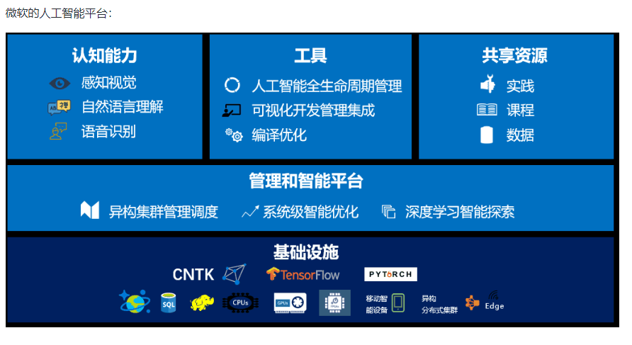

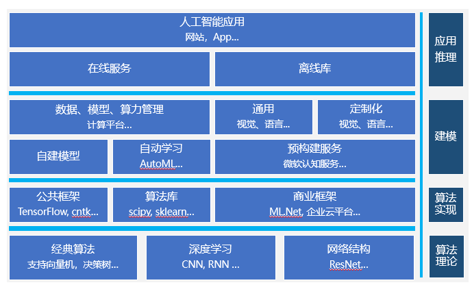

**人工智能**（Artificial Intelligence），英文缩写为AI。它是研究、开发用于模拟、延伸和扩展人的智能的理论、方法、技术及应用系统的一门新的技术科学。

人工智能是计算机科学的一个分支，它企图了解智能的实质，并生产出一种新的能以人类智能相似的方式做出反应的智能机器，该领域的研究包括机器人、语言识别、图像识别、自然语言处理等。人工智能从诞生以来，理论和技术日益成熟，应用领域也不断扩大，可以设想，未来人工智能带来的科技产品，将会是人类智慧的“容器”。人工智能可以对人的意识、思维的信息过程的模拟。人工智能不是人的智能，但能像人那样思考、也可能超过人的智能。

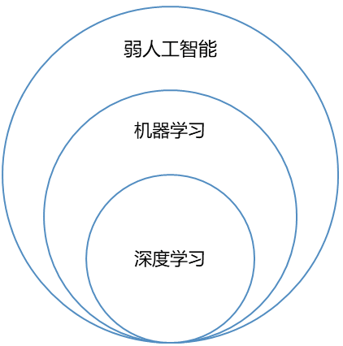

>+ ### 强人工智能

是具备与人类同等智慧、或超越人类的人工智能，能表现正常人类所具有的所有智能行为。

>+ ### 弱人工智能

处理特定的问题，并不具有人类的感知能力。前两年名噪一时的AlphaGo 程序并不知道自己在下 “围棋”，它只是忙着处理矩阵运算…

**弱人工智能**包括了包含机器学习（Machine Learning)， 机器学习又包括了深度学习（Deep Learning）

目前要打造一个人工智能的系统和应用，需要很多知识，我们分层次来看， 从离用户最近的，到离机器最近的。

>+ 交叉应用层：和其他学科的交叉融合

人工智能要和其他学科的知识结合起来，才能发挥实际的作用，例如，如果要做智能驾驶，我们就要和汽车工业，交通，规划等行业有很深的了解。人工智能可以看病，那么，我们就要和医药行业做融合，医生要了解人工智能工具需要什么数据，人工智能专家也要了解各种医学数据和流程。

>+ 平台系统：机器学习平台，工具，AI 程序设计

我们需要一个平台来支撑机器学习的训练，程序开发，测试，以及各种探索工作，新的程序设计语言说不定会发明出来（例如Julia语言），我们也要学习并让这个语言和平台上的其它模块一起工作。

>>支撑技术：模式识别，计算机视觉，语音信息处理，启发式搜索，自动规划，多智能体系统

人工智能以及有很多比较成熟的子领域，这些技术能让我们在其基础上构建更复杂和丰富的应用。

>>核心基础：机器学习，知识表示与处理

人工智能的核心还是我们如何有效地表达知识，如何表达在客观世界中我们习以为常的“常识”，如何把把知识，规律转化为机器能掌握的形式，并能逐步提高。

怎么样达到人工智能呢？历史上有不少努力，大致可以分为下面三个方向：

>+ 方法论 - 逻辑

如果程序可以用逻辑解决一切问题， 那么我们能否用逻辑表达人类的智能呢？

>+ 方法论 - 仿人类智能

人的大脑经过千万年的进化，它可以学习，那我们能否模拟人类大脑（以及神经）的交流方式，从而构造出一个能学习的程序呢？目前的深度学习的方法模拟了一些神经元交流信息的方式，但是人类对于人脑如何处理信息，如何形成概念，如何做决定还是没有明确的结论，我们的人工智能的算法是基于统计模型的结论，所以有precision/recall等概念。

>+ 方法论 - 智慧基础设施（Intelligent Infrastructure）和智慧增强（Intelligence Augmentation）

我们用计算能力和数据构建服务，它们可以增强人类的智力和创造能力。例如搜索引擎，它并不是模仿人脑思维而构造而成，但是它对于人类的贡献是十分巨大的，而且大家都觉得它是有“智能”的。

我们可以用计算能力数据和相关物理实体组成一个网络，它可以帮助人类在物流运输，医药、商业和金融这样的领域中更快速地处理事务，这也不是模仿人脑和神经的信息传播方式而得来的。

## 机器学习

**机器学习**（Machine Learning）是一门多领域交叉学科，涉及概率论、统计学、逼近论、凸分析、算法复杂度理论等多门学科。专门研究计算机怎样模拟或实现人类的学习行为，以获取新的知识或技能，重新组织已有的知识结构使之不断改善自身的性能。它是人工智能的核心，是使计算机具有智能的根本途径。

## 深度学习

**深度学习**(DL, Deep Learning)是机器学习(ML, Machine Learning)领域中一个新的研究方向。深度学习是学习样本数据，总结数据的内在规律和表示层次，这些学习过程中获得的信息对诸如文字，图像和声音等数据的解释有很大的帮助。它的最终目标是让机器能够像人一样具有分析学习能力，能够识别文字、图像和声音等数据。 深度学习是一个复杂的机器学习算法。深度学习在搜索技术，数据挖掘，机器学习，机器翻译，自然语言处理，多媒体学习，语音，推荐和个性化技术，以及其他相关领域都取得了很多成果。深度学习使机器模仿视听和思考等人类的活动，解决了很多复杂的模式识别难题，使得人工智能相关技术取得了很大进步。

**深度学习**是一类模式分析方法的统称，就具体研究内容而言，主要涉及三类方法： 

>+ 1.基于卷积运算的神经网络系统，即**卷积神经网络**(CNN)。 

>+ 2.基于多层神经元的**自编码神经网络**，包括自编码( Auto encoder)以及近年来受到广泛关注的**稀疏编码**( Sparse Coding)。 

>+ 3.以多层自编码神经网络的方式进行预训练，进而结合鉴别信息进一步优化神经网络权值的**深度置信网络**(DBN)。

## 神经网络

**人工神经网络**（Artificial Neural Networks，简写为ANNs）也简称为**神经网络**（NNs）或称作**连接模型**（Connection Model），它是一种模仿动物神经网络行为特征，进行分布式并行信息处理的算法数学模型。这种网络依靠系统的复杂程度，通过调整内部大量节点之间相互连接的关系，从而达到处理信息的目的。
神经网络的研究内容相当广泛，反映了多学科交叉技术领域的特点。主要的研究工作集中在以下几个方面：
>+ 生物原型

从生理学、心理学、解剖学、脑科学、病理学等方面研究神经细胞、神经网络、神经系统的生物原型结构及其功能机理。
>+ 建立模型

根据生物原型的研究，建立神经元、神经网络的理论模型。其中包括概念模型、知识模型、物理化学模型、数学模型等。
>+ 算法

在理论模型研究的基础上构作具体的神经网络模型，以实现计算机模拟或准备制作硬件，包括网络学习算法的研究。这方面的工作也称为技术模型研究。
神经网络用到的算法就是向量乘法，并且广泛采用符号函数及其各种逼近。并行、容错、可以硬件实现以及自我学习特性，是神经网络的几个基本优点。
## 模式识别
**模式识别**就是通过计算机用数学技术方法来研究模式的自动处理和判读，把环境与客体统称为“***模式***”。随着计算机技术的发展，人类有可能研究复杂的信息处理过程，其过程的一个重要形式是生命体对环境及客体的识别。

**模式识别**以图像处理与计算机视觉、语音语言信息处理、脑网络组、类脑智能等为主要研究方向，研究人类模式识别的机理以及有效的计算方法。
## 大数据
**大数据**（big data）是指无法在一定时间范围内用常规软件工具进行捕捉、管理和处理的数据集合，需要新处理模式才能具有更强的决策力、洞察发现力和流程优化能力的海量、高增长率和多样化的信息资产。
## 云计算
**云计算**（cloud computing）是分布式计算的一种，指的是通过网络“***云***”将巨大的数据计算处理程序分解成无数个小程序，然后，通过多部服务器组成的系统进行处理和分析这些小程序得到结果并返回给用户。通过这项技术，可以在很短的时间内（几秒种）完成对数以万计的数据的处理，从而达到强大的网络服务。

现阶段所说的云服务已经不单单是一种分布式计算，而是分布式计算、效用计算、负载均衡、并行计算、网络存储、热备份冗杂和虚拟化等计算机技术混合演进并跃升的结果。
## 基于微软研究院和visual studio2017的AI项目
### 基于本地模型的手写数字识别应用开发案例
使用Visual Studio Tools for AI加速桌面智能应用开发

>+ 典型的AI应用的代码结构和功能，如处理输入；

>+ 使用Visual Studio Tools for AI进行TensorFlow模型和.Net Framework应用环境的快速集成。

手写数字识别应用”的开发。

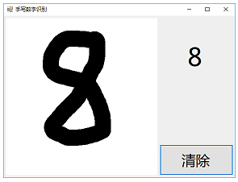

这款应用通过借力MNIST数据集，具备了最基本的手写输入功能和图像识别功能，能将用户手写的0，1，2，…，9数字单个地识别出来。该应用使用效果如图：

采取.Net Framework桌面环境作为开发环境，基于WPF框架实现用户界面，并依赖TensorFlow和VS Tools for AI等组件来完成人工智能模型的创建和集成。

### 准备工作

**samples-for-ai**样例库中包含了大量的机器学习训练和应用的示例，其中就有针对MNIST数据集的人工智能模型（下称MNIST模型）训练程序，这正是我们需要的。

**MNIST**数据集包含了大量单个手写数字的位图数据，包含各种手写风格，并且这些位图数据都已经被很好地标记过了。即每一张手写数字的位图都存在一个对应的数字，并且这个数字是可以以数据的形式被访问的。这极大地简化了我们的准备工作。

MNIST数据集为本文中识别手写数字的问题提供了大量素材，利用这些素材我们可以训练出专门用于识别单个手写数字的人工智能模型。

<u>同时，我们选择使用TensorFlow来训练MNIST模型。TensorFlow是一款使用非常普遍、很有代表性的机器学习框架。</u>

### 实战

1.首先创建模型项目。在解决方案资源管理器中，右击解决方案，指向添加，再点击新建项目，如下图所示：

2.在弹出的添加新项目的对话框里，选择 AI Tools 下的 Inference 后，在右边选择 模型推理类库(.NET Framework)，如下图所示。然后在下面的 名称 处改为 Model，并点击确定。

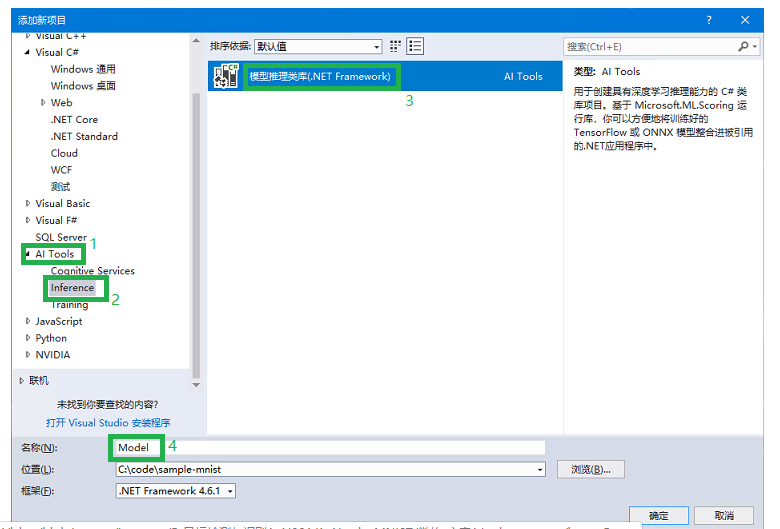

3.点击确定后，Visual Studio 会提示正在 检查环境。完成后会显示创建向导对话框，如下图。红色的框先不用担心，点击 浏览。

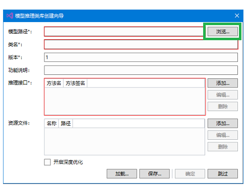

4.找到之前训练出的 saved_model.pb 文件（一般在samples-for-ai样例库下的 examples\tensorflow\MNIST\export 文件夹内），并点击 打开。如下图所示。

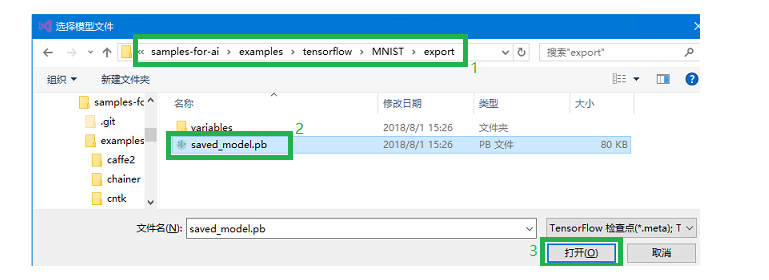

5.点击打开后，会出现 分析模型 的过程，等待分析完成。分析完成后，再如图所示在类名中输入 Mnist，最后点击 确定。第一次导入模型会下载所依赖的库，因此，正在创建项目"Model"... 的对话框会显示较长时间。

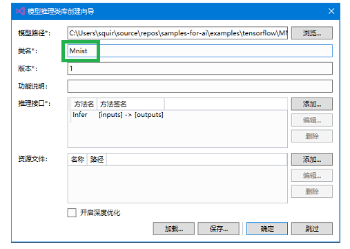

6.创建项目完成后，先检查一下是不是如图中高亮区域1所示产生了 Model 项目，并且里面有 packages.config 文件（高亮区域1）。如果没有看到此文件，通常是由于网速过慢，下载超时造成的。请参考5.2创建模型项目时出现错误。

推理类库创建成功后，我们还需要调整一个依赖项的版本，否则会出现不兼容的错误。要调整依赖项版本，请在解决方案管理器中，于 Model 项目下的 引用 上右键，选择 管理NuGet包，如下图所示。

然后在弹出的NuGet包管理页面里，找到 Microsoft.ML.Scoring 项（已经被自动安装了，比如下图中显示的 1.2.0 版），我们需要将它换成其他版本。请在下图所示的高亮区里，选择 1.0.3 版本并安装。之后等待安装完备。这样就设置好可以运行本教程的软件环境了。

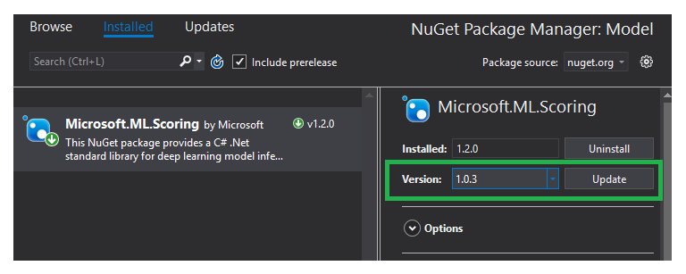

完成NuGet包的版本替换之后，我们需要在主体界面的项目上，引用我们的模型推理类库。

在解决方案资源管理器中，右击 MNIST.App 项目的 引用，并点击 添加引用。如下图高亮区域2、3所示。

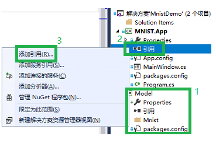

7.在弹出的对话框中，点击 项目，并在右侧将 Model 勾上。这样就能在窗体项目MNIST.App中引用 Model 项目中用于访问MNIST模型的代码了。如图所示。

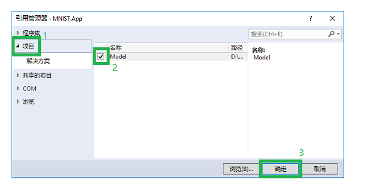

8.现在按下 CTRL+F5，或者点击工具栏上的 启动 按钮。之后便会如下图一样，我们的手写数字识别应用运行起来了！

## 总结

通过第一次人工智能课程的学习，那些曾经一度高大上、异常火爆的高逼格词汇变得不再遥远。我们对人工智能已经不是第一次接触了，但是的的确确是第一次完成人工智能开发项目。这对于我们而言是新的领域、新的挑战。相信在龚老师的带领下我们能够继续深入的探究更多人工智能方面的新鲜、有意思、激发人思考的项目。依托微软这个大平台，一定要利用好这个平台提供的各式各样的工具。

