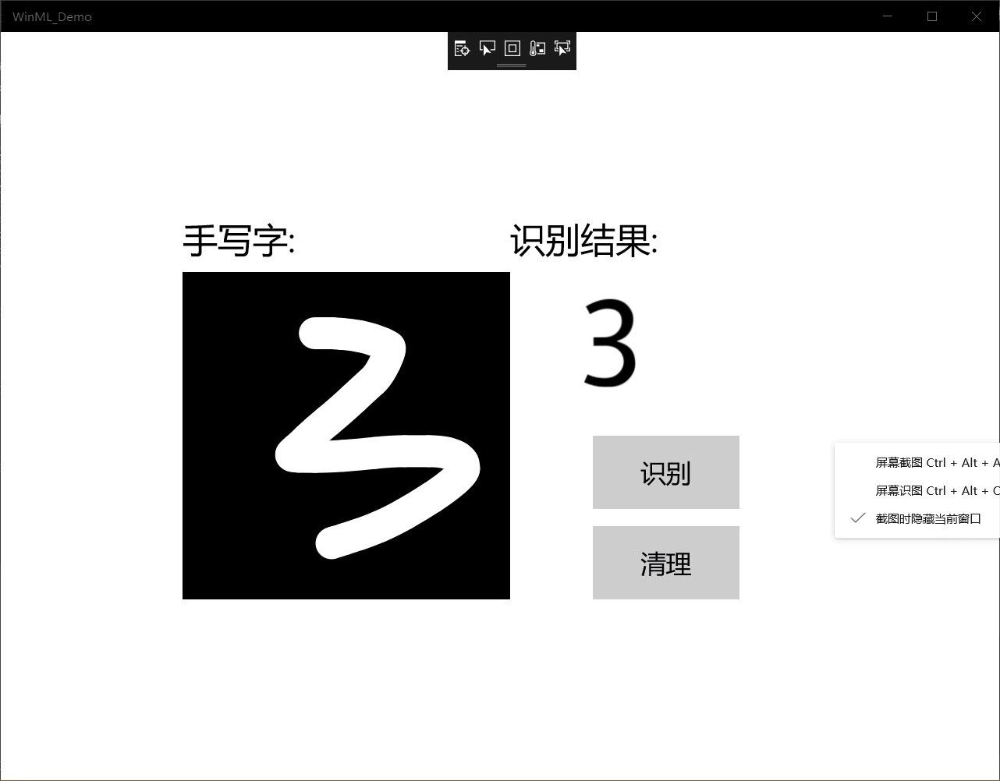

# MNIST手写数字
## 先决条件
* Windows 10（版本1809或更高版本）
* Windows 10 SDK（内部版本17763或更高版本）
* Visual Studio 2019（或Visual Studio 2017 15.7.4版或更高版本）
* 适用于VisualStudio 2019或2017的Windows Machine Learning Code Generator扩展
* 一些基本的UWP和C#知识
## 启动UWP
* 从GitHub下载项目后，启动VisualStudio并打开MNIST_Demo.sln文件（该文件位于\windows-Machine-Learning\Samples\MNIST\Tutorial\cs）。如果解决方案显示为不可用，则需要在解决方案资源管理器中右键单击项目，然后选择Reload Project。
  提供带有已实现的XAML控件和事件的模板，包括：
  * InkCanvas绘制数字。用于解释数字并清除画布的按钮。帮助程序将InkCanvas输出转换为VideoFrame的例程。在解决方案资源管理器内部，该项目具有三个主要代码文件：
  1. MainPage.xaml-我们所有的XAML代码都为LnkCanvas，按钮和标签创建UI。
  2. MainPage.xaml.cs-我们的应用程序代码所在的位置。
  3. Helper.cs-裁剪和转换图像格式的帮助程序例程。
## 构建并运行项目
* 在VisualStudio工具栏中，将解决方案平台更改为X64,以在自己的设备为64位时在本地计算机上运行该项目，如果设备为32位，则在X86上运行。（可以在Windows设置应用中检入：“系统”>“关于”>“设备规格”>“系统类型”。）
* 要运行项目，单击工具栏上的“开始调试”按钮，或按F5键。该应用程序应该显示一个LnkCanvas，用户可以在其中写一个数字，一个Recognize按钮来解释该数字，一个空标签字段，其中解释后的数字将以文本形式显示，以及一个Clear Digit按钮来清除LnkCanvas。
## 添加模型
* 右键单击解决方案资源管理器中的Assets文件夹，然后选择“添加”>“现有项”。将文件选择器指向ONNX模型的位置，然后单击添加。

该项目现在应该有两个新文件：mnist.onnx-训练的模型。mnist.cs-Windows ML生成的代码。
（为了确保在编译应用程序时能够构建模型，右键单击mnist.onnx文件，然后选择Properties。对于Build Action，选择Content。）

mnist.cs文件中新生成的代码，分为三类：
 * mnistModel创建机器学习模型表示，在系统默认设备上创建会话，将特定的输入和输出绑定到模型，并异步评估模型。
 * mnistInput初始化模型期望的输入类型。在这种情况下，输入需要一个ImageFeatureValue。
 * mnistOutput初始化模型的输出类型。在这种情况下，输出是将TensorFloat类型的名为Plus214_Output_0的列表。
## 加载，绑定和评估模型
对于Windows ML 应用程序，要遵循ed模式是：“加载”>“绑定”>“求值”。加载机器学习模型。将输入和输出绑定到模型。评估模型并查看结果。我们将使用mnist.cs中生成的接口代码来加载，绑定和评估应用程序中的模型。
* 加载模型
  * 在MainPage.xaml.cs中，我们实例化模型，输入和输出。将以下成员变量添加到MainPage类：
     private mnistModel ModelGen;
     private mnistInput ModelInput = new mnistInput；
     private mnistOutput ModelOutput;
  * 在LoadModelAsync中，将加载模型。使用任何模型的方法。该mnistModel类表示MNIST模式并创建系统默认设备上的会话。要加载模型，我们调用CreateFromStreamAsync方法，并传入ONNX文件作为参数。
* 绑定模型 
  * 要将输入和输出绑定到模型。生成的代码还包括mnistInput和mnistOutput包装器类。所述mnistInput类表示该模型的预期输入，并且mnistOutput类表示该模型的预期的输出。
  * 要初始化模型的输入对象，调用mnistInput类构造函数，传入您的应用程序数据，并确保输入数据与模型期望的输入类型匹配。该mnistInput类期待一个ImageFeatureValue，所以使用一个辅助方法获取ImageFeatureValue为输入。使用helper.cs中包含的帮助函数，将复制InkCanvas的内容，将其转换ImageFeatureValue类型，然后将其绑定到模型。
* 评估模型 
  * 对于输出，只需使用指定的输入调用EvaluateAsync。输入初始化后，调用模型的EvaluateAsync方法以根据输入数据评估模型。EvaluateAsync将输入和输出绑定到模型对象，并在输入上评估模型。由于模型返回了输出张量，因此首先要将其转换为友好的数据类型，然后解析返回的列表以确定哪个数字具有最高的概率并显示该数字。
  * 我们要清除InkCanvas，以允许用户绘制另一个数字
## 启动应用程序
构建并启动应用程序后，将能够识别在LnkCanvas上绘制的数字。

## 总结
MNIST数据集与你自己采集的图像，实际上是两个不同的数据集，你在MNIST上训练，然后在你的数据集上测试，测试性能不好是十分正常的。这实际上涉及在两个相似但是不同的域之间的迁移学习的问题。有三个办法解决你的问题：

1. 对自己的数据集进行正确的归一化，包括裁剪、平移、缩放、二值化等，让它们至少看起来与MNIST数据集中的图像类似，这样识别率会改善。

2. 先在MNIST上训练你的CNN模型（预训练），再用自己的数据集进行训练（精调），一般也可以获得识别率的提升；

3. 如果想获得更高的识别率，建立自己的大规模数据集（规模与MNIST相当），然后直接训练。
