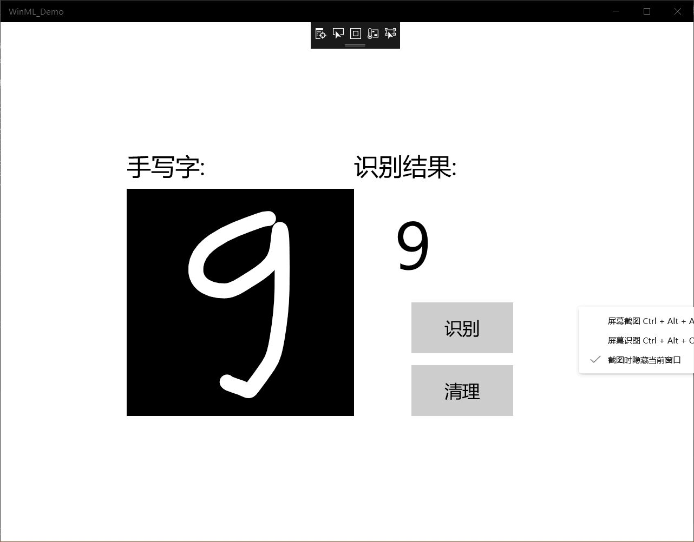

## 第六次作业
### MNIST手写数字
#### 先决条件
    Windows 10（版本1809或更高版本）
    Windows 10 SDK（内部版本17763或更高版本）
    Visual Studio 2019（或Visual Studio 2017 15.7.4版或更高版本）
    适用于Visual Studio 2019或2017的 Windows Machine Learning Code Generator扩展
    一些基本的UWP和C＃知识
#### 启动UWP
从GitHub下载项目后，启动Visual Studio并打开MNIST_Demo.sln文件（该文件应该位于 \ Windows-Machine-Learning \ Samples \ MNIST \ Tutorial \ cs）。如果解决方案显示为不可用，则需要在解决方案资源管理器中右键单击该项目，然后选择Reload Project。
#### 构建并运行项目
在Visual Studio工具栏中，将解决方案平台更改为x64，以在您的设备为64位时在本地计算机上运行该项目，如果设备为32位，则在x86上运行。（您可以在Windows设置应用中检入：“ 系统”>“关于”>“设备规格”>“系统类型”。）

要运行项目，请单击工具栏上的“ 开始调试”按钮，或按F5键。该应用程序应该显示一个InkCanvas，用户可以在其中写一个数字，一个Recognize按钮来解释该数字，一个空标签字段，其中解释后的数字将以文本形式显示，以及一个Clear Digit按钮来清除InkCanvas。
#### 添加模型
右键单击解决方案资源管理器中的Assets文件夹，然后选择“ 添加” >“ 现有项”。将文件选择器指向ONNX模型的位置，然后单击添加。

该项目现在应该有两个新文件： mnist.onnx-训练的模型。 mnist.cs -Windows ML生成的代码
#### 加载，绑定和评估模型
对于Windows ML应用程序，我们要遵循的模式是：“加载”>“绑定”>“求值”。

加载机器学习模型。 将输入和输出绑定到模型。 评估模型并查看结果。 我们将使用mnist.cs中生成的接口代码来加载，绑定和评估应用程序中的模型。

添加已有代码即可；
#### 运行结果

#### 实验总结
  通过本节课的学习，我学会了用MNIST识别数字。这是一个可以边测试边学习的过程，随着输入数据的增加，识别率也会逐渐变高，可以收入大量不同人手写的数字，避免全部由一个人手写。MNIST是一个简单的图片数据集，包含了大量的数字手写图片，MNIST数据集是包含数据信息的，它一共包含三个部分，训练数据集，测试数据集，验证数据集。编程过程中，要实例化模型，输入和输出，将成员变量添加到MainPage类中，在LoadModeAsync中，加载模型，再输入和输出绑定到模型。生成的代码还包括mnistInput和mnistOutput包装器类。调用mnistInput类构造函数，传入应用程序数据，并确保出入数据与模型期望的输入类型匹配。