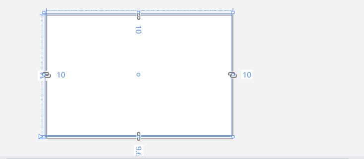
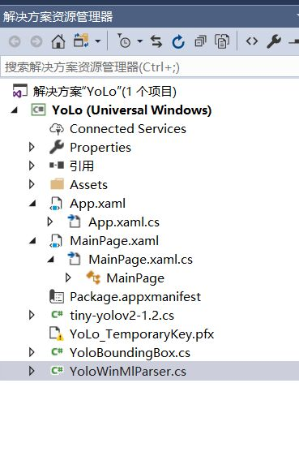
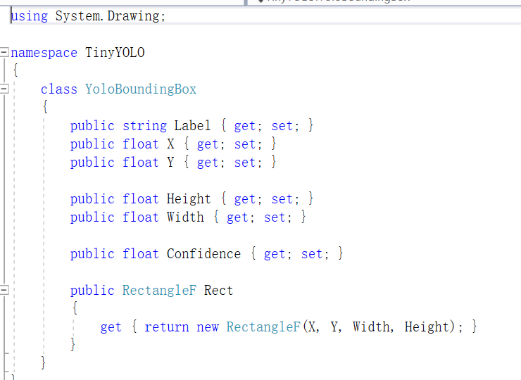
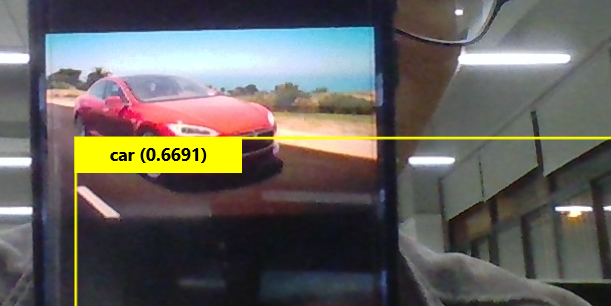

# YOLO-V1.2-WinML-Sample
## 工程的创建
改工程的创建与mnist的WinML一样可以参考[我第六次作业](https://github.com/mo660/RobotVision/tree/master/Exercises/20191022%E7%AC%AC6%E6%AC%A1%E4%BD%9C%E4%B8%9A/201702041chenziliang)

## 应用布局
**MainPage.xaml**在其中的源中加入Grid代码

    <Grid>
            <Grid.RowDefinitions>
                <RowDefinition Height="*" />
                <RowDefinition Height="Auto" />
            </Grid.RowDefinitions>
            <Custom:CameraPreview x:Name="CameraPreview"
                            Grid.Row="0" />
            <Canvas Name="YoloCanvas"
                    Grid.Row="0" />
            <TextBlock x:Name="TextBlockInformation"
                    Grid.Row="1" />
        </Grid>

改布局是一个**CameraPreview**类型的，就是一个摄像机显示。其效果图
该方框图将会获取你的摄像头，展现你摄像头的内容。

## 文件

**YoloWinMlParser.cs**是自己编写的，里面是是对物体识别所做的处理如图所示，对于模板可以的识别的东西进行编著和定位。

**YoloBoundingBox.cs**也是自己编写的，对摄像头的尺寸进行操作

**tiny-yolov2-1.2.cs**是添加onnx文件后自动生成的。

**MainPage.xaml.cs**是代码的编写，对于显示控件的功能进行定义，是主程序文件。

## 部分代码的理解
改代码是摄像头获取的尺寸

    private void GetCameraSize()
            {
                _canvasActualWidth = (uint)CameraPreview.ActualWidth;
                _canvasActualHeight = (uint)CameraPreview.ActualHeight;
            }

不知道理解的到不到位，我认为，这是获取摄像头所得到的数据。

    private async void CameraHelper_FrameArrived(object sender, Microsoft.Toolkit.Uwp.Helpers.FrameEventArgs e)
            {
                if (e?.VideoFrame?.SoftwareBitmap == null) return;

                SoftwareBitmap softwareBitmap = SoftwareBitmap.Convert(e.VideoFrame.SoftwareBitmap, BitmapPixelFormat.Bgra8, BitmapAlphaMode.Premultiplied);
                VideoFrame inputFrame = VideoFrame.CreateWithSoftwareBitmap(softwareBitmap);
                _input.image = ImageFeatureValue.CreateFromVideoFrame(inputFrame);

                // Evaluate the model
                _stopwatch = Stopwatch.StartNew();
                _output = await _model.EvaluateAsync(_input);
                _stopwatch.Stop();

                IReadOnlyList<float> VectorImage = _output.grid.GetAsVectorView();
                float[] ImageAry = VectorImage.ToArray();

                _boxes = _parser.ParseOutputs(ImageAry);

                await Dispatcher.RunAsync(CoreDispatcherPriority.Normal, async () =>
                {
                    TextBlockInformation.Text = $"{1000f / _stopwatch.ElapsedMilliseconds,4:f1} fps on Width {_canvasActualWidth} x Height {_canvasActualHeight}";
                    DrawOverlays(e.VideoFrame);
                });

                //Debug.WriteLine(ImageList.ToString());
            }
>其中
    await Dispatcher.RunAsync(CoreDispatcherPriority.Normal, async () =>
                {
                    TextBlockInformation.Text = $"{1000f / _stopwatch.ElapsedMilliseconds,4:f1} fps on Width {_canvasActualWidth} x Height {_canvasActualHeight}";
                    DrawOverlays(e.VideoFrame);
                });这是对帧率，界面的高宽的显示

## 实验结果
**识别出了汽车，但是似乎定位的不是特别准确。**

# 总结
这个实验的代码是挺复杂的，其中对于摄像头数据的获取，已经识别类别的确立是难点。该实验的损耗计算机资源非常大，其onnx模板的获取也是非常之难的，对于azure的运用我现在还无法申请账号，模板以及代码都是老师给的。这次的WinML文件和上次不同，多了两个cs文件，需要自己编写，是非常复杂的，需要很强的代码能力，自己说实话，都没有怎么看懂，对于C#语言的语法掌握非常少，如果自己能多花点时间去学习C#，自己应该可以看懂代码。