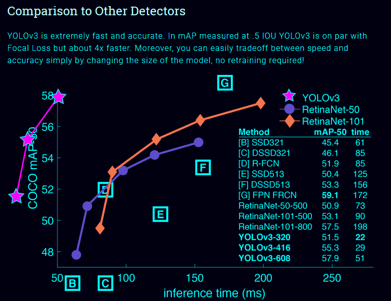
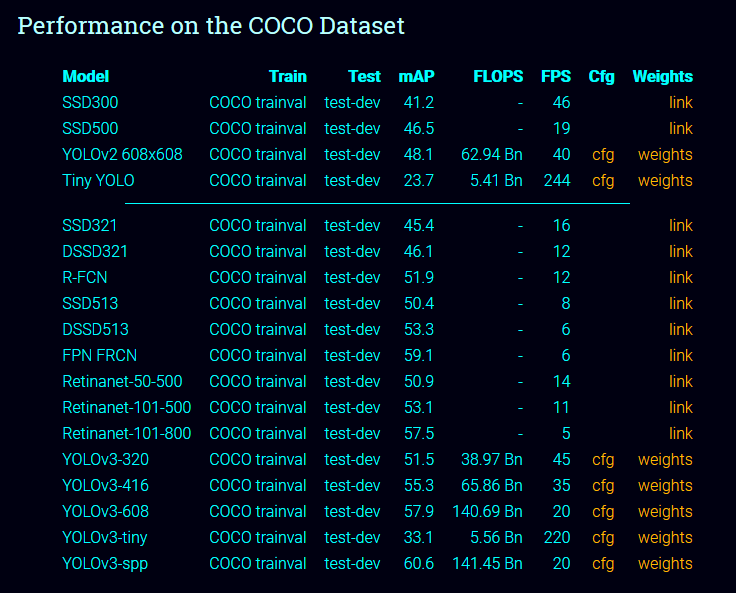
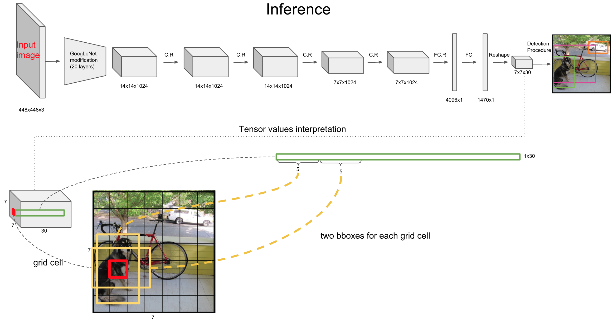
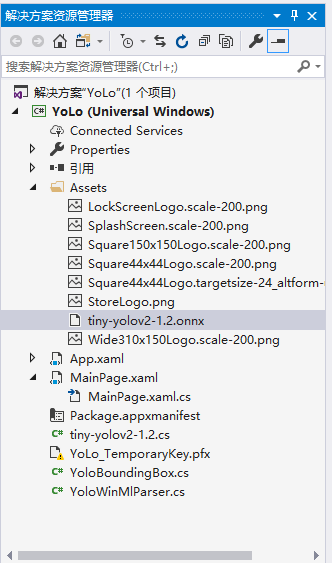
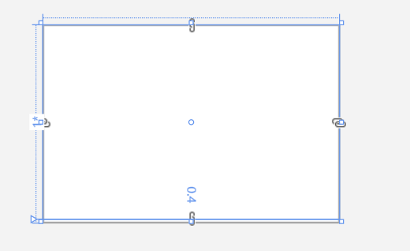
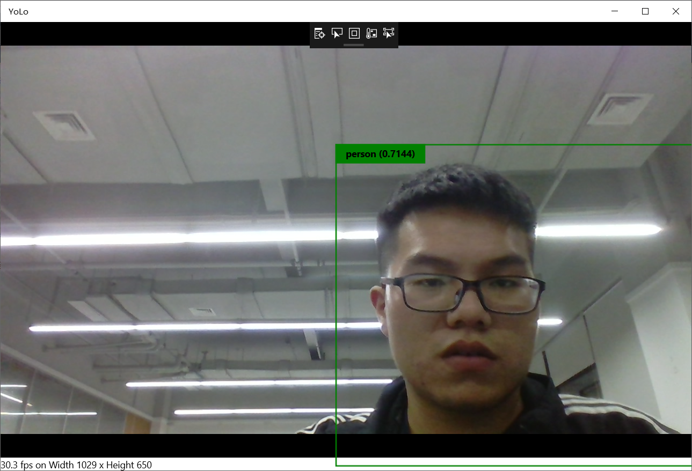
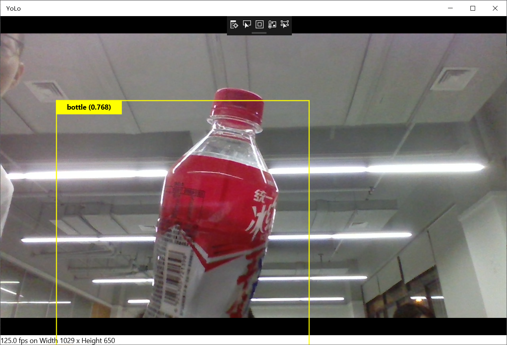
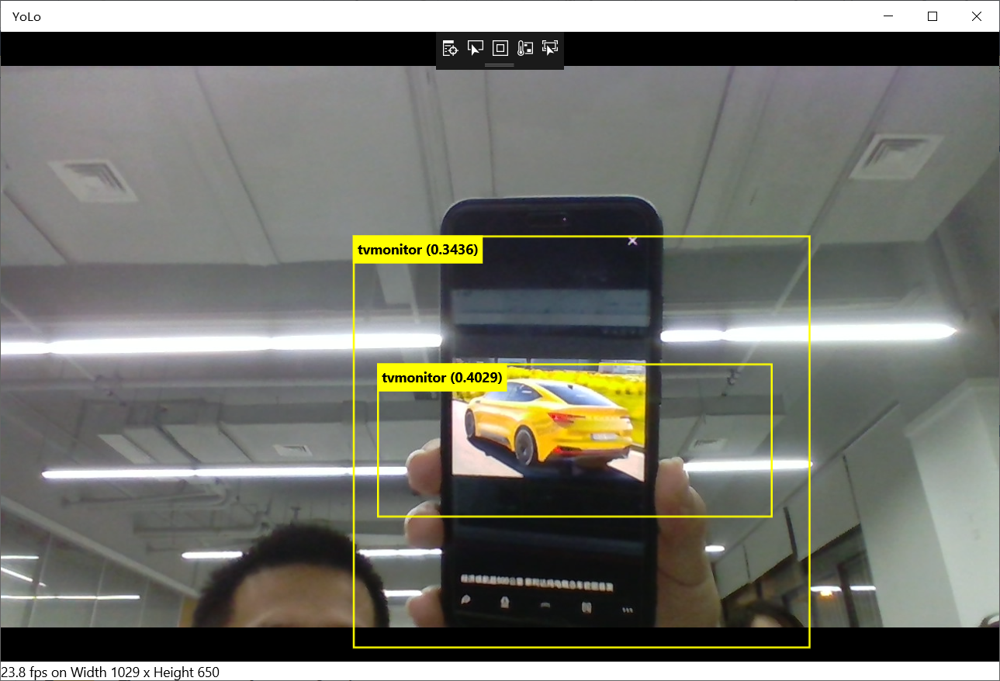
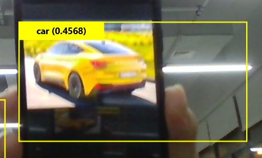

RobotVision
-------
# 第八次总结
# 第八次课题：基于深度学习算法的目标检测算法--YOLO

# YOLO: Real-Time Object Detection 实时对象检测算法

## Comparison to Other Detectors

**YOLOv3** is extremely fast and accurate. In mAP measured at .5 IOU YOLOv3 is on par with Focal Loss but about 4x faster. Moreover, you can easily tradeoff between speed and accuracy simply by changing the size of the model, no retraining required!

与其他探测器的比较 YOLOv3非常快速和准确。在mAP值为0.5 IOU时，YOLOv3与Focal Loss相当，但速度约快4倍。此外，只需更改模型的大小即可轻松在速度和精度之间进行权衡，而无需重新训练！

## How It Works

We use a totally different approach. We apply a single neural network to the full image. This network divides the image into regions and predicts bounding boxes and probabilities for each region. These bounding boxes are weighted by the predicted probabilities.

YOLO使用完全不同的方法。将单个神经网络应用于完整图像。该网络将图像划分为多个区域，并预测每个区域的边界框和概率。这些边界框由预测的概率加权。

Our model has several advantages over classifier-based systems. It looks at the whole image at test time so its predictions are informed by global context in the image. It also makes predictions with a single network evaluation unlike systems like R-CNN which require thousands for a single image. This makes it extremely fast, more than 1000x faster than R-CNN and 100x faster than Fast R-CNN.

与基于分类器的系统相比，我们的模型具有多个优势。它在测试时查看整个图像，因此其预测由图像中的全局上下文提供。它还像R-CNN这样的系统需要单个网络评估来进行预测，而R-CNN单个图像需要数千个。这使其变得非常快，比R-CNN快1000倍以上，比Fast R-CNN快100倍。

If you don't already have Darknet installed, you should do that first.

**Darknet**会打印出它检测到的对象，其置信度以及找到它们所花费的时间。我们没有使用OpenCV编译Darknet，因此它无法直接显示检测结果。相反，它将它们保存在predictions.png中。您可以打开它以查看检测到的对象。由于我们在CPU上使用Darknet，因此每个图像大约需要6-12秒。如果我们使用GPU版本，它将更快。

更多相关内容详见:

<https://pjreddie.com/darknet/yolo/>

<https://www.jianshu.com/p/13ec2aa50c12>

YOLO的检测思想不同于R-CNN系列的思想，它将目标检测作为回归任务来解决。

下面来看看YOLO的整体结构：

由上两图所示，网络是根据GoogLeNet改进的，输入图片为448*448大小，输出为7*7*(2*5+20)，现在看来这样写输出维度很奇怪，下面来看一下输出是怎么定义的。

将图片分为S * S个单元格(S=7)，之后的输出是以单元格为单位进行的：

1.如果一个object的中心落在某个单元格上，那么这个单元格负责预测这个物体。

2.每个单元格需要预测B个bbox值(bbox值包括坐标和宽高，原文中B=2)，同时为每个bbox值预测一个置信度(confidence scores)。也就是每个单元格需要预测B×(4+1)个值。

3.每个单元格需要预测C(物体种类个数，原文C=20，这个与使用的数据库有关)个条件概率值。

所以，最后网络的输出维度为S * S * (B * 5 + C)，这里虽然每个单元格负责预测一种物体(这也是这篇文章的问题，当有小物体时可能会有问题)，但是每个单元格可以预测多个bbox值(这里可以认为有多个不同形状的bbox，为了更准确的定位出物体，如下图所示)。

至于大神的一通数学分析我并没有细致研究。也不是我主要的研究领域，暂时搁置。

可以看到，YOLO中依旧使用ONNX Runtime封装ONNX模型来实现目标检测。

Assets文件中的.png文件均是识别物体的矩形框，不同的是，各自的框体尺寸不同，用于识别不同可信度，不同大小的物体。

## 识别页面布局：MainPage.xaml

    <Grid>
            <Grid.RowDefinitions>
                <RowDefinition Height="*" />
                <RowDefinition Height="Auto" />
            </Grid.RowDefinitions>
            <Custom:CameraPreview x:Name="CameraPreview"
                          Grid.Row="0" />
            <Canvas Name="YoloCanvas"
                Grid.Row="0" />
            <TextBlock x:Name="TextBlockInformation"
                   Grid.Row="1" />
    </Grid>

## 识别场景：

识别为人

识别为水杯

识别为屏幕

识别为car

## 摄像头的调度：
     protected override async void OnNavigatedTo(NavigationEventArgs e)
        {
            // Load the model
            await LoadModelAsync();

            GetCameraSize();
            Window.Current.SizeChanged += Current_SizeChanged;

            await CameraPreview.StartAsync();
            CameraPreview.CameraHelper.FrameArrived += CameraHelper_FrameArrived;
        }

识别物体的具体参数：

# 总结

    今天使用了YOLO，对深度学习中目标物体检测第一次接触。
    以前仅仅是在无人驾驶汽车技术中看到这样的物体识别技术。感觉非常先进，我觉得这个和3D建模还有视觉识别算法有很大的关联。除了可以用来为无人驾驶技术路面的物体识别服务还可以有很多应用场景，比如上班打卡、比如机场安检等等。只要机器学习的样本足够大，它的偏差就会足够小，甚至可以忽略不计，这样才能真正为我们的生活服务，解放生产力。
    对于今天程序的算法，感觉没能吃透。尤其是对于摄像头调度算法这块的，本来想多写一些篇幅的，最后苦于实在不懂原理，有心无力而为之。希望明天在龚老师的讲解下，结合自己今晚的思考，能有新的认识和进步。

