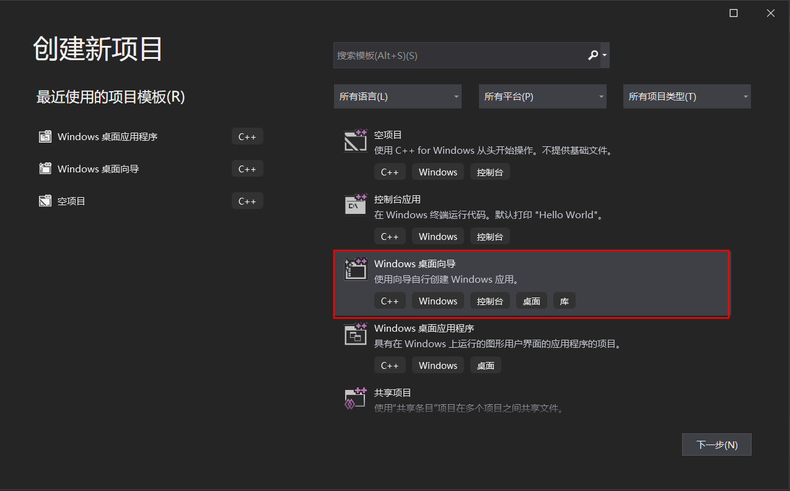

2020.11.24 201809058  Wang Yulong
<font face = 楷体 >

# OpenCV的安装、Visual Studio的安装与配置测试

----

1.安装Visual Studio 2019 Community


<center>图1 下载Community版的Visual Studio</center>

2.安装 openCV ，在下方网址选择opencv-4.5.0版本
https://www.bzblog.online/wordpress/index.php/2020/03/09/opencvdownload/


<center>图2 opencv的版本</center>


3.配置opencv的环境变量
步骤：我的电脑-->右键属性-->高级系统设置-->高级-->环境变量-->系统变量Path-->添加opencv的dll文件的安装路径


<center>图3 系统环境变量Path</center>


<center>图4 opencv的dll文件路径</center>


<center>图5 添加dll路径至Path</center>

4.在Visual Studio 2019 Community中创建工程

①打开软件后，创建新项目

<center>图6  创建项目</center>

②选择Windows桌面应用程序

<center>图7 选择工程类型</center>

③自动生成工程名，并创建


<center>图8 创建工程 </center>


④选择 Debug x64 ，一定要选对，否则会影响后续实验

<center>图9 选择Visual Studio平台的调试器</center>

⑤选择C++源文件

<center>图10 添加C++源文件</center>


⑥属性配置：视图-->其他窗口-->属性管理器


<center>图11 属性配置</center>

⑦添加包含目录和库目录的路径
包含目录：

******（磁盘路径）\opencv\build\include


******（磁盘路径）\opencv\build\include\opencv2


库目录：

******（磁盘路径）\opencv\build\x64\vc15\lib


<center>图12 包含目录与库目录配置</center>
⑧添加附加依赖项，将v15文件夹的lib文件名复制进去即可


<center>图13 附加依赖项</center>


<center>图14 lib文件名</center>

---

# <center>  5.测试 </center> 

## 5.1 ShowImg---imread()函数

```cpp

#include <iostream>
#include <opencv2/opencv.hpp>

using namespace cv;

int main()
{
    Mat img = imread("C:\\Users\\NewAdmin\\Pictures\\1.jpg");

	imshow("图片", img);

	waitKey(0);
    }
```


<center>图15 图片展示</center>

（1）imread函数用于读取文件中的图片到OpenCV中，其格式为：
```cpp
Mat imread（const string& filename, intflages=1);
```
（2） imshow函数用于在指定的窗口中显示一幅图像，其函数原型为：
```cpp
void imshow（const string& winname，InputArray mat）；
```
## 5.2 ErodeImg---erode()函数

```cpp
#include<iostream>
#include<opencv2/highgui/highgui.hpp>
#include<opencv2/imgproc/imgproc.hpp>

using namespace cv;

int main()
{
	Mat img = imread("C:\\Users\\NewAdmin\\Pictures\\1.jpg");

	imshow("图片 腐蚀操作", img);
	Mat element = getStructuringElement(MORPH_RECT, Size(10, 10));
	Mat dstImage;
	erode(img, dstImage, element);
	imshow("效果图 腐蚀操作",dstImage);

	waitKey(0);
}
```


<center>图16 图片腐蚀</center>

erode()函数可以对输入图像用特定结构元素进行腐蚀操作，该结构元素确定腐蚀操作过程中的邻域的形状，各点像素值将被替换为对应邻域上的最小值：
```cpp
erode（InputArray src，OutputArraydst，InputArray kernel，Point anchor，int iterations，int borderType，constScalar& borderValue)
```
（1）第一个参数，InputArray 类型的 src，输入图像，即源图像，填 Mat 类的对象即可。图像通道的数量可以是任意的，但图像深度应为 CV_8U，CV_16U，CV_16S，CV_32F 或 CV_64F 其中之一。

（2）第二个参数，OutputArray 类型的 dst，即目标图像，需要和源图片有一样的尺寸和类型。

（3）第三个参数，InputArray 类型的 kernel，腐蚀操作的内核。若为 NULL 时，表示的是使用参考点位于中心 3x3 的核。我们一般使用函数 getStructuringElement 配合这个参数的使用。getStructuringElement 函数会返回指定形状和尺寸的结构元素（内 核矩阵）。

（4）第四个参数，Point 类型的 anchor，锚的位置，其有默认值（-1，-1），表示锚位于单位（element）的中心，我们一般不用管它。

（5）第五个参数，int 类型的 iterations，迭代使用 erode（）函数的次数，默认值为 1。

（6）第六个参数，int 类型的 borderType，用于推断图像外部像素的某种边界模式。注意它有默认值 BORDER_DEFAULT。

（7）第七个参数，const Scalar&类型的 borderValue，当边界为常数时的边界值，有默值 morphologyDefaultBorderValue()。

## 5.3 BlurImg---blur()函数

```cpp
#include<iostream>
#include<opencv2/highgui/highgui.hpp>
#include<opencv2/imgproc/imgproc.hpp>

using namespace cv;

int main()
{
	Mat img = imread("C:\\Users\\NewAdmin\\Pictures\\1.jpg");

	imshow("均值滤波 【原图】", img);
	Mat dstImage;
	
	blur(img, dstImage, Size(7,7));
	imshow("均值滤波【效果图】",dstImage);

	waitKey(0);
}
```