# 第一次作业

## opencv安装以及配置

**软件准备**
1. Visual Studio 2019
2. opencv

**环境配置**
环境变量配置

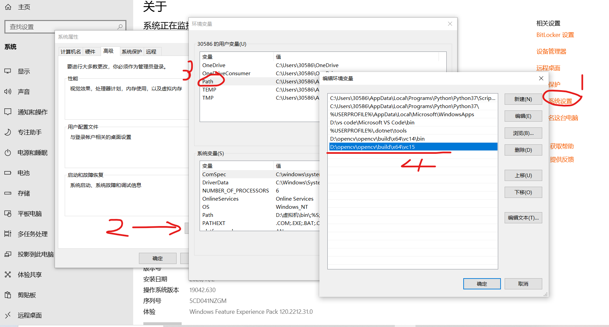

在vs2019创建项目进行操作,并配置相关参数
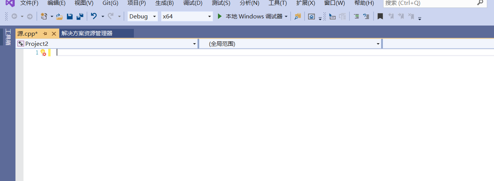
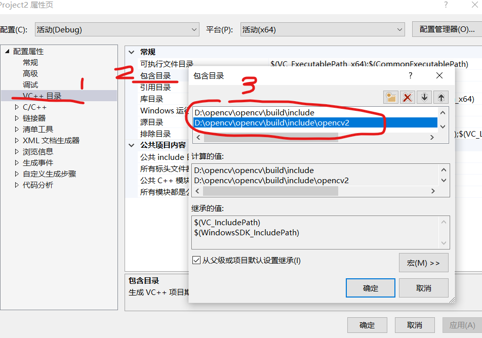

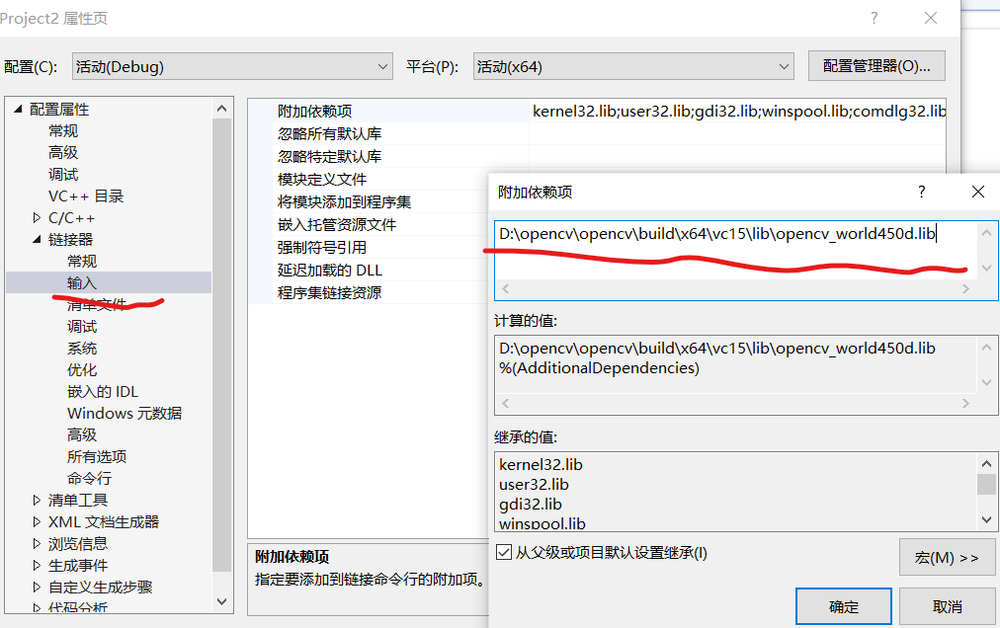

## opencv实验

### opencv 图像处理

（1）imread函数用于读取文件中的图片到OpenCV中，其格式为：
```c++
Mat imread（const string& filename, intflages=1);
```
（2） imshow函数用于在指定的窗口中显示一幅图像，其函数原型为：
```c++
void imshow（const string& winname，InputArray mat）；
```
#### **实验一图像显示**
```c++
#include<opencv2/opencv.hpp>

#include<iostream>

using namespace cv;

int main(int argc, char** argv) {

	Mat image = imread("D:/image/testopencv.jpg");

	if (image.empty()) {

		printf("could not load image...\n");

		return -1;

	}

	namedWindow("test_opencv_setup", 0);

	imshow("test_opencv_srtup", image);

	waitKey(0);

	return 0;

}
```
**实验运行结果**
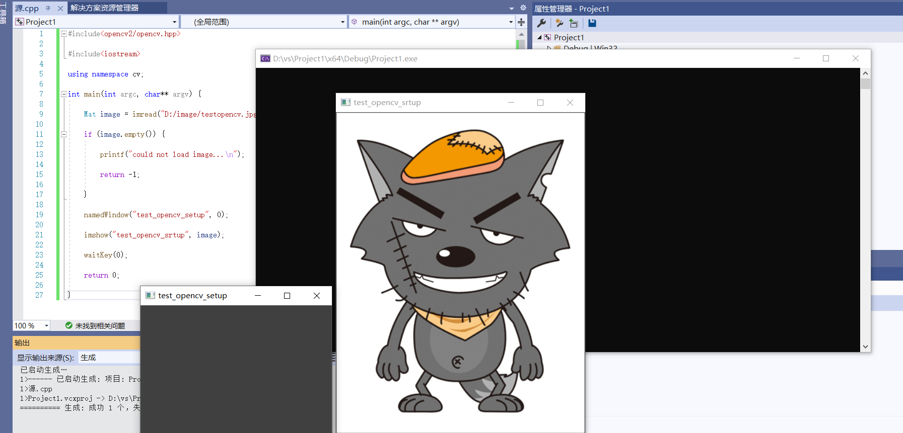

#### **实验二图像腐蚀**

erode()函数可以对输入图像用特定结构元素进行腐蚀操作，该结构元素确定腐蚀操作过程中的邻域的形状，各点像素值将被替换为对应邻域上的最小值：

```c++
erode（InputArray src，OutputArraydst，InputArray kernel，Point anchor，int iterations，int borderType，constScalar& borderValue)
```
（1）第一个参数，InputArray 类型的 src，输入图像，即源图像，填 Mat 类的对象即可。图像通道的数量可以是任意的，但图像深度应为 CV_8U，CV_16U，CV_16S，CV_32F 或 CV_64F 其中之一。

（2）第二个参数，OutputArray 类型的 dst，即目标图像，需要和源图片有一样的尺寸和类型。

（3）第三个参数，InputArray 类型的 kernel，腐蚀操作的内核。若为 NULL 时，表示的是使用参考点位于中心 3x3 的核。我们一般使用函数 getStructuringElement 配合这个参数的使用。getStructuringElement 函数会返回指定形状和尺寸的结构元素（内 核矩阵）。

（4）第四个参数，Point 类型的 anchor，锚的位置，其有默认值（-1，-1），表示锚位于单位（element）的中心，我们一般不用管它。

（5）第五个参数，int 类型的 iterations，迭代使用 erode（）函数的次数，默认值为 1。

（6）第六个参数，int 类型的 borderType，用于推断图像外部像素的某种边界模式。注意它有默认值 BORDER_DEFAULT。

（7）第七个参数，const Scalar&类型的 borderValue，当边界为常数时的边界值，有默值 morphologyDefaultBorderValue()。

```c++
#include <opencv2/highgui/highgui.hpp>
#include <opencv2/imgproc/imgproc.hpp>
using namespace cv;

int main() {
	Mat srcImage = imread("D:/image/testopencv.jpg");
	imshow("[原图]腐蚀操作",srcImage);
	Mat element = getStructuringElement(MORPH_RECT, Size(15, 15));
	Mat dstImage;
	erode(srcImage, dstImage, element);
	imshow("[效果图]腐蚀操作",dstImage);
	waitKey(0);
	return 0;
}
```

**实验结果**
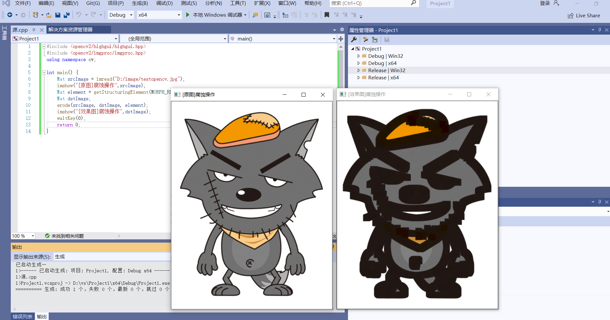


#### **实验三图像模糊处理**

主要函数说明： blur函数的作用是对输入的图像src进行均值滤波后用dst输出。格式为： void blur(InputArray src, OutputArraydst, Size ksize, Point anchor=Point(-1,-1), int borderType=BORDER_DEFAULT )；

（1）第一个参数，InputArray类型的src，输入图像，即源图像，填Mat类的对象即可。该函数对通道是独立处理的，且可以处理任意通道数的图片，但需要注意，待处理的图片深度应该为CV_8U, CV_16U, CV_16S, CV_32F 以及 CV_64F之一。

（2）第二个参数，OutputArray类型的dst，即目标图像，需要和源图片有一样的尺寸和类型。比如可以用Mat::Clone，以源图片为模板，来初始化得到如假包换的目标图。

（3）第三个参数，Size类型（对Size类型稍后有讲解）的ksize，内核的大小。一般这样写Size( w,h )来表示内核的大小( 其中，w 为像素宽度， h为像素高度)。Size（3,3）就表示3x3的核大小，Size（5,5）就表示5x5的核大小。

（4）第四个参数，Point类型的anchor，表示锚点（即被平滑的那个点），注意他有默认值Point(-1,-1)。如果这个点坐标是负值的话，就表示取核的中心为锚点，所以默认值Point(-1,-1)表示这个锚点在核的中心。

（5）第五个参数，int类型的borderType，用于推断图像外部像素的某种边界模式。有默认值BORDER_DEFAULT。

```c++

#include <opencv2/highgui/highgui.hpp>
#include <opencv2/imgproc/imgproc.hpp>
using namespace cv;

int main() {
	Mat srcImage = imread("D:/image/testopencv.jpg");//加载图片
	imshow("[原图]均值滤波",srcImage);//显示
	Mat dstImage;//初始化，有点像java
	blur(srcImage, dstImage, Size(7, 7));//调用库函数
	imshow("[效果图]均值滤波",dstImage);
	waitKey(0);
}
```

**实验结果**

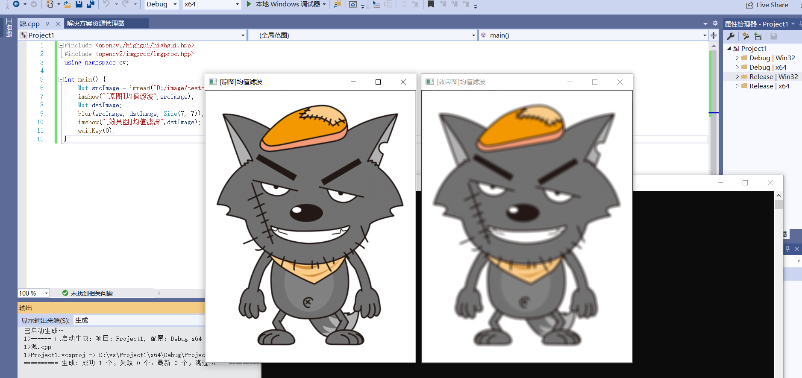

#### **实验四carry边缘检测**

主要函数说明：

```c++
void cvCanny( const CvArr* image, CvArr* edges, double threshold1, double threshold2, int aperture_size=3 );
```
（1）它的第一个参数表示输入图像，必须为单通道灰度图。

（2）第二个参数表示输出的边缘图像，为单通道黑白图。

（3）第三个参数和第四个参数表示阈值，这二个阈值中当中的小阈值用来控制边缘连接，大的阈值用来控制强边缘的初始分割即如果一个像素的梯度大与上限值，则被认为是边缘像素，如果小于下限阈值，则被抛弃。如果该点的梯度在两者之间则当这个点与高于上限值的像素点连接时我们才保留，否则删除。

（4）第五个参数表示Sobel 算子大小，默认为3即表示一个3*3的矩阵。 边缘检测的一般步骤

1）滤波：边缘检测的算法主要是基于图像强度的一阶和二阶导数，但导数通常对噪声很敏感，因此必须采用滤波器来改善与噪声有关的边缘检测器的性能。常见的滤波方法主要有高斯滤波，即采用离散化的高斯函数产生一组归一化的高斯核，然后基于高斯核函数对图像灰度矩阵的每一点进行加权求和。

2）增强：增强边缘的基础是确定图像各点邻域强度的变化值。增强算法可以将图像灰度点邻域强度值有显著变化的点凸显出来。在具体编程实现时，可通过计算梯度幅值来确定。

3）检测：经过增强的图像，往往邻域中有很多点的梯度值比较大，而在特定的应用中，这些点并不是我们要找的边缘点，所以应该采用某种方法来对这些点进行取舍。实际工程中，常用的方法是通过阈值化方法来检测。

```c++
#include <opencv2/highgui/highgui.hpp>
#include <opencv2/imgproc/imgproc.hpp>
using namespace cv;

int main() {
	Mat srcImage = imread("D:/image/testopencv.jpg");//加载图片
	imshow("Carry边缘检检测",srcImage);//显示

	Mat dstImage,edge, grayImage;
	dstImage.create(srcImage.size(), srcImage.type());//初始化
	cvtColor(srcImage, grayImage, COLOR_BGR2GRAY);//滤去颜色

	blur(grayImage, edge, Size(3, 3));//模糊处理
	Canny(edge, edge, 3, 9, 3);
	imshow("[效果图]Carry边缘检测",edge);
	waitKey(0);
	return 0;
}
```

**实验结果**


### opencv 视频操作

#### **实验五读取播放视频**

```c++
#include <opencv2\opencv.hpp>
using namespace cv;

int main()
{
	VideoCapture capture("D:/test/1.avi");//加载进去，感觉像极了java
while (1) {	
	Mat frame;
	capture >>frame;
	imshow("读取视频",frame);
	waitKey(30);
}
return 0;
}
```
下载视频并且存放到代码所指定的文件夹
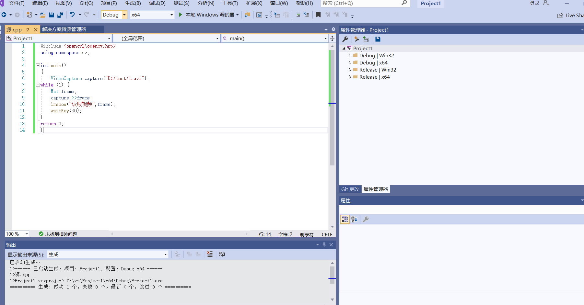
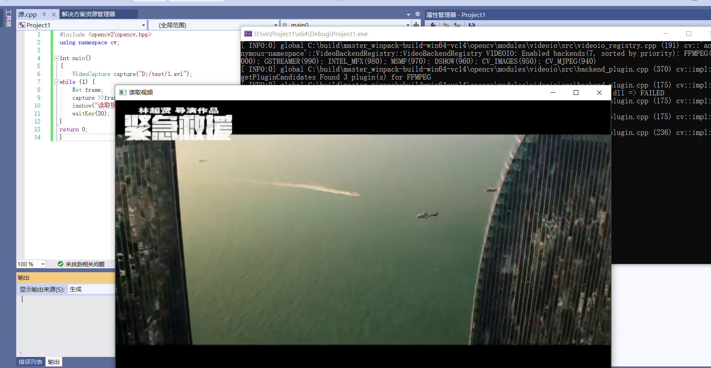

#### **实验六调用摄像头采集图像**

```c++
#include <opencv2\opencv.hpp>
using namespace cv;

int main()
{
	VideoCapture capture(0);//对比之前写的，这里就是直接获取视频了
while (1) {	
	Mat frame;
	capture >>frame;
	imshow("读取视频",frame);
	waitKey(30);
}
return 0;
}
```

**实验结果**
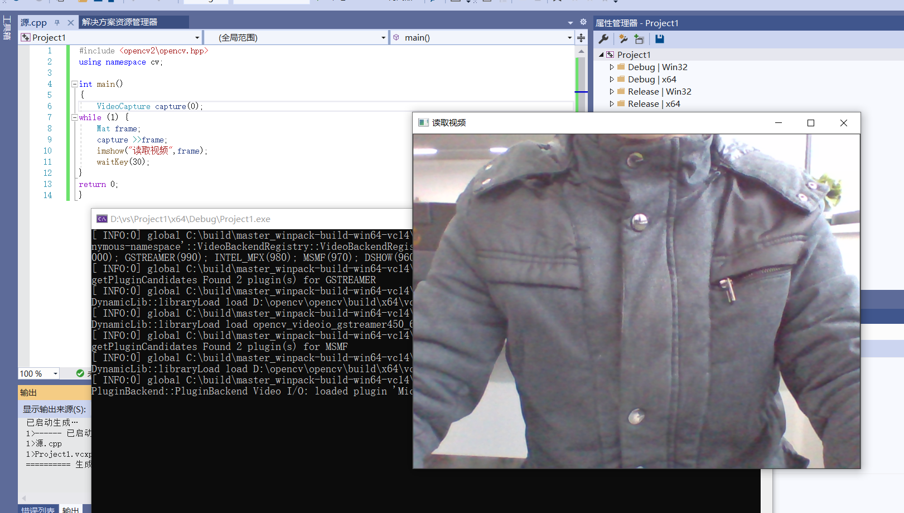

#### **实验七carry边缘检测**

```c++
int main()
{
	VideoCapture capture(0);
	Mat edges;
while (1) {	
	Mat frame;
	capture >>frame;
	cvtColor(frame, edges, COLOR_BGR2GRAY);
	blur(edges, edges, Size(7, 7));
	Canny(edges, edges, 0, 30, 3);
	imshow("被carry后的视频",edges);
	if (waitKey(30) >= 0) break;
	waitKey(30);
}
return 0;
}
```

**实验结果**
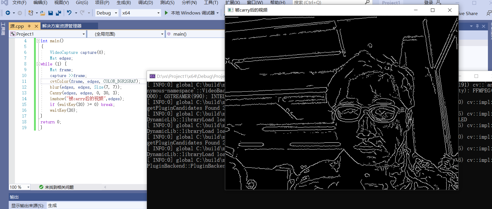

### 第二小节内容

#### 人脸识别
运行

```c++
#include "opencv2/video/tracking.hpp"
#include "opencv2/imgproc.hpp"
#include "opencv2/videoio.hpp"
#include "opencv2/highgui.hpp"

#include <iostream>
#include <ctype.h>

using namespace cv;
using namespace std;

static void help()
{
    // print a welcome message, and the OpenCV version
    cout << "\nThis is a demo of Lukas-Kanade optical flow lkdemo(),\n"
        "Using OpenCV version " << CV_VERSION << endl;
    cout << "\nIt uses camera by default, but you can provide a path to video as an argument.\n";
    cout << "\nHot keys: \n"
        "\tESC - quit the program\n"
        "\tr - auto-initialize tracking\n"
        "\tc - delete all the points\n"
        "\tn - switch the \"night\" mode on/off\n"
        "To add/remove a feature point click it\n" << endl;
}

Point2f point;
bool addRemovePt = false;

static void onMouse(int event, int x, int y, int /*flags*/, void* /*param*/)
{
    if (event == EVENT_LBUTTONDOWN)
    {
        point = Point2f((float)x, (float)y);
        addRemovePt = true;
    }
}

int main(int argc, char** argv)
{
    VideoCapture cap;
    TermCriteria termcrit(TermCriteria::COUNT | TermCriteria::EPS, 20, 0.03);
    Size subPixWinSize(10, 10), winSize(31, 31);

    const int MAX_COUNT = 500;
    bool needToInit = false;
    bool nightMode = false;

    help();
    cv::CommandLineParser parser(argc, argv, "{@input|0|}");
    string input = parser.get<string>("@input");

    if (input.size() == 1 && isdigit(input[0]))
        cap.open(input[0] - '0');
    else
        cap.open(input);

    if (!cap.isOpened())
    {
        cout << "Could not initialize capturing...\n";
        return 0;
    }

    namedWindow("LK Demo", 1);
    setMouseCallback("LK Demo", onMouse, 0);

    Mat gray, prevGray, image, frame;
    vector<Point2f> points[2];

    for (;;)
    {
        cap >> frame;
        if (frame.empty())
            break;

        frame.copyTo(image);
        cvtColor(image, gray, COLOR_BGR2GRAY);

        if (nightMode)
            image = Scalar::all(0);

        if (needToInit)
        {
            // automatic initialization
            goodFeaturesToTrack(gray, points[1], MAX_COUNT, 0.01, 10, Mat(), 3, 3, 0, 0.04);
            cornerSubPix(gray, points[1], subPixWinSize, Size(-1, -1), termcrit);
            addRemovePt = false;
        }
        else if (!points[0].empty())
        {
            vector<uchar> status;
            vector<float> err;
            if (prevGray.empty())
                gray.copyTo(prevGray);
            calcOpticalFlowPyrLK(prevGray, gray, points[0], points[1], status, err, winSize,
                3, termcrit, 0, 0.001);
            size_t i, k;
            for (i = k = 0; i < points[1].size(); i++)
            {
                if (addRemovePt)
                {
                    if (norm(point - points[1][i]) <= 5)
                    {
                        addRemovePt = false;
                        continue;
                    }
                }

                if (!status[i])
                    continue;

                points[1][k++] = points[1][i];
                circle(image, points[1][i], 3, Scalar(0, 255, 0), -1, 8);
            }
            points[1].resize(k);
        }

        if (addRemovePt && points[1].size() < (size_t)MAX_COUNT)
        {
            vector<Point2f> tmp;
            tmp.push_back(point);
            cornerSubPix(gray, tmp, winSize, Size(-1, -1), termcrit);
            points[1].push_back(tmp[0]);
            addRemovePt = false;
        }

        needToInit = false;
        imshow("LK Demo", image);

        char c = (char)waitKey(10);
        if (c == 27)
            break;
        switch (c)
        {
        case 'r':
            needToInit = true;
            break;
        case 'c':
            points[0].clear();
            points[1].clear();
            break;
        case 'n':
            nightMode = !nightMode;
            break;
        }

        std::swap(points[1], points[0]);
        cv::swap(prevGray, gray);
    }

    return 0;
}
```


#### printf用法示例


#### 彩色目标跟踪---Camshift


```c++
#include "opencv2/core/utility.hpp"
#include "opencv2/video/tracking.hpp"
#include "opencv2/imgproc.hpp"
#include "opencv2/videoio.hpp"
#include "opencv2/highgui.hpp"

#include <iostream>
#include <ctype.h>

using namespace cv;
using namespace std;

Mat image;

bool backprojMode = false;
bool selectObject = false;
int trackObject = 0;
bool showHist = true;
Point origin;
Rect selection;
int vmin = 10, vmax = 256, smin = 30;

// User draws box around object to track. This triggers CAMShift to start tracking
static void onMouse(int event, int x, int y, int, void*)
{
    if (selectObject)
    {
        selection.x = MIN(x, origin.x);
        selection.y = MIN(y, origin.y);
        selection.width = std::abs(x - origin.x);
        selection.height = std::abs(y - origin.y);

        selection &= Rect(0, 0, image.cols, image.rows);
    }

    switch (event)
    {
    case EVENT_LBUTTONDOWN:
        origin = Point(x, y);
        selection = Rect(x, y, 0, 0);
        selectObject = true;
        break;
    case EVENT_LBUTTONUP:
        selectObject = false;
        if (selection.width > 0 && selection.height > 0)
            trackObject = -1;   // Set up CAMShift properties in main() loop
        break;
    }
}

string hot_keys =
"\n\nHot keys: \n"
"\tESC - quit the program\n"
"\tc - stop the tracking\n"
"\tb - switch to/from backprojection view\n"
"\th - show/hide object histogram\n"
"\tp - pause video\n"
"To initialize tracking, select the object with mouse\n";

static void help(const char** argv)
{
    cout << "\nThis is a demo that shows mean-shift based tracking\n"
        "You select a color objects such as your face and it tracks it.\n"
        "This reads from video camera (0 by default, or the camera number the user enters\n"
        "Usage: \n\t";
    cout << argv[0] << " [camera number]\n";
    cout << hot_keys;
}

const char* keys =
{
    "{help h | | show help message}{@camera_number| 0 | camera number}"
};

int main(int argc, const char** argv)
{
    VideoCapture cap;
    Rect trackWindow;
    int hsize = 16;
    float hranges[] = { 0,180 };
    const float* phranges = hranges;
    CommandLineParser parser(argc, argv, keys);
    if (parser.has("help"))
    {
        help(argv);
        return 0;
    }
    int camNum = parser.get<int>(0);
    cap.open(camNum);

    if (!cap.isOpened())
    {
        help(argv);
        cout << "***Could not initialize capturing...***\n";
        cout << "Current parameter's value: \n";
        parser.printMessage();
        return -1;
    }
    cout << hot_keys;
    namedWindow("Histogram", 0);
    namedWindow("CamShift Demo", 0);
    setMouseCallback("CamShift Demo", onMouse, 0);
    createTrackbar("Vmin", "CamShift Demo", &vmin, 256, 0);
    createTrackbar("Vmax", "CamShift Demo", &vmax, 256, 0);
    createTrackbar("Smin", "CamShift Demo", &smin, 256, 0);

    Mat frame, hsv, hue, mask, hist, histimg = Mat::zeros(200, 320, CV_8UC3), backproj;
    bool paused = false;

    for (;;)
    {
        if (!paused)
        {
            cap >> frame;
            if (frame.empty())
                break;
        }

        frame.copyTo(image);

        if (!paused)
        {
            cvtColor(image, hsv, COLOR_BGR2HSV);

            if (trackObject)
            {
                int _vmin = vmin, _vmax = vmax;

                inRange(hsv, Scalar(0, smin, MIN(_vmin, _vmax)),
                    Scalar(180, 256, MAX(_vmin, _vmax)), mask);
                int ch[] = { 0, 0 };
                hue.create(hsv.size(), hsv.depth());
                mixChannels(&hsv, 1, &hue, 1, ch, 1);

                if (trackObject < 0)
                {
                    // Object has been selected by user, set up CAMShift search properties once
                    Mat roi(hue, selection), maskroi(mask, selection);
                    calcHist(&roi, 1, 0, maskroi, hist, 1, &hsize, &phranges);
                    normalize(hist, hist, 0, 255, NORM_MINMAX);

                    trackWindow = selection;
                    trackObject = 1; // Don't set up again, unless user selects new ROI

                    histimg = Scalar::all(0);
                    int binW = histimg.cols / hsize;
                    Mat buf(1, hsize, CV_8UC3);
                    for (int i = 0; i < hsize; i++)
                        buf.at<Vec3b>(i) = Vec3b(saturate_cast<uchar>(i * 180. / hsize), 255, 255);
                    cvtColor(buf, buf, COLOR_HSV2BGR);

                    for (int i = 0; i < hsize; i++)
                    {
                        int val = saturate_cast<int>(hist.at<float>(i) * histimg.rows / 255);
                        rectangle(histimg, Point(i * binW, histimg.rows),
                            Point((i + 1) * binW, histimg.rows - val),
                            Scalar(buf.at<Vec3b>(i)), -1, 8);
                    }
                }

                // Perform CAMShift
                calcBackProject(&hue, 1, 0, hist, backproj, &phranges);
                backproj &= mask;
                RotatedRect trackBox = CamShift(backproj, trackWindow,
                    TermCriteria(TermCriteria::EPS | TermCriteria::COUNT, 10, 1));
                if (trackWindow.area() <= 1)
                {
                    int cols = backproj.cols, rows = backproj.rows, r = (MIN(cols, rows) + 5) / 6;
                    trackWindow = Rect(trackWindow.x - r, trackWindow.y - r,
                        trackWindow.x + r, trackWindow.y + r) &
                        Rect(0, 0, cols, rows);
                }

                if (backprojMode)
                    cvtColor(backproj, image, COLOR_GRAY2BGR);
                ellipse(image, trackBox, Scalar(0, 0, 255), 3, LINE_AA);
            }
        }
        else if (trackObject < 0)
            paused = false;

        if (selectObject && selection.width > 0 && selection.height > 0)
        {
            Mat roi(image, selection);
            bitwise_not(roi, roi);
        }

        imshow("CamShift Demo", image);
        imshow("Histogram", histimg);

        char c = (char)waitKey(10);
        if (c == 27)
            break;
        switch (c)
        {
        case 'b':
            backprojMode = !backprojMode;
            break;
        case 'c':
            trackObject = 0;
            histimg = Scalar::all(0);
            break;
        case 'h':
            showHist = !showHist;
            if (!showHist)
                destroyWindow("Histogram");
            else
                namedWindow("Histogram", 1);
            break;
        case 'p':
            paused = !paused;
            break;
        default:
            ;
        }
    }

    return 0;
}
```
**实验结果**
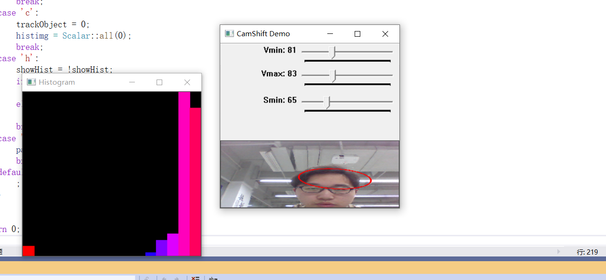
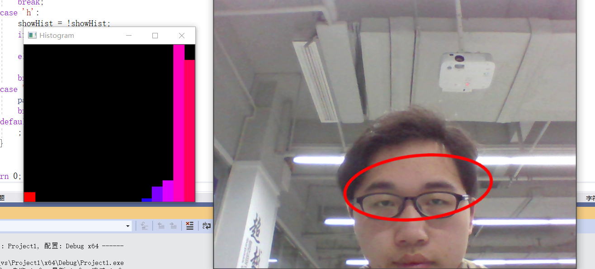

#### imwrite应用

```c++
#include <opencv2/opencv.hpp>
#include <vector>

using namespace cv;
using namespace std;

void createAlphaMat(Mat& mat)
{
	for (int i = 0; i < mat.rows; ++i) {
		for (int j = 0; j < mat.cols; ++j) {
			Vec4b& rgba = mat.at<Vec4b>(i, j);
			rgba[0] = UCHAR_MAX;
			rgba[1] = saturate_cast<uchar>((float(mat.cols - j)) / ((float)mat.cols) * UCHAR_MAX);
			rgba[2] = saturate_cast<uchar>((float(mat.rows - i)) / ((float)mat.rows) * UCHAR_MAX);
			rgba[3] = saturate_cast<uchar>(0.5*(rgba[1]+rgba[2]));
		}
	}
}
int main() {
	Mat mat(480, 640, CV_8UC4);
	createAlphaMat(mat);

	vector<int>compression_params;
	compression_params.push_back(IMWRITE_PNG_COMPRESSION);
	compression_params.push_back(9);
	try {
		imwrite("透明Alpha值图.png", mat, compression_params);
		imshow("生成的PNG图", mat);
		fprintf(stdout, "PNG图片文件的alpha数据保存完毕\n 可以在工程目录下查看imwrite函数生成的图片\n");
		waitKey(0);
	}
	catch (runtime_error& ex) {
		fprintf(stderr, "图像转换PNG格式发生错误：%s\n", ex.what());
		return 1;
	}
	return 0;
}
```

#### 人脸识别
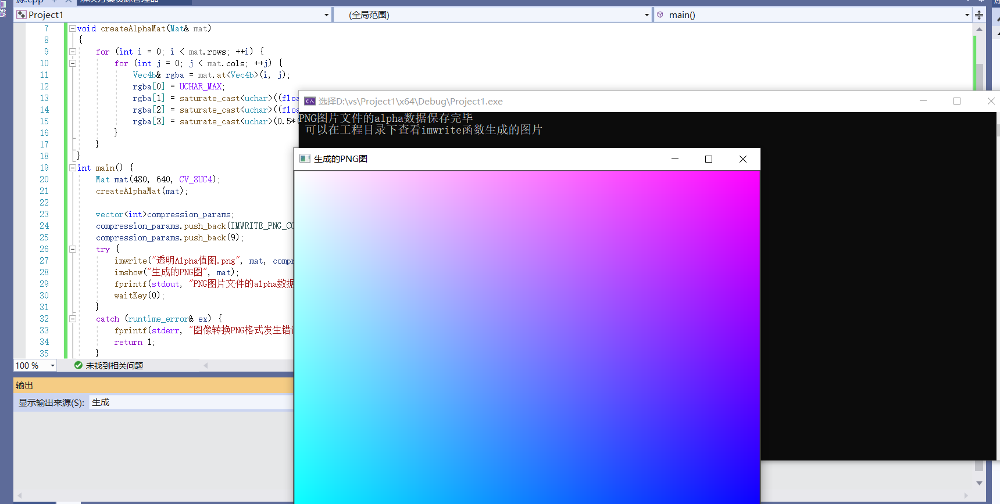

opencv\sources\samples\cpp\tutorial_code\objectDetection"路径下的objectDetection.cpp文件

需要将"…\opencv\sources\data\haarcascades"路径下的"harcascade_eye_tree_eyeglasses.xml"和"haarcascade frontalface alt.xml"文件复制到和源文件同一目录中，才能正确运行


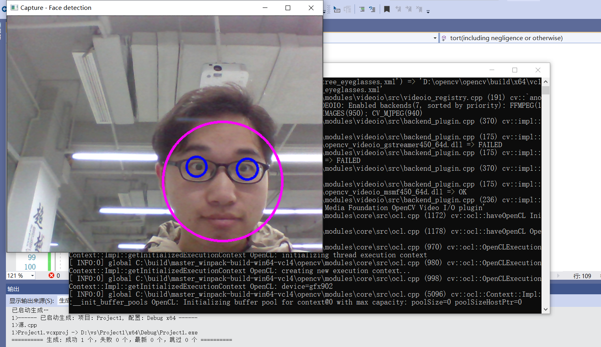

### 第三部分

#### 综合示例程序：图像的载入、显示与输出

```c++
//-----------------------------------【程序说明】----------------------------------------------
//  程序名称:：【OpenCV入门教程之三】图像的载入，显示与输出 一站式完全解析 博文配套源码
// VS2010版   OpenCV版本：2.4.8
//      2014年3月5日 Create by 浅墨
//  描述： 图像的载入，显示与输出 一站式剖析   配套源码
//  图片素材出处：dota2原画圣堂刺客 dota2 logo  动漫人物
//------------------------------------------------------------------------------------------------


#include<opencv2/core/core.hpp>
#include<opencv2/highgui/highgui.hpp>

using namespace cv;


int main()
{
	//-----------------------------------【一、图像的载入和显示】--------------------------------------
	//     描述：以下三行代码用于完成图像的载入和显示
	//--------------------------------------------------------------------------------------------------

	Mat girl = imread("D:/image/girl.jpg"); //载入图像到Mat
	namedWindow("【1】动漫图"); //创建一个名为 "【1】动漫图"的窗口 
	imshow("【1】动漫图", girl);//显示名为 "【1】动漫图"的窗口 

	//-----------------------------------【二、初级图像混合】--------------------------------------
	//     描述：二、初级图像混合
	//-----------------------------------------------------------------------------------------------
	//载入图片
	Mat image = imread("D:/image/dota.jpg");
	Mat logo = imread("D:/image/dota_logo.jpg");

	//载入后先显示
	namedWindow("【2】原画图");
	imshow("【2】原画图", image);

	namedWindow("【3】logo图");
	imshow("【3】logo图", logo);

	//定义一个Mat类型，用于存放，图像的ROI
	Mat imageROI;
	//方法一
	imageROI = image(Rect(800, 350, logo.cols, logo.rows));
	//方法二
	//imageROI=image(Range(350,350+logo.rows),Range(800,800+logo.cols));

	//将logo加到原图上
	addWeighted(imageROI, 0.5, logo, 0.3, 0., imageROI);

	//显示结果
	namedWindow("【4】原画+logo图");
	imshow("【4】原画+logo图", image);

	//-----------------------------------【三、图像的输出】--------------------------------------
	//     描述：将一个Mat图像输出到图像文件
	//-----------------------------------------------------------------------------------------------
	//输出一张jpg图片到工程目录下
	imwrite("我喜欢打dota2 by浅墨.jpg", image);

	waitKey();

	return 0;
}
```

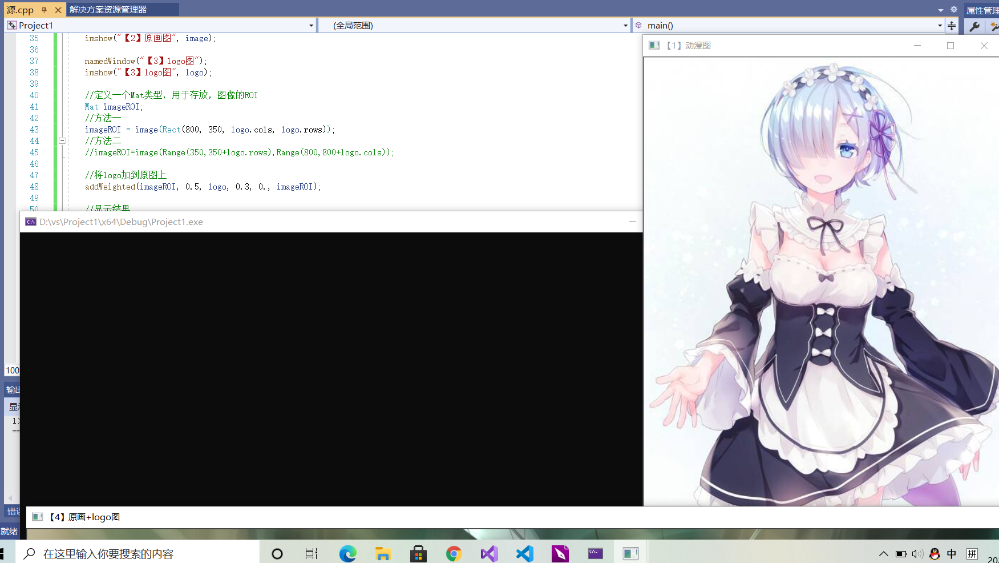
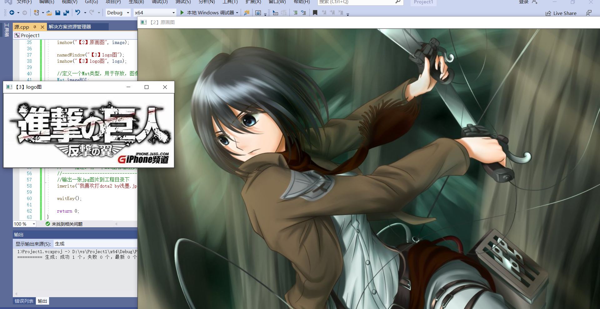
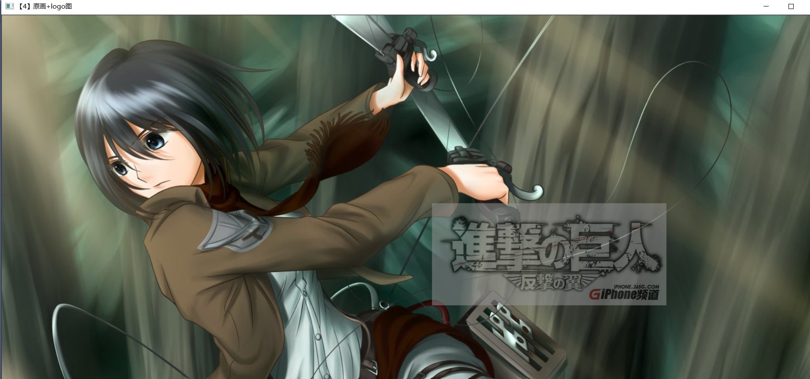

#### 滑动条的创建及其使用
```c++
#include <opencv2/opencv.hpp>
#include "opencv2/highgui/highgui.hpp"
using namespace cv;
#define WINDOW_NAME "[线性混合实例]"
const int g_nMaxAlphaValue = 100;
int g_nAlphaValueSlider;
double g_dBetaValue;
double g_dAlphaValue;
Mat g_srcImage1;
Mat g_srcImage2;
Mat g_dstImage;
void on_Trackbar(int, void*)
{
    g_dAlphaValue = (double)g_nAlphaValueSlider / g_nMaxAlphaValue;
    g_dBetaValue = (1.0 - g_dAlphaValue);
    /*
    addWeighted这个函数的原型如下所示，可以看出这个函数最小需要6个参数。
    1、 第1个参数，输入图片1，
    2、第2个参数，图片1的融合比例
    3、第3个参数，输入图片2
    4、第4个参数，图片2的融合比例
    5、第5个参数，偏差
    6、第6个参数，输出图片
    */
    addWeighted(g_srcImage1, g_dAlphaValue, g_srcImage2, g_dBetaValue, 0.0, g_dstImage);
    imshow(WINDOW_NAME, g_dstImage);

}
int main()
{
    //加载图像 (两图像的尺寸需相同)
    g_srcImage1 = imread("D:\\image\\1.jpg");
    g_srcImage2 = imread("D:\\image\\2.jpg");
    if (!g_srcImage1.data)
    {
        printf("D:\\images\\1.jpg");
        return -1;
    }
    if (!g_srcImage2.data)
    {
        printf("D:\\images\\2.jpg");
        return -1;
    }
    //设置滑动条初值为70
    g_nAlphaValueSlider = 70;
    //创建窗体
    namedWindow(WINDOW_NAME, 1);
    char TrackbarName[50];
    sprintf_s(TrackbarName, "透明度 %d", g_nMaxAlphaValue);
    //在创建的窗体中创建一个滑动条控件
    createTrackbar(TrackbarName, WINDOW_NAME, &g_nAlphaValueSlider, g_nMaxAlphaValue, on_Trackbar);
    //结果在回调函数中显示
    on_Trackbar(g_nAlphaValueSlider, 0);
    //按任意键退出
    waitKey(0);
    return 0;
}
```

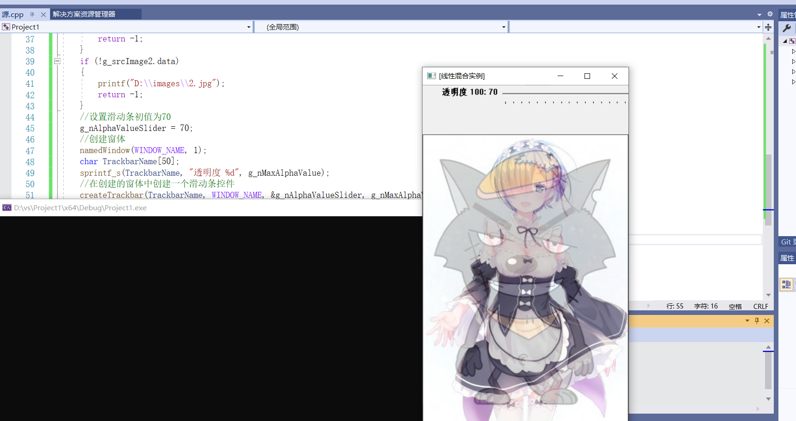

#### 鼠标操作

```c++
#include<iostream>
#include <opencv2/opencv.hpp>

using namespace cv;
//为窗口标题定义的宏
#define WINDOW_NAME "【程序窗口】"
void on_MouseHandle(int event, int x, int y, int flags, void* param);
void DrawRectangle(cv::Mat& img, cv::Rect box);
Rect g_rectangle;
bool g_bDrawingBox = false;//是否进行绘制RNG g_rng(12345);
RNG g_rng(12345);
//【1】准备参数
int main(int argc, char** argv) {
	g_rectangle = Rect(-1, -1, 0, 0);
	Mat srcImage(600, 800, CV_8UC3), tempImage;
	srcImage.copyTo(tempImage);
	g_rectangle = Rect(-1, -1, 0, 0);
	srcImage = Scalar::all(0);

	namedWindow(WINDOW_NAME);
	setMouseCallback(WINDOW_NAME, on_MouseHandle, (void*)&srcImage);

	//【3】程序主循环，当进行绘制的标识符为真时，进行绘制
	while (1){
	srcImage.copyTo(tempImage);//复制源图到临时变量
	if (g_bDrawingBox)DrawRectangle(tempImage, g_rectangle);//当进行绘制的标识符为真，则进行绘制
	imshow(WINDOW_NAME, tempImage);
	if(waitKey(10) == 27)
		break;//按下 ESC键，程序退出return 0;
}
return 0;
}
void on_MouseHandle(int event, int x, int y, int flags, void* param) {
	Mat& image = *(cv::Mat*) param;
	switch (event) {
		//鼠标移动消息
	case EVENT_MOUSEMOVE: {
		if(g_bDrawingBox )//如果是否进行绘制的标识符为真，则记录下长和宽到 RECT 型变量中
		{
			g_rectangle.width = x - g_rectangle.x;
			g_rectangle.height = y - g_rectangle.y;
		}
	}
						break;// 左键按下消息
	case EVENT_LBUTTONDOWN:
	{
		g_bDrawingBox = true;
		g_rectangle = Rect(x,y,0,0);//记录起始点)
	}
	break;
	//左键抬起消息
	case EVENT_LBUTTONUP: {
		g_bDrawingBox = false;//置标识符为false //对宽和高小于 0的处理
		if (g_rectangle.width < 0) {
			g_rectangle.x += g_rectangle.width;
			g_rectangle.width *= -1;
		}
		if (g_rectangle.height < 0) {
			g_rectangle.y += g_rectangle.height;
			g_rectangle.height *= -1;
		}
		//调用函数进行绘制
		DrawRectangle(image, g_rectangle);
	}
						break;
	}
}
	
void DrawRectangle(cv::Mat& img, cv::Rect box)
{
	rectangle(img, box.tl(), box.br(), Scalar(g_rng.uniform(0, 255),
		g_rng.uniform(0,255),g_rng.uniform(0,255)));//随机颜色

}
```

**实验结果**
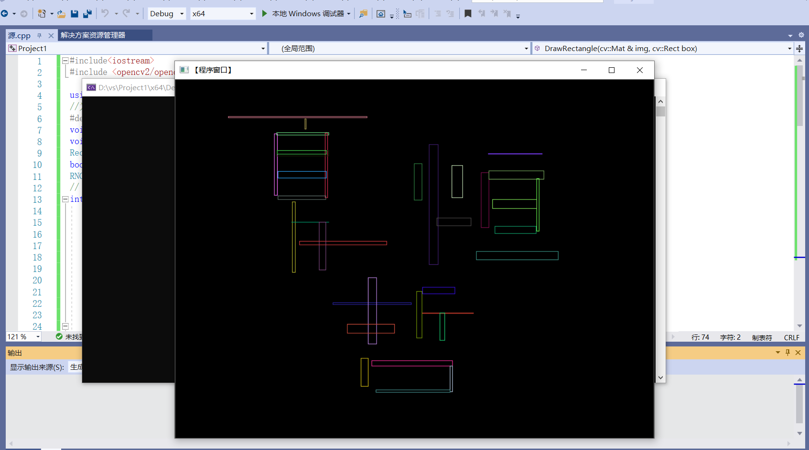


