# Ch_4

## **4.1基础图像容器Mat**

### **4.1.1 数字图像储存概述**

我们可以通过各种各样的方法从现实世界获取到数字图像，如借助相机、扫描仪、计算机摄像头或磁共振成像等。通常由显示屏上看到的都是真实而漂亮的图像，但是这些图像在转化到我们的数字设备中时，记录的却是图像中的每个点的数值。

### **4.1.2 Mat结构的使用**

Mat是一个类，它由两个数据部分组成：矩阵头和一个指向存储所有像素值的矩阵的指针。其中矩阵头包含了矩阵的尺寸、存储方法、储存地址等信息，由此可以看出矩阵头所占的内存很小，而具体储存所有像素值的矩阵则非常大。举个例子，比如一个班级，矩阵头就相当于储存了班级里有多少人、男女比多少、平均身高、平均体重等信息，而矩阵就储存了班级中所有同学的所有基本信息，每一个同学就相当于是一个像素点，而每个像素点的颜色信息、深度信息等一串数据就相当于是每个同学的身高、体重、性别等一系列信息组成的一串数据。

### **4.1.3 像数值的储存方法**

存储像素值需要指定颜色空间和数据类型。

* 颜色空间是指针对一个给定的颜色，如何组合颜色元素以对其编码。最简单的颜色空间要属灰度级空间， 只处理黑色和白色， 对它们进行组合便可以产生不同程度的灰色。
对于彩色方式则有更多种类的颜色空间， 但不论哪种方式都是把颜色分成三个或者四个基元素，通过组合基元素可以产生所有的颜色。 RGB 颜色空间是最常用的一种颜色空间，。它的基色是红色、绿色和蓝色，有时为了表示透明颜色也会加入第四个元素alpha ( A)。

* 每个组成元素都有自己的定义域， 而定义域収决于其数据类型，如何存储一个元素决定了我们在其定义域上能够控制的精度。最小的数据类型是 char ，占一个字节或者 8 位，可以是有符号型（0 到255 之间）或无符号型( -127 到+127之间）。尽管使用三个 char 型元素已经可以表示 1600 万种可能的颜色（使用 RGB 颜色空间），但若使用 float ( 4 字节，32 位）或 double ( 8 字节，64 位）则能给出更加精细的颜色分辨能力。但同时也要切记， 增加元素的尺寸也会增加图像所占的内存空间。

### **4.1.7 基础图像容器Mat类的使用**

>程序代码

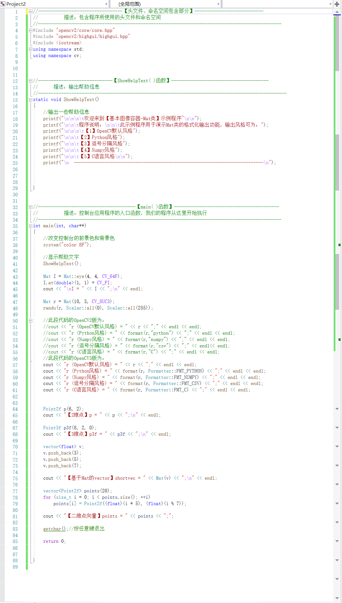

>运行结果

## **4.2 常用数据结构和函数**

### **4.2.1 点的表示：Point类**

Point 类数据结构表示了二维坐标系下的点，即由其图像坐标 x 和 y 指定的 2D 点。用法如下：

Point point;

point.x = 10;

point.y = 8;

或者

Point point = Point(10, 8 );

### **4.2.2 颜色的表示：Scalar类**

Scalar()表示具有4个元素的数组,在OpenCV中被大量用于传递像素值,如RGB颜色值。而RGB颜色值为三个参数，其实对于Scalar函数来说，如果用不到第四个参数，则不需要写出来;若只写三个参数，OpenCV会认为我们就想表示三个参数。

来看个例子。如果给出以下颜色参数表达式:

scalar( a, b,c )

那么定义的RGB颜色值:红色分量为c，绿色分量为b，蓝色分量为a。Scalar类的源头为Scalar_类，而 Scalar_类是Vec4x的一个变种，我们常用的Scalar其实就是Scalar_<double>。这就解释了为什么很多函数的参数输入可以是Mat，也可以是Scalar。

### **4.2.3 尺寸的表示：Size类**

OpenCV 中对 Size 类源代码有以下定义，用于指定图像或矩形大小。这个类添加了两个成员 width 和 height ，以及有用的 area() 函数。

**typedef Size_<int> Size2i;**

**typedef Size2i Size;**

其中， Size_ 是个模板类，在这里 Size_<int> 表示其类体内部的模板所代表的类型为 int 。那这两句代码的意思，就是首先给已知的数据类型 Size_<int> 起个新名字， 叫 Size2i 。然后又给已知的数据类型 Size2i 起个新名字，叫 Size 。所以，连起来就是， Size_<int> 、 Size2i 、 Size 这三个类型名等价。

### **4.2.4 矩形的表示：Rect类**

Rect 类的成员变量有 x 、 y 、 width 、 height , 分别为左上角点的坐标和矩形的宽和高。常用的成员函数有：

* Size() 返回值为 Size ；
* area() 返回矩形的面积；
* contains(Point) 判断点是否在矩形内；
* inside(Rect) 函数判断矩形是否在该矩形内；
* tl() 返回左上角点坐标；
* br() 返回右下角点坐标。

### **4.2.5 颜色空间转换：cvtColor()函数**

cvtColor()函数是OpenCV里的颜色空间转换函数，可以实现RGB颜色向HSV、HSI等颜色空间的转换，也可以转换为灰度图像。

对于颜色空间转换，OpenCV2的CV_前缀的宏命名规范，被OpenCV3中COLOR_式的宏命名前缀所取代。另外，在这里需要再次提醒大家的是，OpenCV默认的图片通道存储顺序是BGR，即蓝绿红，而不是RGB。

## **4.3 基本图形绘制**

>程序代码

>运行结果

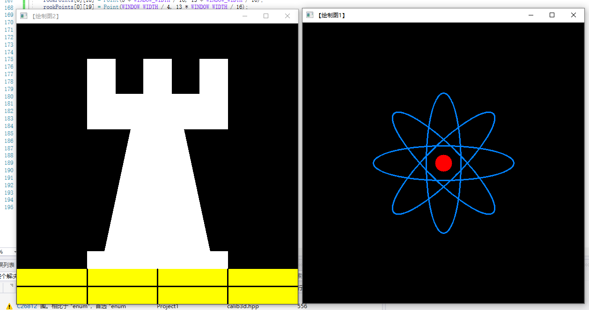

# Ch_5

## **5.1 访问图像中的像素**

### **5.1.5 访问图像中像素的三类方法**

>**方法一 用指针访问像素**

用指针访问像素的这种方法利用的是C语言中的操作符[ ]。这种方法最快，但是略有点抽象。

* 程序代码

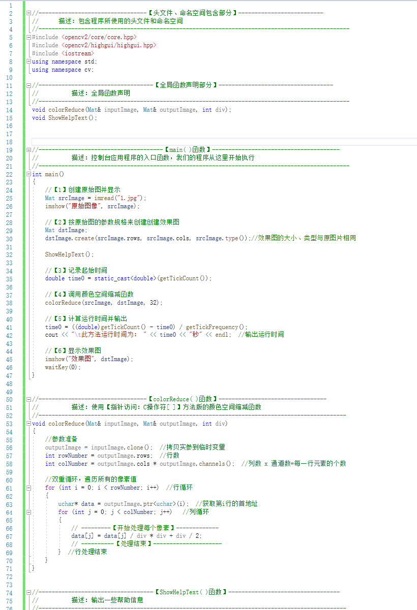

* 运行结果

>**方法二 用迭代器访问像素**

第二种方法为用迭代器操作像素，这种方法与STL库的用法类似。

在迭代法中，我们所需要做的仅仅是获得图像矩阵的 begin和 end，然后增加迭代直至从 begin到end。将*操作符添加在迭代指针前，即可访问当前指向的内容。

相比用指针直接访问可能出现越界问题，迭代器绝对是非常安全的方法。

* 程序代码

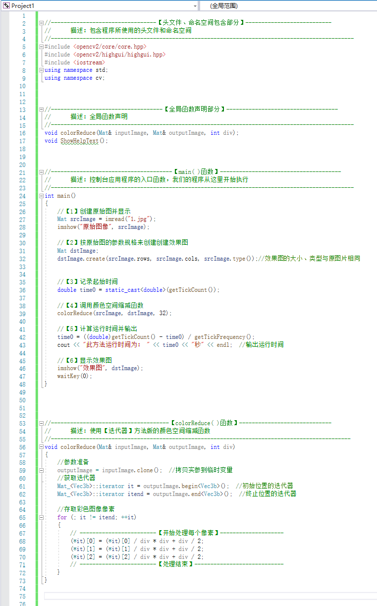

* 运行结果

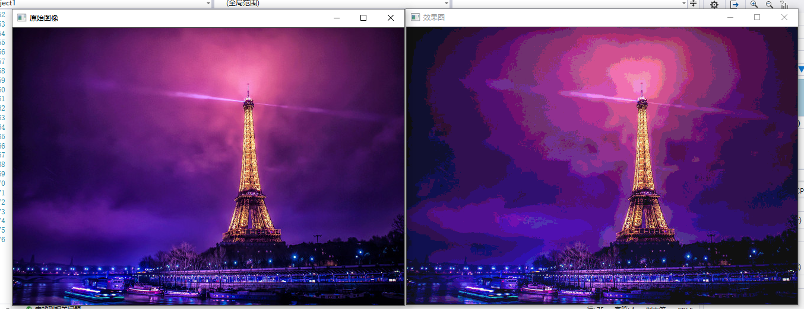

>**方法三 动态地址计算**

第三种方法为用动态地址计算来操作像素。下面是使用动态地址运算配合at方法的colorReduce函数的代码。这种方法简洁明了,符合大家对像素的直观认识。

* 程序代码

* 运行结果

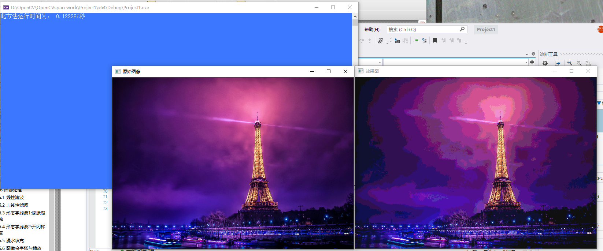

## **5.2 ROI区域图像叠加&图像混合**

定义 ROI 区域有两种方法 ：

* 第一种是使用表示矩形区域的 Rect。 它指定矩形的左上角坐标 （ 构造函数的前两个参数）和矩形的长宽（构造函数的后两个参数）以定义一个矩形区域 。

* 另一种定义ROI的方式是指定感兴趣行或列的范围(Range)。Range是指从起始索引到终止索引（不包括终止索引）的一连段连续序列。cRange可以用来定义Range。

### **5.2.4 初级图像混合**

* 程序代码

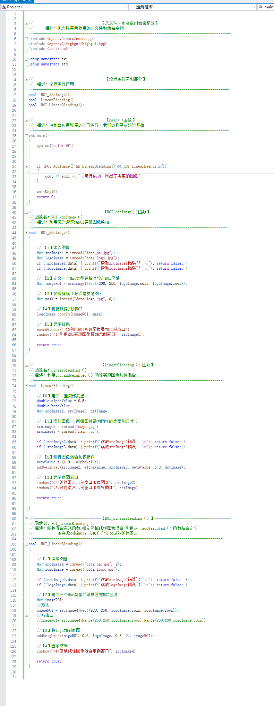

* 运行结果

### **5.3.3 多通道图像混合**

* 程序代码

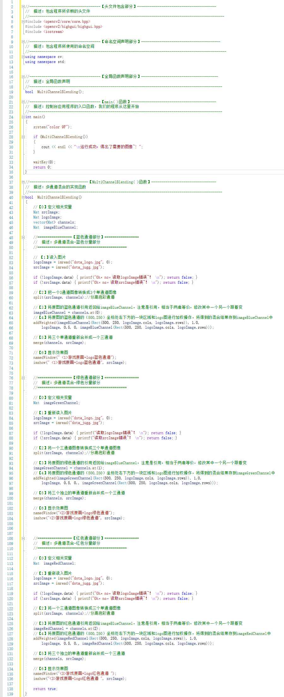

* 运行结果

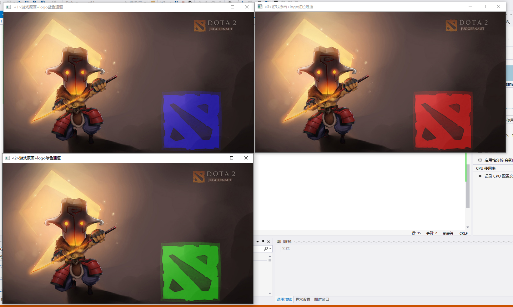

### **5.4.3 图像对比度、亮度调整**

* 程序代码

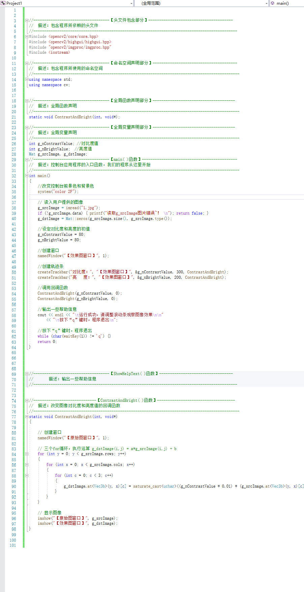

* 运行结果

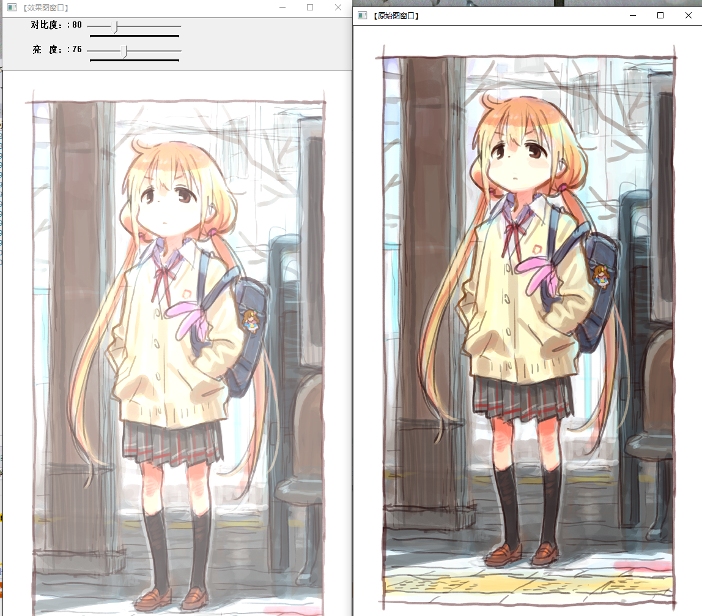

### **5.5.8 离散傅里叶变换**

* 程序代码

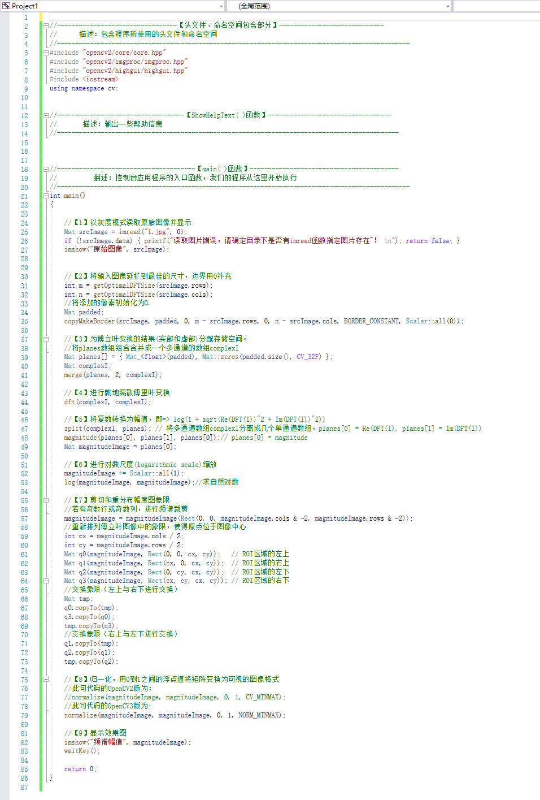

* 运行结果

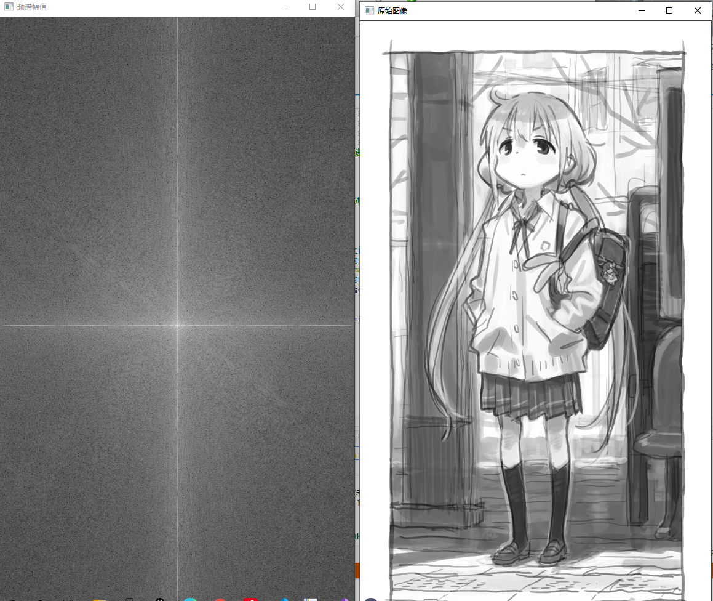

### **5.6.3 XML和YAML文件的写入**

* 程序代码

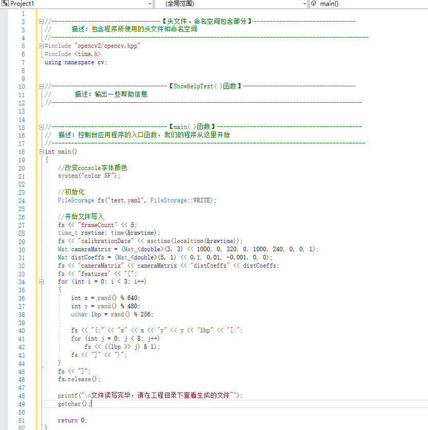

* 运行结果

### **5.6.4 XML和YAML文件的读取**

* 程序代码

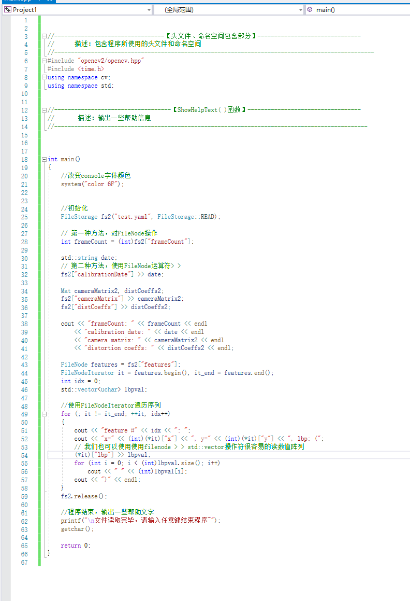

* 运行结果

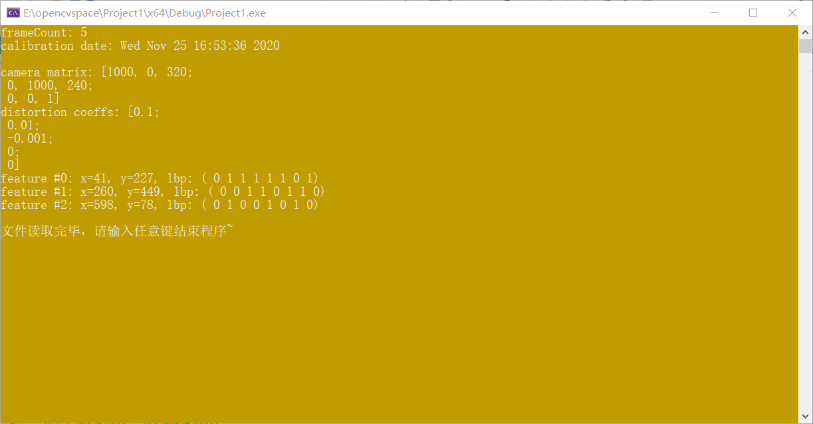
