## 第四章 OpenCV数据结构与基本绘图
### 4.1基础图像存储概述
显示器上的图像转化到数字设备中时，记录的时每个点的数值。
- Mat结构的使用
  Mat本质上是由两个数据部分组成的类： （包含信息有矩阵的大小，用于存储的方法，矩阵存储的地址等） 的矩阵头和一个指针，指向包含了像素值的矩阵（可根据选择用于存储的方法采用任何维度存储数据）。矩阵头部的大小是恒定的。然而，矩阵本身的大小因图像的不同而不同，通常是较大的数量级。因此，当你在您的程序中传递图像并在有些时候创建图像副本您需要花费很大的代价生成图像矩阵本身，而不是图像的头部。OpenCV 是图像处理库，它包含大量的图像处理函数。若要解决的计算挑战，最终大部分时间你会使用库中的多个函数。由于这一原因图像传给库中的函数是一种常见的做法。我们不应忘记我们正在谈论往往是计算量相当大的图像处理算法。我们想要做的最后一件事是通过制作不必要的可能很大的图像的拷贝进一步降低您的程序的速度。
##### 显示创建Mat对象的七种方法
1. 使用Mat()构造函数
     
2. C/C++中通过构造函数进行初始化
   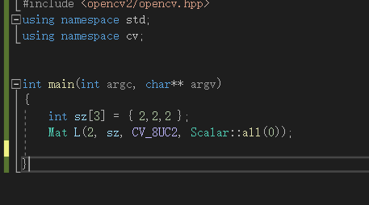
3. 为已存在的IplImage指针创建信息头
   
4. 利用Create()函数
   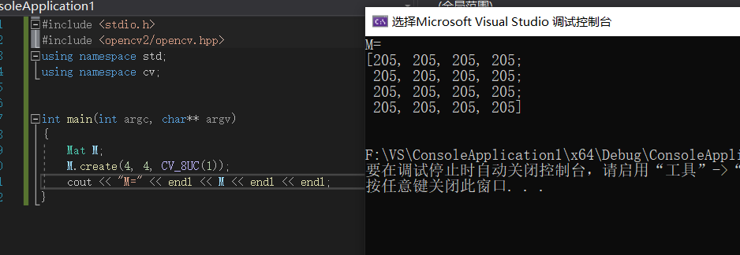
5. 采用Matlab式的初始化方式
   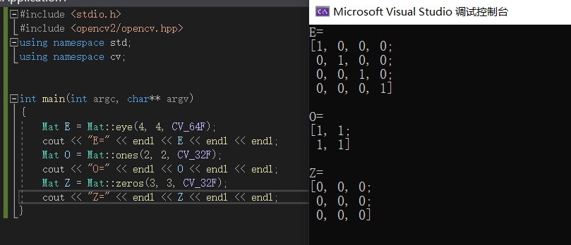
6. 对小矩阵使用逗号分隔式初始化函数
   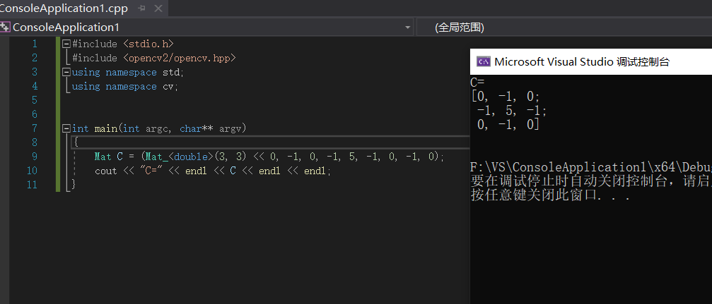
7. 为已存在的对象创建新信息头
   

##### OpenCV中的格式化输出方法
1. OpenCV风格
   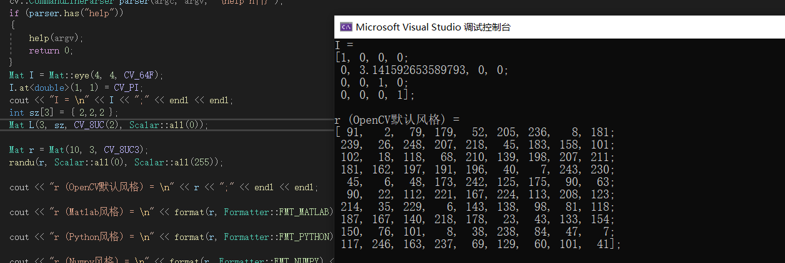
2. Python风格
   
3. 逗号分隔风格
   
4. Numpy风格
   
5. C语言风格
   

### 4.2常用数据结构和函数
- Point类:点的表示
Point类表示的是一个二维坐标下的点，其图像由其图像坐标X和Y指定的2D点
- Scalar类：颜色的表示
Scalar()是一个具有四个元素的数组，在OpenCV中被大量用于传递像素值，比如RGB颜色。但RGB颜色值为三个参数，对于Scalar函数来说，如果用不到第四个参数，则不需要写出来
- Size类：尺寸的表示
Size_是个模版类
- Rect类：矩形的表示
Rect类的成员变量有x、y、width、height，分别为左上角点的坐标和矩形的宽和高
- cvtColor()函数:颜色空间的转换
函数可以实现RGB颜色向HSV、HSI等颜色空间的转换，也可以转化为灰度图像

### 4.3基本图形的绘制
用于绘制直线的line函数
用于绘制椭圆的ellipse函数
用于绘制矩形的rectangle函数
用于绘制圆的circle函数
用于绘制填充的多边形的fillPoly函数
DrawEllipse()函数、DrawFilledCircle()函数、DrawPolygon()函数、DrawLine()函数、 main函数
代码实现：
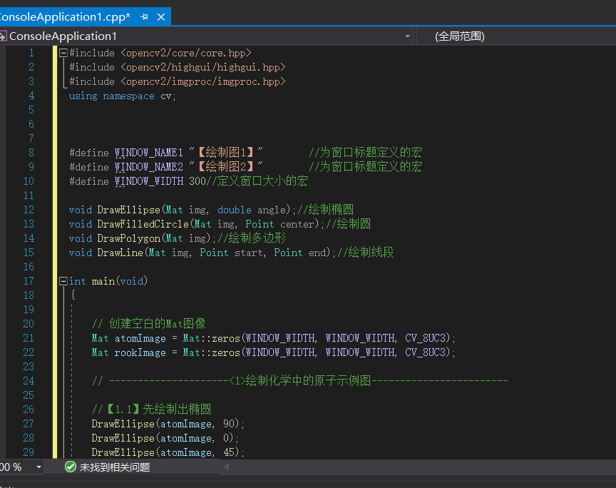
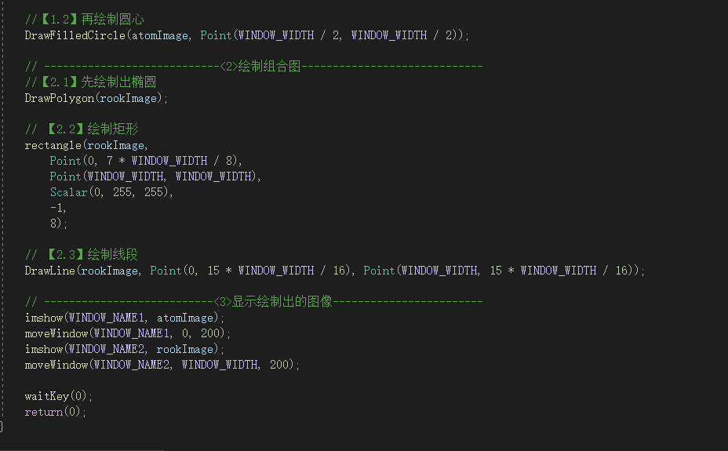
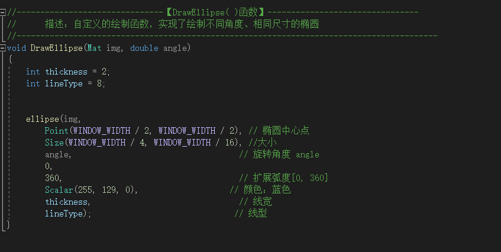
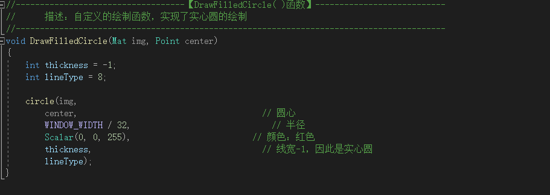
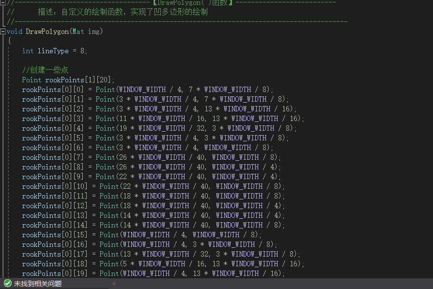
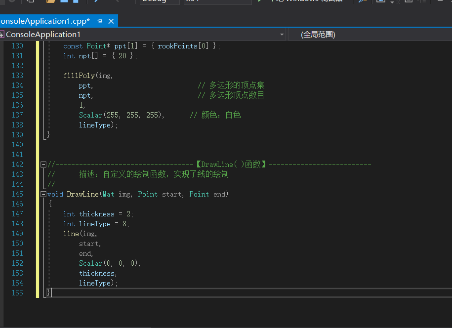
运行结果：
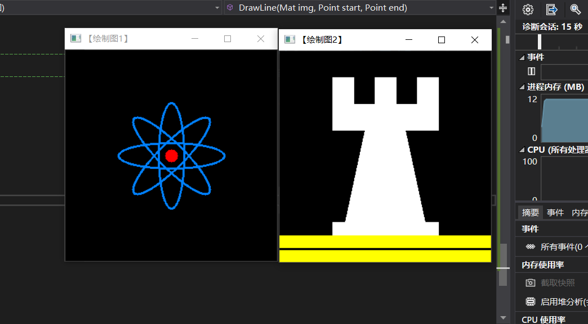

## 第五章core组件进阶
### 5.1访问图像中的像素
- 图像在内存中的存储方式
取决于通道数
1.灰度图像
2.多通道：矩阵的类会包含多个子阵：比如RGB（注意opencv中子列的通道顺序是反过来的是BGR而不是RGB）
3.如果内存足够大，可以实现连续存储，因此，图像中的各行就能一行一行的连接起来，形成一个长行。连续存储有助于提升扫描速度，可以用isContinuous()判断是不是连续存储
- 颜色空间缩减
若矩阵存储的是单通道像素和三通道像素就会有非常多的颜色，所以就会有颜色空间缩减这一个说法：颜色空间值除以某个输入值，以获得较少的颜色数，也就是做减法
- LUT函数
把图像中的数据从之前的比较高的灰度级降下来，例如灰度级是256的char类型的灰度级，我们通过一个参数（以100为例），将原来的256个灰度级降到了3个灰度级，原来图像中灰度值在0-100的数据现在灰度值变成了0，原来灰度值为101-200的图像数据现在灰度值变为了1，而201-256的灰度值就变为了2。所以通过参数100，图像的灰度级就到了2，只有0，1，2三个灰度值，那么原来的图像矩阵中的每一位数据我们是char型的，需要8位来表示一个数据，而灰度级降下来之后，我们只需要2位就足以表示所有灰度值。
- 计时函数
getTickCount()函数返回CPU自某个事件以来走过的时钟周期数
getTickFrequency()函数返回CPU一秒所走的时钟周期数
- 访问像素的三种方法
方法一：用指针访问像素
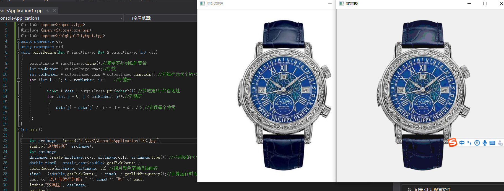
方法二：用迭代器iterator操作像素
```
#include <opencv2/opencv.hpp>
#include <opencv2/core/core.hpp>
#include <opencv2/highgui/highgui.hpp>
using namespace cv;
using namespace std;

void colorReduce(Mat & inputImage, Mat & outputImage, int div)
{
	 outputImage = inputImage.clone();//复制实参到临时变量
	 //获取迭代器
	 Mat_<Vec3b>::iterator it = outputImage.begin<Vec3b>();//初始位置的迭代器
	 Mat_<Vec3b>::iterator itend = outputImage.end<Vec3b>();//终止位置的迭代器
		    for (; it != itend; ++it)
		    {
		        (*it)[0] = (*it)[0] / div * div + div / 2;
		        (*it)[1] = (*it)[1] / div * div + div / 2;
		        (*it)[2] = (*it)[2] / div * div + div / 2;
		    }
	 }

int main()
{
	Mat srcImage = imread("F:\\VS\\ConsoleApplication1\\3.jpg");
	imshow("原始数据", srcImage);
	Mat dstImage;
	dstImage.create(srcImage.rows, srcImage.cols, srcImage.type());//效果图的大小、类型与原图片相同
	double time0 = static_cast<double>(getTickCount());
	colorReduce(srcImage, dstImage, 32);//调用颜色空间缩减函数
	time0 = ((double)getTickCount() - time0) / getTickFrequency();//计算运行时间
	cout << "此方法运行时间：" << time0 << "秒" << endl;
	imshow("效果图", dstImage);
	waitKey(0);
}
```
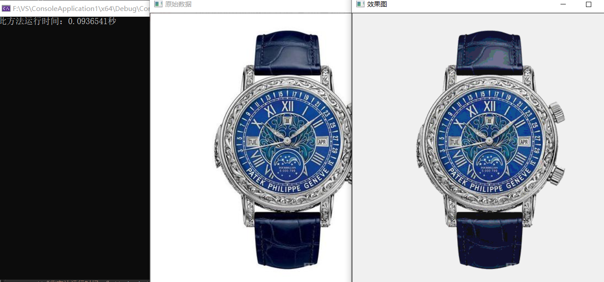
方法三：动态地址计算
```
#include <opencv2/opencv.hpp>
#include <opencv2/core/core.hpp>
#include <opencv2/highgui/highgui.hpp>
using namespace cv;
using namespace std;

void colorReduce(Mat & inputImage, Mat & outputImage, int div)
{
	outputImage = inputImage.clone();//复制实参到临时变量
	int rowNumber = outputImage.rows;//行数
	int colNumber = outputImage.cols;//列数
 //存取彩色图像像素
	for (int i = 0; i < rowNumber; i++)
	{
		for (int j = 0; j < colNumber; j++)
		{
			outputImage.at<Vec3b>(i, j)[0] = outputImage.at<Vec3b>(i, j)[0] / div * div + div / 2;//蓝色通道
			outputImage.at<Vec3b>(i, j)[1] = outputImage.at<Vec3b>(i, j)[1] / div * div + div / 2;//绿色通道
			outputImage.at<Vec3b>(i, j)[2] = outputImage.at<Vec3b>(i, j)[2] / div * div + div / 2;//红色通道
		 }
	}
}
int main()
{
	Mat srcImage = imread("F:\\VS\\ConsoleApplication1\\3.jpg");
	imshow("原始数据", srcImage);
	Mat dstImage;
	dstImage.create(srcImage.rows, srcImage.cols, srcImage.type());//效果图的大小、类型与原图片相同
	double time0 = static_cast<double>(getTickCount());
	colorReduce(srcImage, dstImage, 32);//调用颜色空间缩减函数
	time0 = ((double)getTickCount() - time0) / getTickFrequency();//计算运行时间
	cout << "此方法运行时间：" << time0 << "秒" << endl;
	imshow("效果图", dstImage);
	waitKey(0);
 }
```
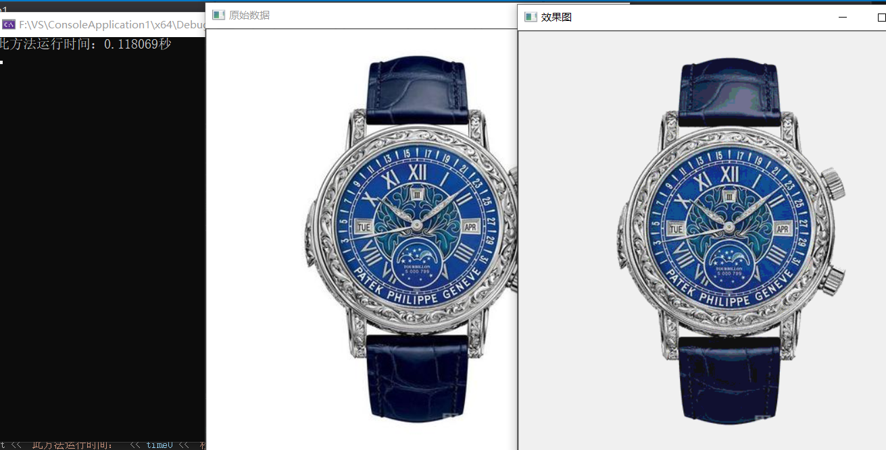
### 5.2ROI区域图像叠加&图像混合
- 感兴趣区域-ROI: 在图像处理领域，我们常常需要设置感兴趣区域(ROI，region of interest)，来专注或者简化我们的工作过程 。也就是从图像中选择的一个图像区域，这个区域是我们图像分析所关注的重点。我们圈定这个区域，以便进行进一步处理。而且，使用ROI指定我们想读入的目标，可以减少处理时间，增加精度，给图像处理来带不小的便利。
定义ROI区域有两种方法，第一种是使用cv:Rect.顾名思义，cv::Rect表示一个矩形区域。指定矩形的左上角坐标（构造函数的前两个参数）和矩形的长宽（构造函数的后两个参数）就可以定义一个矩形区域。另一种定义ROI的方式是指定感兴趣行或列的范围（Range）。Range是指从起始索引到终止索引（不包括终止索引）的一连段连续序列。cv::Range可以用来定义Range。
图像初级混合
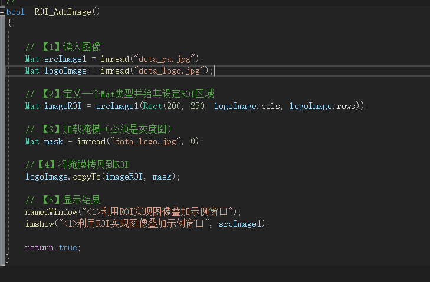
- 线性混合操作：线性混合操作是一种典型的二元（两个输入）的像素操作
- addWeighted函数
  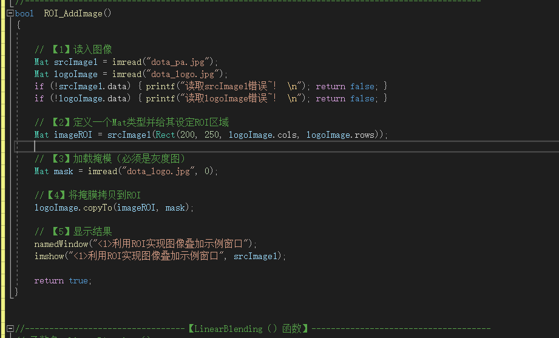
### 5.3分离颜色通道、多通道图像混合
  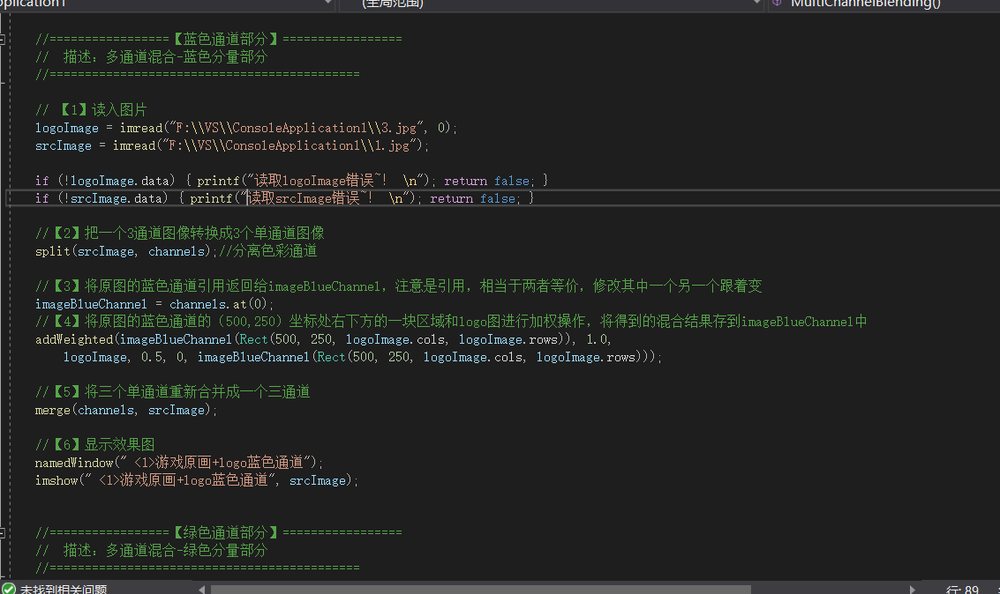
- 图像对比度、亮度值调整
  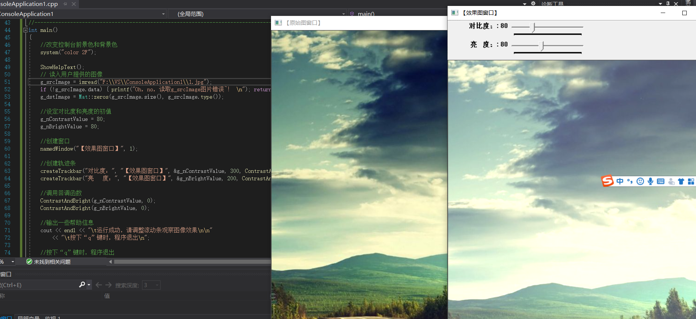
### 5.5离散傅里叶变换
傅里叶变换可以将一幅图片分解为正弦和余弦两个分量，换而言之，他可以将一幅图像从其空间域（spatial domain）转换为频域（frequency domain）。这种变换的思想是任何函数可以很精确的接近无穷个sin()函数和cos()函数的和。傅里叶变换提供了这种方法来达到这种效果。
对于数字图像这种离散的信号，频率大小表示信号变化的剧烈程度或者说是信号变化的快慢。频率越大，变化越剧烈，频率越小，信号越平缓，对应到图像中，高频信号往往是图像中的边缘信号和噪声信号，而低频信号包含图像变化频繁的图像轮廓及背景等信号
opencv提供的傅里叶变换函数dft()
代码实现：
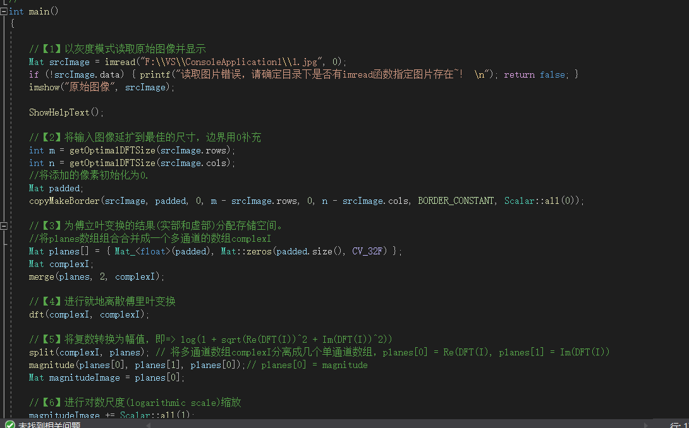
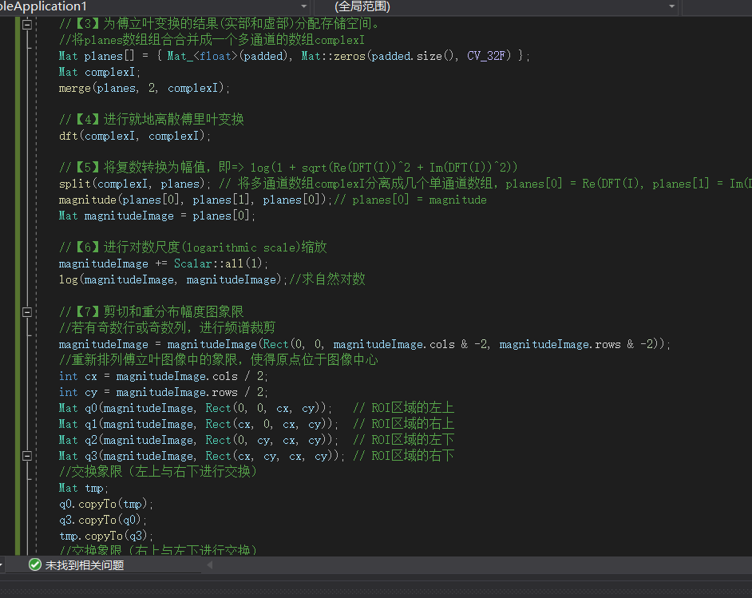
效果对比：
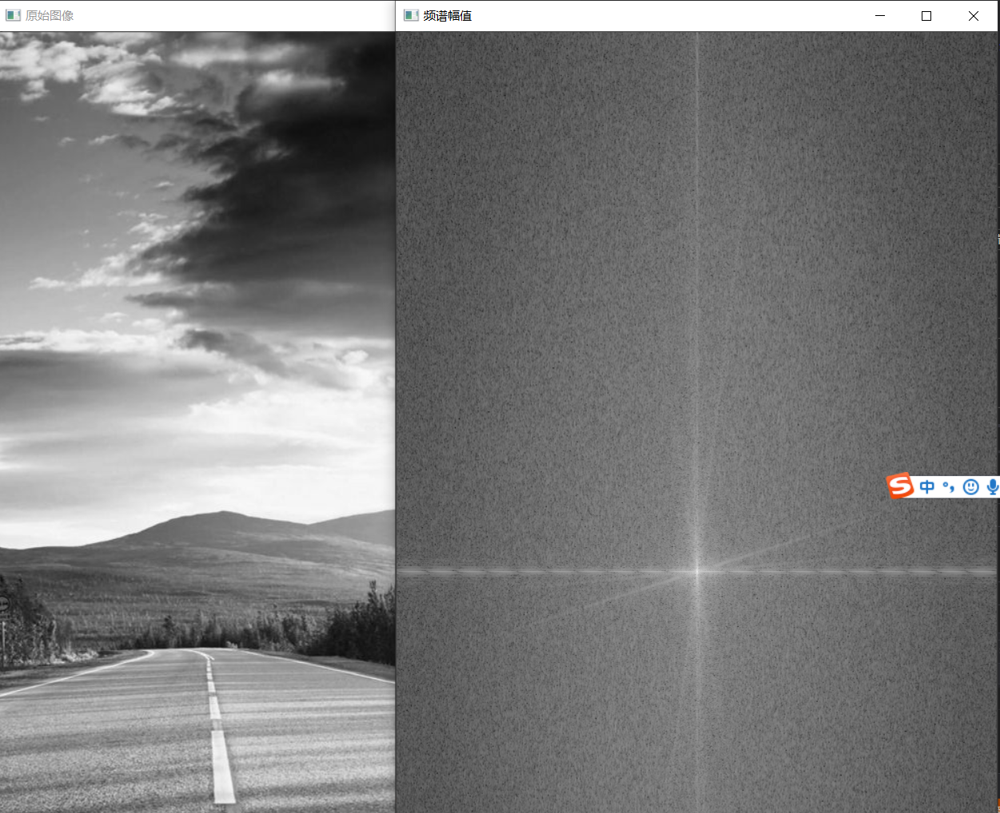
### 5.6输入输出XML和YAML文件
1. XML和YAML文件的简介
XML（eXtensible Markup Language），一种语义/结构化语言，描述了文档的结构和语义。首先，XML是一种元标记语言。所谓“元标记”，就是开发者可以根据自身需要定义自己的标记，比如可以定义标记book、name。任何满足XML命名规则的名称都可以标记，这就向不同的应用程序打开了的大门。此外，XML是一种语义/结构化语言，它描述了文档的结构和语义。
YAML（YAML Ain’t a Markup Langage），该语言以数据为中心，可读性高，用来表达资料序列的格式。在开发的这种语言时，YAML的原是："Yet Another Markup Language”（仍是一种置标语言），但为了强调这种语言以数据为中心，而不是以置标语言为重点，而用返璞词进行重新命名。YAML是一个可读性高，用来表达资料序列的格式。它参考了其他多种语言，包括：XML、C语言、Python、Perl,以及电子邮件格式RFC2822。
2. Filestorage类操作文件的使用引导
XML和YAML是使用非常广泛的文件格式，可以利用XML或者YAML格式的文件存储和还原各式各样的数据结构。当然，它们还可以存储和载入任意复
杂的数据结构，其中就包括了OpenCV相关周边的数据结构，以及各种原始数据类型，如整数和浮点数字和文本字符串． 

- 示例程序：XML和YAML文件的写入
代码实现：
```
#include<opencv2\opencv.hpp>
#include<time.h>

using namespace cv;

int main() {
	//初始化
	FileStorage fs("test.yaml", FileStorage::WRITE);

	//开始文件写入
	fs << "frameCount" << 5;
	time_t rawtime;
	time(&rawtime);
	fs << "calibrationDate" << asctime(localtime(&rawtime));
	Mat cameraMatrix = (Mat_<double>(3, 3) << 100, 0, 320, 0, 1000, 240, 0, 0, 1);
	Mat distCoeffs = (Mat_<double>(5, 1) << 0.1, 0.01, -0.001, 0, 0);
	fs << "cameraMatrix" << cameraMatrix << "distCoeffs" << distCoeffs;
	fs << "features" << "[";
	for (int i = 0; i < 3; i++)
	{
		int x = rand() % 640;
		int y = rand() % 480;
		uchar lbp = rand() % 256;

		fs << "{:" << "x" << x << "y" << y << "lbp" << "[:";
		for (int j = 0; j < 8; j++)
		{
			fs << ((lbp >> j) & 1);
		}
		fs << "]" << "}";
	}
	fs << "]";
	fs.release();

	printf("文件读写完毕！");
	getchar();

	return 0;
}
``` 
运行结果：
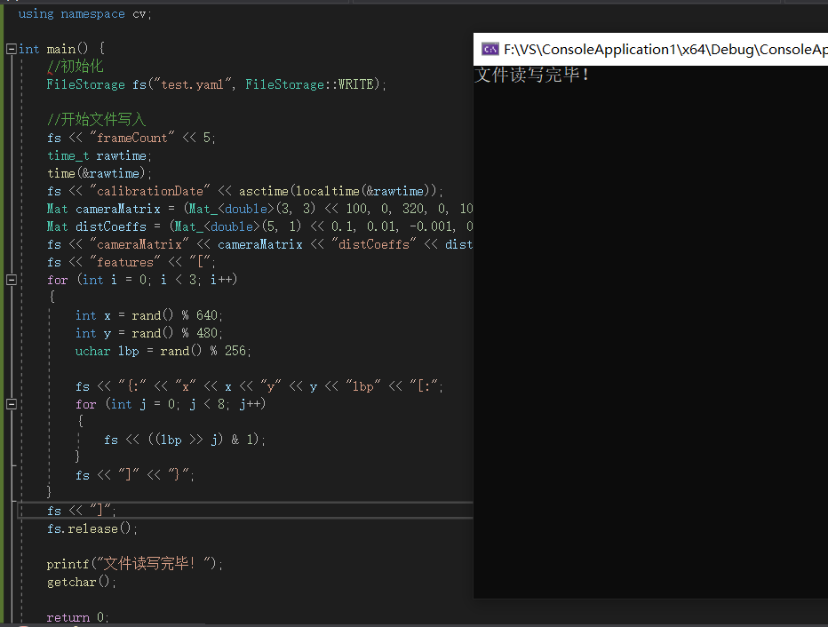

- 示例程序XML和YAML文件的读写
```
#include<opencv2\opencv.hpp>
#include<time.h>

using namespace cv;
using namespace std;

int main(){
	//改变控制台字体颜色
	system("color 6F");

	//初始化
	FileStorage fs2("test.yaml", FileStorage::READ);

	//第一种方法，对FileNode进行操作
	int frameCount = (int)fs2["frameCount"];
	std::string date;

	//第二种方法，使用FileNode运算符
	fs2["calibrationDate"] >> date;
	Mat cameraMatrix2, distCoeffs2;
	fs2["cameraMatrix"] >> cameraMatrix2;
	fs2["distCoeffs"] >> distCoeffs2;

	cout << "frameCount:" << frameCount << endl
		<< "calibration date:" << date << endl
		<< "camera matrix:" << cameraMatrix2 << endl
		<< "dist marix" << distCoeffs2 << endl;

	FileNode features = fs2["features"];
	FileNodeIterator it = features.begin(), it_end = features.end();
	int idx = 0;
	std::vector<uchar> lbpval;
	//使用FileNodeIterator遍历序列
	for (; it != it_end; it++)
	{
		cout << "feature #" << idx << ":";
		cout << "x=" << (int)(*it)["x"] << ",y=" << (int)(*it)["y"] << ",lbp:(";
		(*it)["lbp"] >> lbpval;
		for (int i = 0; i < (int)lbpval.size(); i++)
		{
			cout << " " << (int)lbpval[i];
		}
		cout << ")" << endl;
	}
	fs2.release();

	printf("\n文件读取完毕，请输入热一件结束程序！\n");
	getchar();

	return 0;
}
```
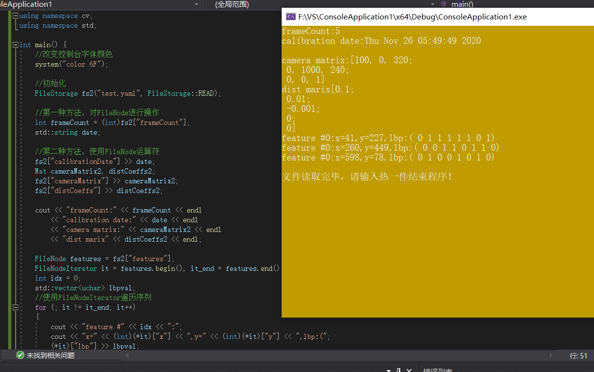

## 心得体会：
基础图像容器Mat
为解决复制开销大的问题，OpenCV引用计数机制。其思路是让每个Mat对象有自己的信息头，但共享同一个举证。通过矩阵指针指向同一地址，拷贝构造函数只复制信息头与矩阵指针，而不复制矩阵。
常用的数据结构和函数
点的表示：Point类，表示了二维坐标系下的点
颜色的表示：Scalar类，如Scalar(a, b, c)则定义的RGB颜色值为：红色分量的c，绿色b，蓝色a
尺寸的表示：Size类
矩形的表示：Rect类
第四章内容讲述了Mat的多种用法，并讲述了基本的图形绘制
第五章主要教学如何操作图像的像素、设置感兴趣区域、调成对比度和亮度值、对图像进行离散傅里叶变换，输入输出XML和YAML文件
通过对4、5两章内容的学习，使得对OpenCV的操作的更加熟练，增强了自己的操作能力，学习如何用OpenCV对图像进行操作