# 第四章  OpenCV数据结构与基本绘图
##4.1基础图像容器Mat
###4.1.1概述
Mat是一个容器类，支持C++中一般容器对元素的操作，同时作为一种矩阵数据存储类，由两个数据部分构成：1、矩阵头：包含矩阵尺寸、存储方式、存储地址等信息；2、指向存储所有像素值的矩阵的指针。矩阵头的尺寸是常数，但尺寸本身的尺寸会因图像的不同而不同。
通常创建和传递矩阵时会造成很大开销，在进行较大矩阵复制时，OpenCV引入了计数机制，让每个Mat对象都有自己的信息头，但共享同一个矩阵，者通过让矩阵指针指向同一地址实现，所以拷贝构造函数只复制信息头和矩阵指针，而不复制矩阵，避免了大量的空间时间开销。
然而某些时候你还是会复制矩阵本身，（不只是信息头和矩阵指针），这时可以使用函数clone()和copyTo()函数。

构造Mat矩阵时：

   使用赋值运算符和拷贝构造函数只复制信息头，改变任何一个矩阵都会影响到其他矩阵。
   使用函数Clone()和copyTo()来复制一幅图像的矩阵，新创建的矩阵和原矩阵相互独立，改变其中一个矩阵不会影响到其他矩阵。

OpenCV中Mat容器类的定义有很多行，下面列出来一些关键属性如下所示：
```
class CV_EXPORTS Mat
{
public:
//********Mat类的构造函数********
Mat();   //图像容器类Mat的默认构造函数
//......其他构造函数定义并初始化,在此省略 【下面讨论】
~Mat();  //Mat的析构函数
...
//********图像矩阵的属性********
int flags;  //图像矩阵是否连续
int dims;   //矩阵的维数，取值应该大于或等于2
int rows,cols;  //矩阵的行列数
uchar* data;    //指向数据的指针
int* refcount;  //指向引用计数的指针，如果数据由用户分配则为NULL
//......

//......其他的很多函数和数据结构
};
```

###4.1.2 Mat对象创建
1、使用Mat( )构造函数
```
Mat::Mat()      //无参数构造Mat方法

Mat::Mat(int rows, int cols, int type)   //【1】创建行数为rows，列数为cols，类型为type的图像矩阵

Mat::Mat(Size size, int type)  //【2】创建大小为size，类型为type的图像

Mat::Mat(int rows, int cols, int type, const Scalar& s)  //【3】创建行数为rows，列数为cols，类型为type的图像,并将所有元素初始化为s

Mat::Mat(Size size, int type, const Scalar& s)  //【4】创建大小为size，类型为type，初始元素为s

Mat::Mat(const Mat& m)  //【5】将m赋值给新创建的对象:数据共享

Mat::Mat(int rows, int cols, int type, void* data, size_t step = AUTO_STEP)  
//【6】创建行数为rows，列数为cols，类型为type的图像，构造函数不创建图像数据所需内存而是直接使用data所指内存图像的步长由step指定

Mat::Mat(Size size, int type, void* data, size_t step = AUTO_STEP) 
//【7】创建大小为size，类型为type的图像，构造函数不创建图像数据所需内存而是直接使用data所指内存图像的步长由step指定

Mat::Mat(const Mat& m, const Range& rowRange, const Range& colRange)  
//【8】创建新的图像为m数据的一部分，其具体的范围由rowRange和colRange指定:数据共享

Mat::Mat(const Mat& m, const Rect& roi)  //【9】创建新的矩阵为m的一部分，具体的范围由roi指定:数据共享
```

数据共享：指不同Mat图像矩阵矩阵指针指向同一个矩阵地址，当改变一个矩阵时其他矩阵也会跟着改变。

2、使用Create( )函数创建Mat类
```
Mat M1.create(4,4,CV_8UC1); //创建一个尺寸为4×4，type为8UC1的图像矩阵
```
使用create( )函数无法初始化Mat类，只是在改变尺寸时重新为矩阵数据开辟内存而已。也就是说，如果create()函数指定的参数与图像之前的尺寸相同，则不进行实质的内存申请操作，如果尺寸不同，则减少原始数据内存的索引并重新申请内存。

3、使用MATLAB风格创建Mat类
OpenCV也可以使用Matlab的风格创建函数如：zeros(),ones()和eyes(),在使用这些函数时只需要指定图像的大小和类型。
```
Mat M1=Mat::zeros(3,3,CV_8UC1);  //创建尺寸为3×3，类型为8UC1的全0矩阵

Mat M2=Mat::ones(4,4,CV_32FC3);  //创建尺寸为4×4，类型为8UC3的全1矩阵

Mat M3=Mat::eye(5,5,CV_64FC1);  //创建尺寸为5×5，类型为64FC1的单位矩阵
```

4、使用子类Mat_创建Mat矩阵
OpenCV定义了一个Mat的模板子类为Mat_，使用逗号分隔式初始化小型矩阵，如：
```
Mat M=(Mat_<double>(3,3) << 0,-1,0,
						   -1,5,-1,
							0,-1,0);
```

5、使用clone( )或copyTo方法创建Mat矩阵
copyTo( )是深拷贝，但是否申请新的内存空间，取决于dst矩阵头中的大小信息是否与src一至，若一致则只深拷贝并不申请新的空间，否则先申请空间后再进行拷贝．
clone( )是完全的深拷贝，在内存中申请新的空间。
```
Mat A  = Mat::ones(4,5,CV_32F);

Mat B = A.clone()    //clone 是完全的深拷贝，在内存中申请新的空间，与Ａ独立

Mat C;
A.copyTo(C) //此处的Ｃ矩阵大小与Ａ大小不一致，则申请新的内存空间，并完成拷贝，等同于clone()

Mat D = A.col(1);
A.col(0).copyTo(D)　//此处D矩阵大小与Ａ不一致，因此不会申请空间，而是直接进行拷贝，相当于把Ａ的第1列赋值给D
```

###4.1.3 代码实现

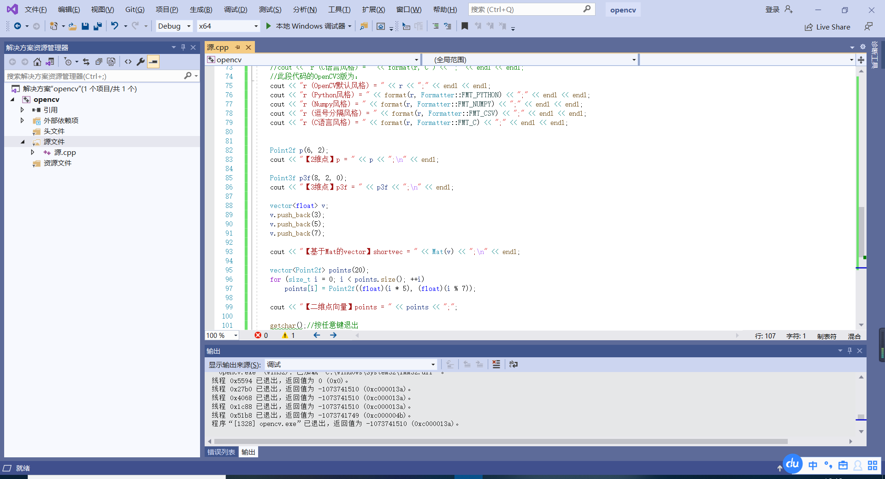
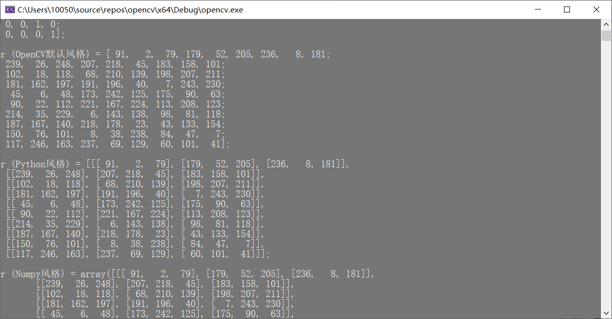

## 4.2常用数据结构和函数
### 4.2.1 点的表示
Point类数据结构表示了二维坐标系的点，例如：
```
Point  point;

point.x=1;

point.y=2;
```
或者
```
Point point=Point(1,2);
```

###4.2.2颜色表示
Scalar()表示具有4个元素的数组，常用于被大量传递像素值，如RGB颜色值，RGB为三个参数，如果用不到第四个参数，则不需要写出来，若只写三个参数则默认为是RGB三个分量。例如：
```
Scalar(a,b,c);
```
默认为红色为c,绿色为b,蓝色为a.（因为RGB在存储时的顺序是BGR）

###4.2.3尺寸的表示
Size()函数表示尺寸，例如：
```
Size(2,2);//构造出的Size宽度和高度都为2，即xxx.width和xxx.height都为5.
```
###4.2.4矩形表示
Rect类的成员变量有想x、y、width、height，分别表示左上角点的坐标和矩形的宽和高。常用的成员函数有：Size()返回值为Size;area()返回值为矩形的面积；contains(Point)判断点是否早矩形内；inside(Rect)函数判断矩形是否在该矩形内；tl()返回左上角点的坐标；br()返回右下角点的坐标。

矩形的交集和并集：
```
Rect rect =rect1&rect2;

Rect rect =rect1|rect2;
```
矩形的平移和缩放：
```
Rect rectShift = rect +point;

Rect rectScale= rect+size;
```
###4.2.5颜色空间转换函数
cvtColor()是opencv中的转换函数，具体用法为：
```
void cvtColor(InputArray src,OutputArray dst,int code,int dstCn=0)
```
其中第一个参数为输入图像，第二个图像为输出图像，第三个参数为颜色空间转换的标识符，第四个参数为目标图像的通道数，若该参数为0，表示目标的图像取原图像的通道数。

一般的常用标识符为，RGB转换Gray的为COLOR_RGB2GRAY、COLOR_GRAY2RGB，更多的标识符可以用的时候再去查找。

###4.2.6基本图形绘制函数
(1)绘制直线函数line();

(2)绘制椭圆函数ellipsee();

(3)绘制矩形函数rectangle();

(4)绘制圆的函数circle();

(5)绘制填充多边形的fillPoly();

##4.3基本图形的绘制

本节涉及到的绘图函数有：

用于绘制直线的line函数；
用于绘制椭圆的ellipse函数：
用于绘制矩形的rectangle函数：
用于绘制圆的circle函数：
用于绘制填充的多边形的fillPoly函数。
让我们通过一个程序实例的学习来掌握OpenCV中各种绘制函数的用法。此程序的原型为OpenCV官方的示例程序，主要的脉络是定义了几个自定义的绘制函数，然后调用这些自定义的函数绘制出了两幅图一一一幅化学原子示例图和一幅组合图。

在此，我们主要分析一下程序中的4个自定义函数的写法和用意。

需要注意，程序的文件开头有如下的宏定义：
```
#define WINDOW_WIDTH 600//定义窗口大小的宏
```
###4.3.1. DrawEllipse()函数的写法
```
void DrawEllipse(Mat img, double angle){
	int thickness = 2;
	int lineType = 8;
	ellipse(img,
		Point(WINDOW_WIDTH / 2, WINDOW_WIDTH / 2),
		Size(WINDOW_WIDTH / 4, WINDOW_WIDTH / 16),
		angle,
		0,
		360,
		Scalar(255, 129, 0),
		thickness,
		lineType);
}
```

函数DrawEIIipse调用了OpenCV中的ellipse函数，将椭圆画到图像img上，椭圆中心为点(WINDOW_WIDTH/2.0,WINDOW_WIDTH/2.0)，并且大小位于矩形(WINDOW_WIDTH/4.0,WINDOW_WIDTH/16.0）内。椭圆旋转角度为angle,扩展的弧度从0度到360度。图形颜色为scalar（255，129，0）代表的蓝色，线宽(thickness)为2，线型(IineType)为8（8联通线型)。

###4.3.2. DrawFilledCircle()函数的写法
```
void DrawFilledCircle(Mat img, Point center){
	int thickness = -1;
	int lineType = 8;
	circle(img,
		center,
		WINDOW_WIDTH / 32,
		Scalar(0, 0, 255),
		thickness,
		lineType);
}
```

此函数的写法解析如下。

函数DrawFilledCircle()调用了OpenCV中的circle()函数，将圆画到图像img上，圆心由点center定义，元的半径为WINDOW_WIDTH/32,元的颜色为Scalar(0,0,255)，按BGR的格式为红色，线粗定义为thickness=-1,因此绘制的圆是实心的。

###4.3.3DrawPolygon()函数的写法
```
void DrawPolygon(Mat img){
	int lineType = 8;

	//创建一些点
	Point rookPoints[1][20];
	rookPoints[0][0] = Point(WINDOW_WIDTH / 4, 7 * WINDOW_WIDTH / 8);
	rookPoints[0][1] = Point(3 * WINDOW_WIDTH / 4, 7 * WINDOW_WIDTH / 8);
	rookPoints[0][2] = Point(3 * WINDOW_WIDTH / 4, 13 * WINDOW_WIDTH / 16);
	rookPoints[0][3] = Point(11 * WINDOW_WIDTH / 16, 13 * WINDOW_WIDTH / 16);
	rookPoints[0][4] = Point(19 * WINDOW_WIDTH / 32, 3 * WINDOW_WIDTH / 8);
	rookPoints[0][5] = Point(3 * WINDOW_WIDTH / 4, 3 * WINDOW_WIDTH / 8);
	rookPoints[0][6] = Point(3 * WINDOW_WIDTH / 4,  WINDOW_WIDTH / 8);
	rookPoints[0][7] = Point(26 * WINDOW_WIDTH / 40,  WINDOW_WIDTH / 8);
	rookPoints[0][8] = Point(26 * WINDOW_WIDTH / 40,  WINDOW_WIDTH / 4);
	rookPoints[0][9] = Point(22 * WINDOW_WIDTH / 40,  WINDOW_WIDTH / 4);
	rookPoints[0][10] = Point(22 * WINDOW_WIDTH / 40,  WINDOW_WIDTH / 8);
	rookPoints[0][11] = Point(18 * WINDOW_WIDTH / 40,  WINDOW_WIDTH / 8);
	rookPoints[0][12] = Point(18 * WINDOW_WIDTH / 40,  WINDOW_WIDTH / 4);
	rookPoints[0][13] = Point(14 * WINDOW_WIDTH / 40,  WINDOW_WIDTH / 4);
	rookPoints[0][14] = Point(14 * WINDOW_WIDTH / 40,  WINDOW_WIDTH / 8);
	rookPoints[0][15] = Point( WINDOW_WIDTH / 4,  WINDOW_WIDTH / 8);
	rookPoints[0][16] = Point( WINDOW_WIDTH / 4, 3 * WINDOW_WIDTH / 8);
	rookPoints[0][17] = Point(13 * WINDOW_WIDTH / 32, 3 * WINDOW_WIDTH / 8);
	rookPoints[0][18] = Point(5 * WINDOW_WIDTH / 16, 13 * WINDOW_WIDTH / 16);
	rookPoints[0][19] = Point(3 * WINDOW_WIDTH / 4, 13 * WINDOW_WIDTH / 16);

	const Point* ppt[1] = { rookPoints[0] };
	int npt[] = { 20 };

	fillPoly(img,
		ppt,
		npt,
		1,
		Scalar(255, 255, 255),
		lineType);
}
```
函数DrawPolygon()调用了OpenCV中的fillPoly函数，用于将多边形画到图像img上，其中多边形的顶点集为ppt，要绘制的多边形顶点数目为npt,要绘制的多边形数量仅为1，多边形的颜色定义为Scalar(255,255,255)。

###4.3.4 DrawLine()函数的写法
```
void DrawLine(Mat img, Point start, Point end){
	int thickness = 2;
	int lineType = 8;
	line(img,
		start,
		end,
		Scalar(0, 0, 0),
		thickness,
		lineType);
}
```

此函数调用了OpenCV中的line函数，用于在图像img上画一条从点start到end的直线段，显得颜色为Scalar(0,0,0)代表的为黑色，线的粗细thickness为2，且此线为8联通（lineType=8)。

###4.3.5 代码实现
```
#include<opencv2\core\core.hpp>
#include<opencv2\highgui\highgui.hpp>
using namespace cv;
#define WINDOW_WIDTH 600
#define WINDOW_NAME1 "【绘制图1】"
#define WINDOW_NAME2 "【绘制图2】"
void DrawEllipse(Mat img, double angle){
	int thickness = 2;
	int lineType = 8;
	ellipse(img,
		Point(WINDOW_WIDTH / 2, WINDOW_WIDTH / 2),
		Size(WINDOW_WIDTH / 4, WINDOW_WIDTH / 16),
		angle,
		0,
		360,
		Scalar(255, 129, 0),
		thickness,
		lineType);
}
void DrawFilledCircle(Mat img, Point center){
	int thickness = -1;
	int lineType = 8;
	circle(img,
		center,
		WINDOW_WIDTH / 32,
		Scalar(0, 0, 255),
		thickness,
		lineType);
}
void DrawPolygon(Mat img){
	int lineType = 8;

	//创建一些点
	Point rookPoints[1][20];
	rookPoints[0][0] = Point(WINDOW_WIDTH / 4, 7 * WINDOW_WIDTH / 8);
	rookPoints[0][1] = Point(3 * WINDOW_WIDTH / 4, 7 * WINDOW_WIDTH / 8);
	rookPoints[0][2] = Point(3 * WINDOW_WIDTH / 4, 13 * WINDOW_WIDTH / 16);
	rookPoints[0][3] = Point(11 * WINDOW_WIDTH / 16, 13 * WINDOW_WIDTH / 16);
	rookPoints[0][4] = Point(19 * WINDOW_WIDTH / 32, 3 * WINDOW_WIDTH / 8);
	rookPoints[0][5] = Point(3 * WINDOW_WIDTH / 4, 3 * WINDOW_WIDTH / 8);
	rookPoints[0][6] = Point(3 * WINDOW_WIDTH / 4,  WINDOW_WIDTH / 8);
	rookPoints[0][7] = Point(26 * WINDOW_WIDTH / 40,  WINDOW_WIDTH / 8);
	rookPoints[0][8] = Point(26 * WINDOW_WIDTH / 40,  WINDOW_WIDTH / 4);
	rookPoints[0][9] = Point(22 * WINDOW_WIDTH / 40,  WINDOW_WIDTH / 4);
	rookPoints[0][10] = Point(22 * WINDOW_WIDTH / 40,  WINDOW_WIDTH / 8);
	rookPoints[0][11] = Point(18 * WINDOW_WIDTH / 40,  WINDOW_WIDTH / 8);
	rookPoints[0][12] = Point(18 * WINDOW_WIDTH / 40,  WINDOW_WIDTH / 4);
	rookPoints[0][13] = Point(14 * WINDOW_WIDTH / 40,  WINDOW_WIDTH / 4);
	rookPoints[0][14] = Point(14 * WINDOW_WIDTH / 40,  WINDOW_WIDTH / 8);
	rookPoints[0][15] = Point( WINDOW_WIDTH / 4,  WINDOW_WIDTH / 8);
	rookPoints[0][16] = Point( WINDOW_WIDTH / 4, 3 * WINDOW_WIDTH / 8);
	rookPoints[0][17] = Point(13 * WINDOW_WIDTH / 32, 3 * WINDOW_WIDTH / 8);
	rookPoints[0][18] = Point(5 * WINDOW_WIDTH / 16, 13 * WINDOW_WIDTH / 16);
	rookPoints[0][19] = Point(3 * WINDOW_WIDTH / 4, 13 * WINDOW_WIDTH / 16);

	const Point* ppt[1] = { rookPoints[0] };
	int npt[] = { 20 };

	fillPoly(img,
		ppt,
		npt,
		1,
		Scalar(255, 255, 255),
		lineType);
}
void DrawLine(Mat img, Point start, Point end){
	int thickness = 2;
	int lineType = 8;
	line(img,
		start,
		end,
		Scalar(0, 0, 0),
		thickness,
		lineType);
}
int main(){
	//创建空白的Mat图像
	Mat atomImage = Mat::zeros(WINDOW_WIDTH, WINDOW_WIDTH, CV_8UC3);
	Mat rookImage = Mat::zeros(WINDOW_WIDTH, WINDOW_WIDTH, CV_8UC3);

	//绘制椭圆
	DrawEllipse(atomImage, 90);
	DrawEllipse(atomImage, 0);
	DrawEllipse(atomImage, 45);
	DrawEllipse(atomImage, -45);

	//绘制圆心
	DrawFilledCircle(atomImage,Point(WINDOW_WIDTH/2,WINDOW_WIDTH/2));
	
	//绘制椭圆
	DrawPolygon(rookImage);

	//绘制矩形
	rectangle(rookImage,
		Point(0, 7 * WINDOW_WIDTH / 8),
		Point(WINDOW_WIDTH, WINDOW_WIDTH),
		Scalar(0, 255, 255),
		-1,
		8);

	//绘制一些线段
	DrawLine(rookImage, Point(0, 15 * WINDOW_WIDTH / 16), Point(WINDOW_WIDTH, 15 * WINDOW_WIDTH / 16));
	DrawLine(rookImage, Point(WINDOW_WIDTH/4, 7 * WINDOW_WIDTH / 8), Point(WINDOW_WIDTH/4, WINDOW_WIDTH));
	DrawLine(rookImage, Point(WINDOW_WIDTH / 2, 7 * WINDOW_WIDTH / 8), Point(WINDOW_WIDTH/2,WINDOW_WIDTH));
	DrawLine(rookImage, Point(3 * WINDOW_WIDTH / 4, 7 * WINDOW_WIDTH / 8), Point(3 * WINDOW_WIDTH / 4, WINDOW_WIDTH));

	//显示图像
	imshow(WINDOW_NAME1, atomImage);
	moveWindow(WINDOW_NAME1, 0, 200);
	imshow(WINDOW_NAME2, rookImage);
	moveWindow(WINDOW_NAME2, WINDOW_WIDTH, 200);

	waitKey(0);
	return (0);
}
```


## 4.4 小结
本章我主要学习了经常会遇到的各种数据结构，主要是基础图像容器Mat的用法。让我通过一个程序实例的学习来掌握OpenCV中各种绘制函数的用法。此程序的原型为OpenCV官方的示例程序，主要的脉络是定义了几个自定义的绘制函数，然后调用这些自定义的函数绘制出了两幅图一一一幅化学原子示例图和一幅组合图。


#  第五章 core 组件进阶
## 5.1 访问图像中的像素
### 5.1.1 用指针访问像素
Mat类有若干成员函数可以获取图像的属性。公有成员变量cols 和 rows给出了图像的宽和高，而成员函数channels()用于返回图像的通道数。灰度图的通道数为1，彩色图的通道数为3。
每行的像素值由以下语句得到:
```
int colNumber = outputImage.cols*outputImage.channels();//列数x通道数=每一行元素的个数
```
为了简化指针运算，Mat类提供了ptr函数可以得到图像任意行的首地址。ptr是一个模板函数，它返回第i行的首地址:
```
uchar* data = outputImage.ptr<uchar>(i);//获取第i行的首地址
```
而双层循环内部的那句处理像素的代码，我们可以等效地使用指针运算从一列移动到下一列。所以，也可以这样来写:
```
*data＋＋=*data/div*div+div/2;
```

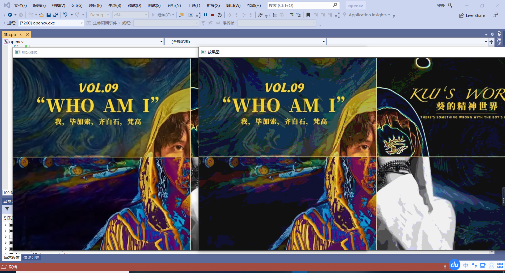

###5.1.2 用迭代器访问像素
这种方法与STL库的用法类似。
在迭代法中，我们所需要做的仅仅是获得图像矩阵的 begin和 end，然后增加迭代直至从begin到 end。将*操作符添加在迭代指针前，即可访问当前指向的内容。
相比用指针直接访问可能出现越界问题，迭代器绝对是非常安全的方法.
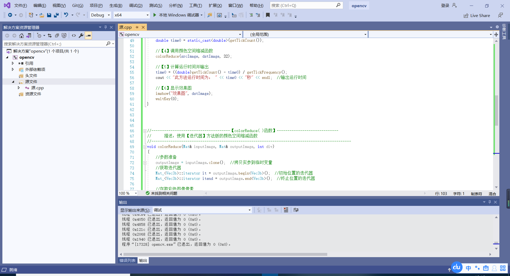
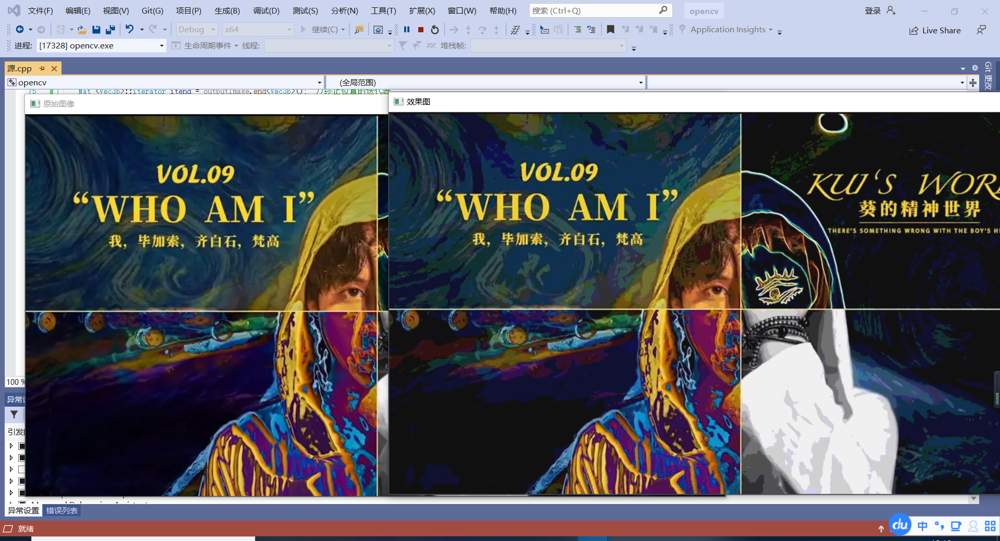

### 5.1.3 用动态地址计算配合at访问像素
Mat类中的cols 和 rows给出了图像的宽和高。而成员函数 at( int y，int x)可以用来存取图像元素，但是必须在编译期知道图像的数据类型。需要注意的是，我们一定要确保指定的数据类型要和矩阵中的数据类型相符合，因为at方法本身不会对任何数据类型进行转换。
对于彩色图像，每个像素由三个部分构成:蓝色通道、绿色通道和红色通道(BGR)。因此，对于一个包含彩色图像的Mat，会返回一个由三个8位数组成的向量。OpenCV将此类型的向量定义为Vec3b，即由三个unsigned char组成的向量。这也解释了为什么存取彩色图像像素的代码可以写出如下形式:
```
image.at<vec3b>(j,i) [ channel ]=value;
```
其中，索引值 channel标明了颜色通道号。
另外需要再次提醒大家的是，OpenCV中的彩色图像不是以RGB的顺序存放的，而是 BGR，所以程序中的 outputImage.at<Vec3b>(i.j)[0]代表的是该点的B分量。同理还有(*it)[0]。

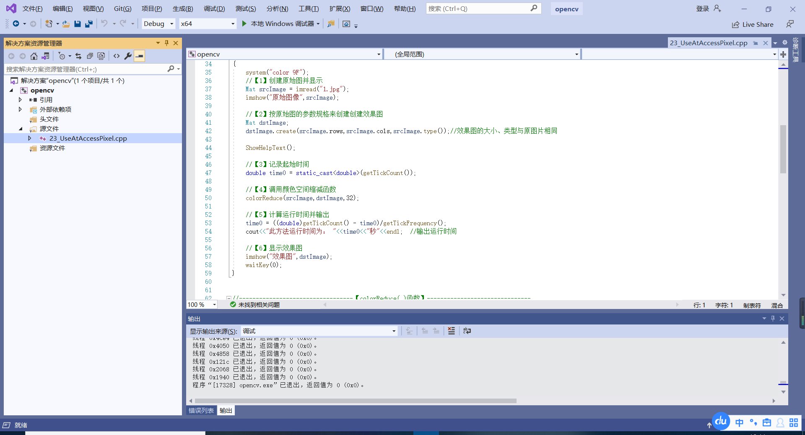
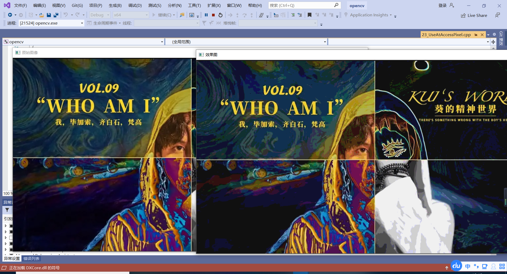

### 5.1.4 遍历图像像素的14种方法
	【方法一】利用.ptr 和 []的方法
	【方法二】利用 .ptr 和 * ++ 的方法
    【方法三】利用.ptr 和 * ++ 以及模操作的方法
	【方法四】利用.ptr 和 * ++ 以及位操作的方法
	【方法五】利用指针算术运算的方法
	【方法六】利用 .ptr 和 * ++以及位运算、channels()的方法
	【方法七】利用.ptr 和 * ++ 以及位运算(continuous)的方法
	【方法八】利用 .ptr 和 * ++ 以及位运算 (continuous+channels)的方法
	【方法九】利用Mat_ iterator 的方法
	【方法十】利用Mat_ iterator以及位运算的方法
	【方法十一】利用Mat Iterator_的方法
	【方法十二】利用动态地址计算配合at 的方法
	【方法十三】利用图像的输入与输出的方法
	【方法十四】利用操作符重载的方法


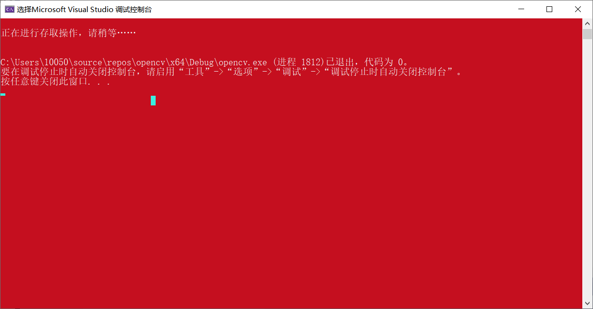

## 5.2  ROI区域图像叠加&图像混合
### 5.2.1  ROI区域定义的两种方法
 定义ROI区域有两种方法，第一种是使用cv:Rect.顾名思义，cv::Rect表示一个矩形区域。指定矩形的左上角坐标（构造函数的前两个参数）和矩形的长宽（构造函数的后两个参数）就可以定义一个矩形区域。
```
 //定义一个Mat类型并给其设定ROI区域
Mat imageROI;
//方法一
imageROI=image(Rect(500,250,logo.cols,logo.rows));
```
另一种定义ROI的方式是指定感兴趣行或列的范围（Range）。Range是指从起始索引到终止索引（不包括终止索引）的一连段连续序列。cv::Range可以用来定义Range。如果使用cv::Range来定义ROI，那么前例中定义ROI的代码可以重写为：
```
//方法二
imageROI=srcImage3(Range(250,250+logoImage.rows),Range(200,200+logoImage.cols));
```
下面我们来看一个实例，显示如何利用ROI将一幅图加到另一幅图的指定位置。大家如果需要拷贝如下的函数中的代码直接运行的话，自己建一个基于console的程序，然后把函数体中的内容拷贝到main函数中，然后找两幅大小合适的图片，加入到工程目录下，并和代码中读取的文件名一致即可。

在下面的代码中，我们通过一个图像掩膜（mask），直接将插入处的像素设置为logo图像的像素值，这样效果会很赞很逼真：
```
//----------------------------------【ROI_AddImage( )函数】----------------------------------
// 函数名：ROI_AddImage（）
//     描述：利用感兴趣区域ROI实现图像叠加
//----------------------------------------------------------------------------------------------
bool ROI_AddImage()
{
 
       //【1】读入图像
       Mat srcImage1= imread("dota_pa.jpg");
       Mat logoImage= imread("dota_logo.jpg");
       if(!srcImage1.data ) { printf("你妹，读取srcImage1错误~！ \n"); return false; }
       if(!logoImage.data ) { printf("你妹，读取logoImage错误~！ \n"); return false; }
 
       //【2】定义一个Mat类型并给其设定ROI区域
       Mat imageROI= srcImage1(Rect(200,250,logoImage.cols,logoImage.rows));
 
       //【3】加载掩模（必须是灰度图）
       Mat mask= imread("dota_logo.jpg",0);
 
       //【4】将掩膜拷贝到ROI
       logoImage.copyTo(imageROI,mask);
 
       //【5】显示结果
       namedWindow("<1>利用ROI实现图像叠加示例窗口");
       imshow("<1>利用ROI实现图像叠加示例窗口",srcImage1);
 
       return true;
}

```
这个函数首先是载入了两张jpg图片到srcImage1和logoImage中，然后定义了一个Mat类型的imageROI，并使用cv::Rect设置其感兴趣区域为srcImage1中的一块区域，将imageROI和srcImage1关联起来。接着定义了一个Mat类型的的mask并读入dota_logo.jpg，顺势使用Mat:: copyTo把mask中的内容拷贝到imageROI中，于是就得到了最终的效果图，namedWindow和imshow配合使用，显示出最终的结果。

运行结果如下：
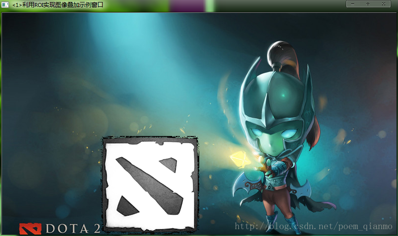

这里白色的dota2 logo，就是通过操作之后加上去的图像。

### 5.2.2 初级图像混合——线性混合操作

addWeighted函数

这个函数的作用是，计算两个数组（图像阵列）的加权和。原型如下：
```
void addWeighted(InputArray src1, double alpha, InputArray src2, double beta, double gamma, OutputArray dst, int dtype=-1);
```
第一个参数，InputArray类型的src1，表示需要加权的第一个数组，常常填一个Mat。
第二个参数，alpha，表示第一个数组的权重
第三个参数，src2，表示第二个数组，它需要和第一个数组拥有相同的尺寸和通道数。
第四个参数，beta，表示第二个数组的权重值。
第五个参数，dst，输出的数组，它和输入的两个数组拥有相同的尺寸和通道数。
第六个参数，gamma，一个加到权重总和上的标量值。看下面的式子自然会理解。
第七个参数，dtype，输出阵列的可选深度，有默认值-1。;当两个输入数组具有相同的深度时，这个参数设置为-1（默认值），即等同于src1.depth（）。

### 5.2.3 综合示例
在前面分别介绍的设定感兴趣区域ROI和使用addWeighted函数进行图像线性混合的基础上，我还将他们两者中和起来使用，也就是先指定ROI，并用addWeighted函数对我们指定的ROI区域的图像进行混合操作，我们将其封装在了一个名为ROI_LinearBlending的函数中。

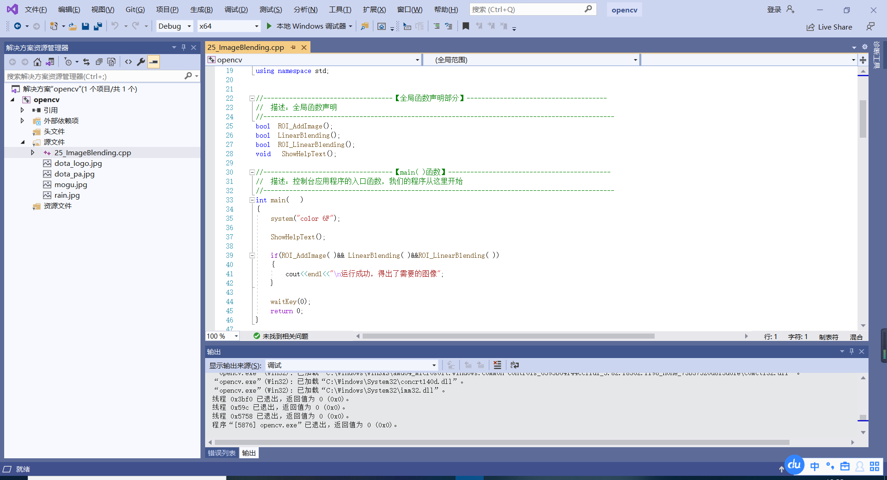
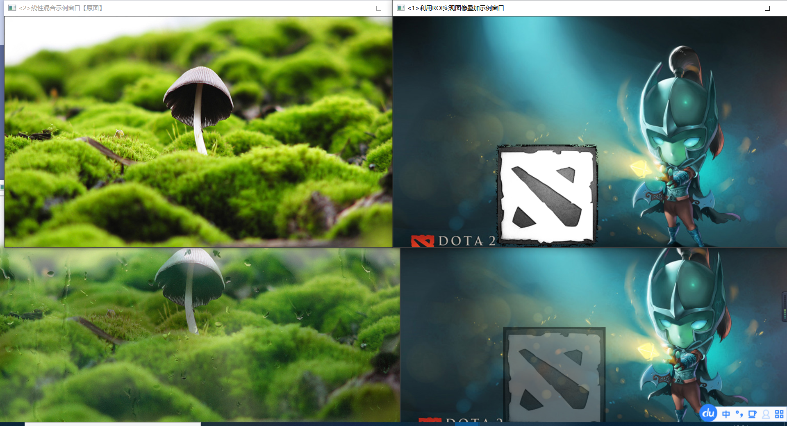

## 5.3 分离颜色通道、多通道图像混合
### 5.3.1 分离颜色通道
<1>split函数详解
将一个多通道数组分离成几个单通道数组。ps：这里的array按语境译为数组或者阵列。
这个split函数的C++版本有两个原型，他们分别是：
```
 void split(const Mat& src, Mat*mvbegin);
 void split(InputArray m,OutputArrayOfArrays mv);
```
关于变量介绍：
第一个参数，InputArray类型的m或者const Mat&类型的src，填我们需要进行分离的多通道数组。
第二个参数，OutputArrayOfArrays类型的mv，填函数的输出数组或者输出的vector容器。
就如上一节中讲到方法一样，这里的OutputArrayOfArrays我们通过【转到定义】大法，可以查到它是_OutputArray的引用，那么我们在源代码中再次通过【转到定义】看到_OutputArray类的原型，即是OutputArrayOfArrays的原型：
```
class CV_EXPORTS _OutputArray : public_InputArray
{
public:
   _OutputArray();
 
   _OutputArray(Mat& m);
   template<typename _Tp> _OutputArray(vector<_Tp>& vec);
   template<typename _Tp> _OutputArray(vector<vector<_Tp>>& vec);
   _OutputArray(vector<Mat>& vec);
   template<typename _Tp> _OutputArray(vector<Mat_<_Tp>>& vec);
   template<typename _Tp> _OutputArray(Mat_<_Tp>& m);
   template<typename _Tp, int m, int n> _OutputArray(Matx<_Tp, m,n>& matx);
   template<typename _Tp> _OutputArray(_Tp* vec, int n);
   _OutputArray(gpu::GpuMat& d_mat);
   _OutputArray(ogl::Buffer& buf);
   _OutputArray(ogl::Texture2D& tex);
 
    _OutputArray(constMat& m);
   template<typename _Tp> _OutputArray(const vector<_Tp>&vec);
   template<typename _Tp> _OutputArray(constvector<vector<_Tp> >& vec);
   _OutputArray(const vector<Mat>& vec);
   template<typename _Tp> _OutputArray(const vector<Mat_<_Tp>>& vec);
   template<typename _Tp> _OutputArray(const Mat_<_Tp>& m);
   template<typename _Tp, int m, int n> _OutputArray(constMatx<_Tp, m, n>& matx);
   template<typename _Tp> _OutputArray(const _Tp* vec, int n);
   _OutputArray(const gpu::GpuMat& d_mat);
   _OutputArray(const ogl::Buffer& buf);
   _OutputArray(const ogl::Texture2D& tex);
 
   virtual bool fixedSize() const;
   virtual bool fixedType() const;
   virtual bool needed() const;
   virtual Mat& getMatRef(int i=-1) const;
   /*virtual*/ gpu::GpuMat& getGpuMatRef() const;
   /*virtual*/ ogl::Buffer& getOGlBufferRef() const;
   /*virtual*/ ogl::Texture2D& getOGlTexture2DRef() const;
   virtual void create(Size sz, int type, int i=-1, bool allowTransposed=false,int fixedDepthMask=0) const;
   virtual void create(int rows, int cols, int type, int i=-1, boolallowTransposed=false, int fixedDepthMask=0) const;
   virtual void create(int dims, const int* size, int type, int i=-1, boolallowTransposed=false, int fixedDepthMask=0) const;
   virtual void release() const;
   virtual void clear() const;
 
#ifdefOPENCV_CAN_BREAK_BINARY_COMPATIBILITY
   virtual ~_OutputArray();
#endif
};
```
类体中还是有不少内容的，其实注意到里面是定义的各种模板，重载的各种构造函数就可以了。

好了，穿越完OutputArrayOfArrays的介绍，我们继续讲解split。

split函数分割多通道数组转换成独立的单通道数组，按公式来看就是这样：
```
Mat srcImage;
Mat imageROI;
vector<Mat> channels;
srcImage= cv::imread("dota.jpg");
// 把一个3通道图像转换成3个单通道图像
split(srcImage,channels);//分离色彩通道
       imageROI=channels.at(0);
       addWeighted(imageROI(Rect(385,250,logoImage.cols,logoImage.rows)),1.0,
              logoImage,0.5,0.,imageROI(Rect(385,250,logoImage.cols,logoImage.rows)));
 
       merge(channels,srcImage4);
 
       namedWindow("sample");
       imshow("sample",srcImage);
```

将一个多通道数组分离成几个单通道数组的split()函数的内容大概就是这些了，下面我们来看一下和他亲如手足或者说是他的死对头——merge()函数。


<2>merge函数详解

merge()函数的功能是split()函数的逆向操作，将多个数组组合合并成一个多通道的数组。

它通过组合一些给定的单通道数组，将这些孤立的单通道数组合并成一个多通道的数组，从而创建出一个由多个单通道阵列组成的多通道阵列。它有两个基于C++的函数原型：
```
void merge(const Mat* mv, size_tcount, OutputArray dst)
 void merge(InputArrayOfArrays mv,OutputArray dst)
```

第一个参数，mv，填需要被合并的输入矩阵或vector容器的阵列，这个mv参数中所有的矩阵必须有着一样的尺寸和深度。
第二个参数，count，当mv为一个空白的C数组时，代表输入矩阵的个数，这个参数显然必须大于1.
第三个参数，dst，即输出矩阵，和mv[0]拥有一样的尺寸和深度，并且通道的数量是矩阵阵列中的通道的总数。

函数解析：

merge函数的功能是将一些数组合并成一个多通道的数组。关于组合的细节，输出矩阵中的每个元素都将是输出数组的串接，其中，第i个输入数组的元素被视为mv[i]。 c一般用其中的Mat::at（）方法对某个通道进行存取,也就是这样用channels.at(0)。

PS: Mat::at（）方法，返回一个引用到指定的数组元素。注意是引用，相当于两者等价，修改其中一个另一个跟着变。
```
vector<Mat> channels;
Mat imageBlueChannel;
Mat imageGreenChannel;
Mat imageRedChannel;
srcImage4= imread("dota.jpg");
// 把一个3通道图像转换成3个单通道图像
split(srcImage4,channels);//分离色彩通道
imageBlueChannel = channels.at(0);
imageGreenChannel = channels.at(1);
imageRedChannel = channels.at(2);
```
上面的代码先做了相关的类型声明，然后把载入的3通道图像转换成3个单通道图像，放到vector<Mat>类型的channels中，接着进行引用赋值。

根据OpenCV的BGR色彩空间（bule，Green，Red，蓝绿红），其中channels.at(0)就表示引用取出channels中的蓝色分量，channels.at(1)就表示引用取出channels中的绿色色分量，channels.at(2)就表示引用取出channels中的红色分量。

一对做相反操作的plit()函数和merge()函数和用法就是这些了。另外提一点，如果我们需要从多通道数组中提取出特定的单通道数组，或者说实现一些复杂的通道组合，可以使用mixChannels()函数。

### 5.3.2 多通道图像混合示例程序

在本小节展示的示例程序中，我们把多通道图像混合的实现代码封装在了为MultiChannelBlending()的函数中。

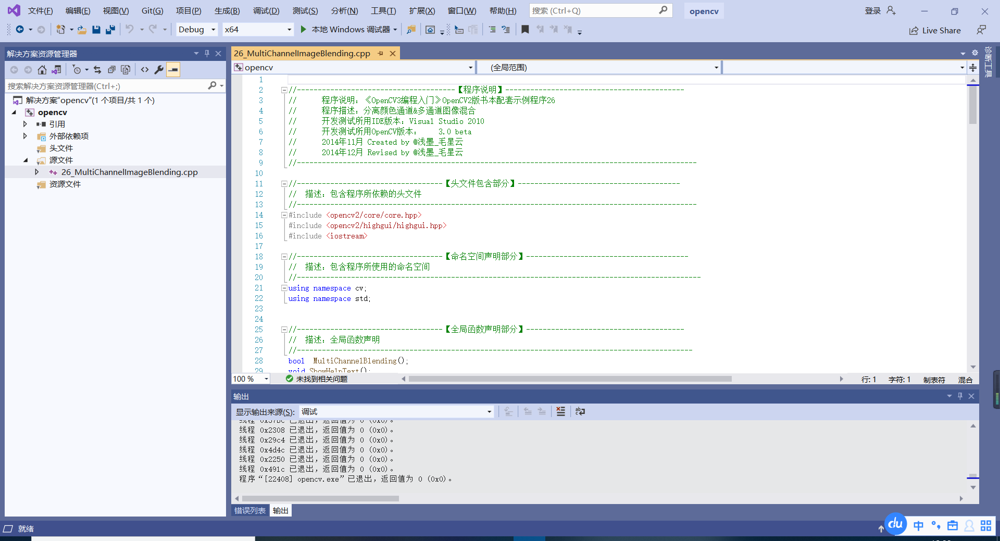
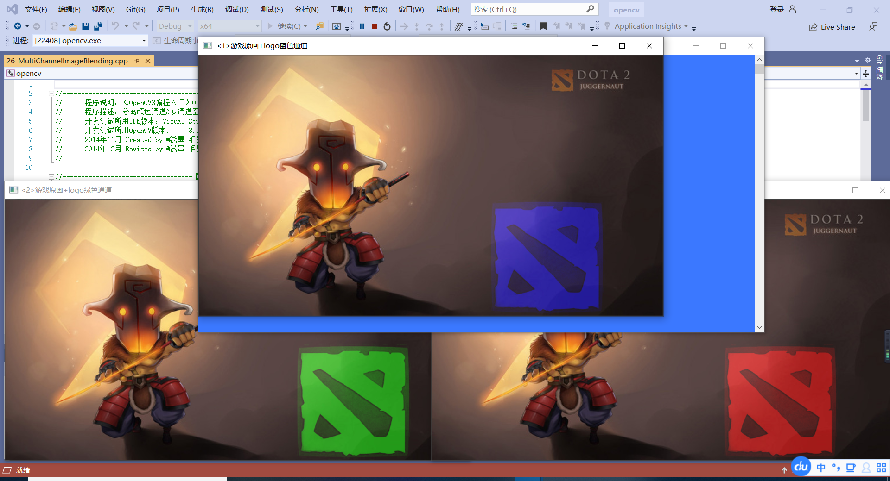

## 5.4 图像对比度、亮度值调整

在图像像素公式g(x)=a*f(x)+b其中：

参数f(x)表示源图像像素。
参数g(x) 表示输出图像像素。
参数a（需要满足a>0）被称为增益（gain），常常被用来控制图像的对比度。
参数b通常被称为偏置（bias），常常被用来控制图像的亮度。
为了访问图像的每一个像素，我们使用这样的语法： image.at<Vec3b>(y,x)[c]

其中，y是像素所在的行， x是像素所在的列， c是R、G、B（对应0、1、2）其中之一。

因为我们的运算结果可能超出像素取值范围（溢出），还可能是非整数（如果是浮点数的话），所以我们要用saturate_cast对结果进行转换，以确保它为有效值。

这里的a也就是对比度，一般为了观察的效果，取值为0.0到3.0的浮点值，但是我们的轨迹条一般取值都会整数，所以在这里我们可以，将其代表对比度值的nContrastValue参数设为0到300之间的整型，在最后的式子中乘以一个0.01，这样就可以完成轨迹条中300个不同取值的变化。所以在式子中，我们会看到saturate_cast<uchar>( (g_nContrastValue*0.01)*(image.at<Vec3b>(y,x)[c] ) + g_nBrightValue )中的g_nContrastValue*0.01。


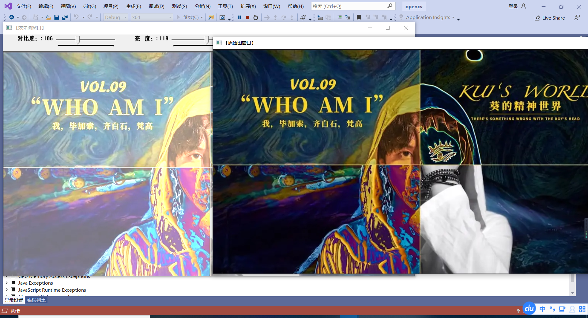

## 5.5 离散傅里叶变换
### 5.5.1 图像的离散傅里叶变换：
傅里叶变换可以将一幅图片分解为正弦和余弦两个分量，换而言之，他可以将一幅图像从其空间域（spatial domain）转换为频域（frequency domain）。这种变换的思想是任何函数可以很精确的接近无穷个sin()函数和cos()函数的和。傅里叶变换提供了这种方法来达到这种效果。

对于数字图像这种离散的信号，频率大小表示信号变化的剧烈程度或者说是信号变化的快慢。频率越大，变化越剧烈，频率越小，信号越平缓，对应到图像中，高频信号往往是图像中的边缘信号和噪声信号，而低频信号包含图像变化频繁的图像轮廓及背景等信号

二维图像的傅里叶变换数学表达式：
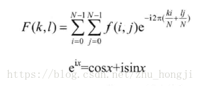

 式中f(i, j)是图像空间域的值而F是频域的值。傅里叶转换的结果是复数，这也显示出了傅里叶变换是一副实数图像（real image）和虚数图像（complex image）叠加或者是幅度图像（magitude image）和相位图像（phase image）叠加的结果。在实际的图像处理算法中仅有幅度图像（magnitude image）图像能够用到，因为幅度图像包含了我们所需要的所有图像几何结构的信息。但是，如果想通过修改幅度图像或者相位图像来间接修改原空间图像，需要保留幅度图像和相位图像来进行傅里叶逆变换，得到修改后图像。

### 5.5.2  dft()
opencv提供的傅里叶变换函数dft()，其定义如下：
```
 void dft(InputArray src, OutputArray dst, int flags=0, int nonzeroRows=0);
 ```
参数解释： 

InputArray src: 输入图像，可以是实数或虚数 
OutputArray dst: 输出图像，其大小和类型取决于第三个参数flags 
int flags = 0: 转换的标识符，有默认值0.其可取的值如下所示： 
。DFT_INVERSE: 用一维或二维逆变换取代默认的正向变换 
。DFT_SCALE: 缩放比例标识符，根据数据元素个数平均求出其缩放结果，如有N个元素，则输出结果以1/N缩放输出，常与DFT_INVERSE搭配使用。 
。DFT_ROWS: 对输入矩阵的每行进行正向或反向的傅里叶变换；此标识符可在处理多种适量的的时候用于减小资源的开销，这些处理常常是三维或高维变换等复杂操作。 
。DFT_COMPLEX_OUTPUT: 对一维或二维的实数数组进行正向变换，这样的结果虽然是复数阵列，但拥有复数的共轭对称性（CCS），可以以一个和原数组尺寸大小相同的实数数组进行填充，这是最快的选择也是函数默认的方法。你可能想要得到一个全尺寸的复数数组（像简单光谱分析等等），通过设置标志位可以使函数生成一个全尺寸的复数输出数组。 
。DFT_REAL_OUTPUT: 对一维二维复数数组进行逆向变换，这样的结果通常是一个尺寸相同的复数矩阵，但是如果输入矩阵有复数的共轭对称性（比如是一个带有DFT_COMPLEX_OUTPUT标识符的正变换结果），便会输出实数矩阵。 

int nonzeroRows = 0: 当这个参数不为0，函数会假设只有输入数组（没有设置DFT_INVERSE）的第一行或第一个输出数组（设置了DFT_INVERSE）包含非零值。这样的话函数就可以对其他的行进行更高效的处理节省一些时间，这项技术尤其是在采用DFT计算矩阵卷积时非常有效。

### 5.5.3 getOptimalDFTSize()
返回给定向量尺寸经过DFT变换后结果的最优尺寸大小。其函数定义如下：
 ```
 int getOptimalDFTSize(int vecsize);
 ```
参数解释： 

int vecsize: 输入向量尺寸大小(vector size) 
DFT变换在一个向量尺寸上不是一个单调函数，当计算两个数组卷积或对一个数组进行光学分析，它常常会用0扩充一些数组来得到稍微大点的数组以达到比原来数组计算更快的目的。一个尺寸是2阶指数（2,4,8,16,32…）的数组计算速度最快，一个数组尺寸是2、3、5的倍数（例如：300 = 5*5*3*2*2）同样有很高的处理效率。 
getOptimalDFTSize()函数返回大于或等于vecsize的最小数值N，这样尺寸为N的向量进行DFT变换能得到更高的处理效率。在当前N通过p,q,r等一些整数得出N = 2^p*3^q*5^r. 
这个函数不能直接用于DCT（离散余弦变换）最优尺寸的估计，可以通过getOptimalDFTSize((vecsize+1)/2)*2得到。

### 5.5.4 示例程序
这节学习了一个以 dft()函数为核心，对图像求傅里叶变换的，有详细注释的示例程序。在此示例中，展示了如何计算以及显示傅里叶变换后的幅度图像。由于数字图像的离散性，像素值的取值范围也是有限的。
如果需要得到图像中的几何结构信息，那么就要用到离散傅里叶变换了。下面的步骤将以输入图像为单通道的灰度图像为例，进行分步说明。
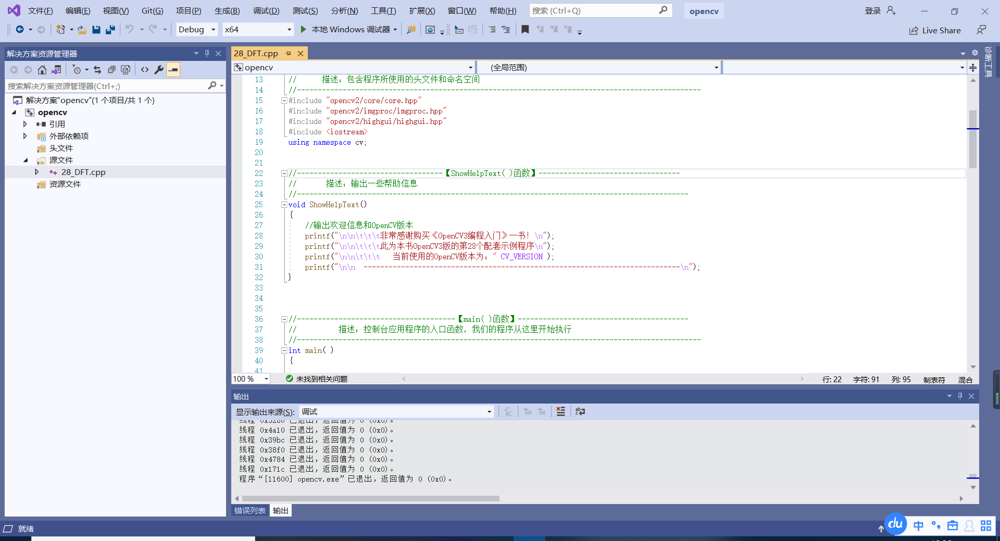
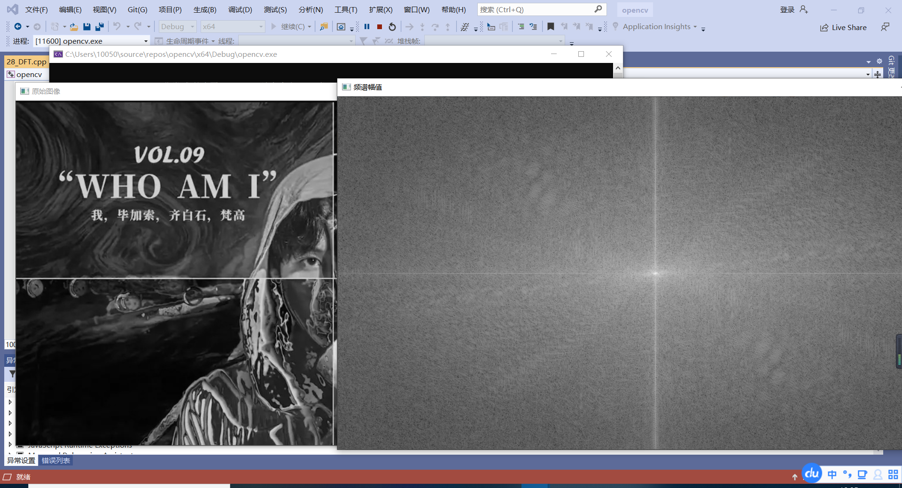

## 5.6 本章小结

本节中，学习了core模块的一些进阶知识点——操作图像中的像素、图像混合、分离颜色通道、调节图像的对比度和亮度、进行离散傅里叶变换。


